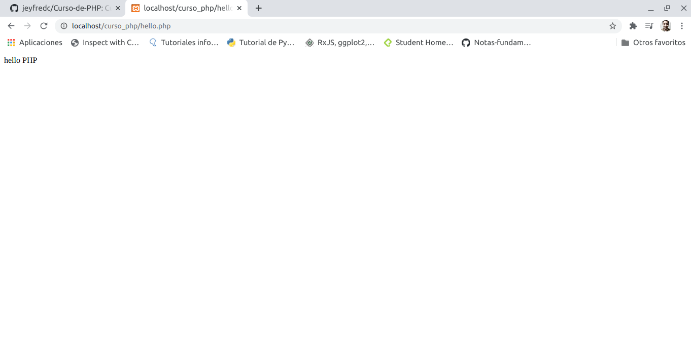

# Curso-de-PHP
Curso de php realizado en Platzi

[Clase 1 Presentación del curso](#Clase-1-Presentación-del-curso)

[Clase 2 ¿Qué es PHP?](#Clase-2-¿Qué-es-PHP?)

[Clase 3 Setup y Herramientas](#Clase-3-Setup-y-Herramientas)

[Clase 4 Revisando el template que usaremos](#Clase-4-Revisando-el-template-que-usaremos)

[Clase 5 Sintaxis de PHP](#Clase-5-Sintaxis-de-PHP)

[Clase 6 Variables tipos de datos y cadenas](#Clase-6-Variables-tipos-de-datos-y-cadenas)

[Clase 7 Tipos de Datos en PHP](Clase-7-Tipos-de-Datos-en-PHP)

[Clase 8 Arreglos](#Clase-8-Arreglos)

[Clase 9 Condicionales y Ciclos](#Clase-9-Condicionales-y-Ciclos)

[Clase 10 Ejercicios Arreglos](#Clase-10-Ejercicios-Arreglos)

[Clase 11 While vs. Do While](#Clase-11-While-vs-Do-While)

[Clase 12 Operadores, Condicionales, Continue y Break](#Clase-12-Operadores-Condicionales-Continue-y-Break)

[Clase 13 Operadores](#Clase-13-Operadores)

[Clase 14 Ejercicios Operadores](#Clase-14-Ejercicios-Operadores)

[Clase 15 Funciones](#Clase-15-Funciones)

[Clase 16 Agregando archivos externos](#Clase-16-Agregando-archivos-externos)

[Clase 17 Programación Orientada a Objetos](#Clase-17-Programación-Orientada-a-Objetos)

[Clase 18 Constructor y Métodos](#Clase-18-Constructor-y-Métodos)

[]()

[]()

[]()

[]()

[]()

[]()

[]()

[]()

[]()


## Clase 1 Presentación del curso

En este curso veremos:

- Programación orientada a Objetos.

- Conexión a bases de datos.

- Usaremos los estándares de PHP.

- Implementaremos librerías de terceros.

- Estructuraremos nuestro proyecto de una forma muy profesional que te servirá para futuros proyectos.

## Clase 2 ¿Qué es PHP?

PHP es un lenguaje de programación de propósito general de alto nivel que fue diseñado especialmente para el desarrollo de aplicaciones web.

Es interpretado lo cual quiere decir que a diferencia de otros lenguajes de programacion como JAVA en el cual se genera un paquete que puede ser distribuido. PHP lo que hace es que recibe el codigo y requiere de la instalacion del interprete de PHP en el computador donde se quiere ejecutar el codigo, es decir cuando se quiere ejecutar una aplicacion de PHP lo que se hace es utilizar en un servidor web, un servidor APACHE o ENGINEX y a ese se le agrega el interprete PHP. Quiere decir que cuando alguien manda a llamar la pagina se va a empezar a interpretar PHP en ese momento y lanzar la salida hacia el cliente.

PHP es un lenguaje multiplataforma, open source, el cual ha sido muy popular en los últimos años.

**¿Qué NO es PHP?**

- No es un lenguaje compilado, por lo cual siempre tendrás que llevar juntos tu código y tu interprete.

- No esta diseñado para realizar aplicaciones de escritorio.

Para trabajar con PHP instalaremos un entorno de desarrollo llamado XAMPP, no es un entorno pensado para producción.

## Clase 3 Setup y Herramientas

Antes de trabajar con PHP lo primero que se debe hacer es preparar todo el entorno para poder trabajar con este. la herramienta a usar es XAMPP, la **X** viene porque puede ser utilizado en cualquier **sistema operativo**, la **A** viene porque tiene incluido **APACHE**, la **M** porque tiene incluido **MariaDB** (la cual es una derivación que viene de Mysql que funciona igual y utiliza las mismas herramientas), la **P** viene de **PHP** y la otra **P** viene de **Perl**

en el enlace esta la pagina de PHP https://www.apachefriends.org/index.html

**Realizar instalación en LINUX**

- Se debe ingresar a la pagina y seleccionar la opcion XAMPP for Linux, automaticamente empezara a descargar un archivo

- Abrir la terminal de linux con Ctrl + alt + t y luego ingresar a la carpeta donde se haya descargado el archivo

- ejecutar la siguiente instrucción

    ```
    chmod 755 xampp-linux-*-installer.run
    ```
el comando se utiliza para cambiar los permisos

- luego ejecutar el instalador con la siguiente instrucción

    ```
    sudo ./xampp-linux-*-installer.run
    ```
- luego se inicia el setup, dar en next


- Desmarcar la opcion de XAMPP Developer y dar en next


- Siguiente ventana informa que XAMPP se va a instalar en el directorio 

    ```
    /opt/lampp
    ```
Luego dar en next a las siguientes opciones

luego de terminar de realizar la instalación dar en finish con la opcion de **Launch XAMPP** marcada y a continuación se va a abrir la siguiente ventana


con la opcion marcada en la pestaña de Manage Services se puede ver que servicios estan encendidos o apagados, estos servicios se pueden iniciar o detener con **Start** o **Stop**, inicialmente los servicios a tener instalados son **Apache Web Server** y **mySQL Database**

luego de esto se puede abrir el navegador web escribir localhost y a continuación aparecera esta pantalla


en **PHPInfo** se puede ver toda la información respecto a la instalación realiazada

en **phpMyAdmin** se puede ingresar a un cliente que permite la conexion a base de datos

para volver a abrir la ventana en linux se debe ejecutar en la terminal con el siguiente comando siempre que se quiera iniciar o detener un servicio

```
sudo /opt/lampp/manager-linux-x64.run
```

## Clase 4 Revisando el template que usaremos

Descargar en el repositorio  en la carpeta **archivos_descarga** el archivo llamado **index.html** y **style.css**, los cuales se empezaran a modificar a medida que avance el curso 

el archivo en **linux** se debe descargar en el sistema de archivos

```
/opt/lampp/htdocs
```
en caso de no tener permisos para crear carpetas y documentos en esta direccion ejecutar esta linea de comando en la terminal y cambiar username por el nombre de usuario que tenga establecido, en mi caso es jeyfred y por tanto iria **sudo chown -R jeyfred:jeyfred /opt/lampp/htdocs**

```
sudo chown -R username:username /opt/lampp/htdocs
```
despues de esto crear una carpeta dentro de htdocs llamada **curso_php** y copiar el archivo **index.html** y **style.css**, el cual esta en el repositorio, abrir con el editor de texto de preferencia para visualizar los archivos puede ser en **Visual Studio Code** 

posterior a esto abrir el navegador en google Chrome y abrir la siguiente direccion 

```
http://localhost/curso_php/
```

si todo quedo correcto ya es posible visualizar la pagina que se muestra en el curso


## Clase 5 Sintaxis de PHP

en la carpeta **curso_php** crear un nuevo archivo llamado **hello.php**, dentro del archivo la forma para indicar que se abre php es con la siguiente sintaxis, los comentarios se hacen escriben de la siguiente forma **/* */** para varias lineas o para una linea **//**

```
<?php
/* Todo lo que este dentro de los dos simbolos sera lo que el servidor va a interpretar y sera lo que va a funcionar con el lenguaje de programacion*/
?>
```

Ahora con la instruccion `echo` escribir 'hello PHP'; 


y en el navegador cambiar la ruta **http://localhost/curso_php/**, esta ruta esta buscando directamente a **index.html**, cambiarla por 

```
http://localhost/curso_php/hello.php
```

y a continuacion mostrara en el navegador lo que acabamos de escribir en el archivo **hello.php**



Ahora se pasa a modificar el archivo **index.html**

en la linea 24 donde aparece `<h1>Hector Benitez</h1>` borrar el nombre y probar con el suyo, pero modificandolo asi 

```
<?php echo 'Jeyfred Calderon'; ?>
```


para que el navegador pueda interpretar PHP el archivo **index.html** se debe renombrar o cambiar su extension por **index.php**


guardar cambios y nuevamente recargar la ruta anterior **http://localhost/curso_php/**

y de esta forma empezaran a aplicarse los cambios al navegador, si se deja la extension .html no va a aparecer el nombre que se cambio en el archivo


https://github.com/jeyfredc/Curso-de-PHP#Clase-5-Sintaxis-de-PHP


## Clase 6 Variables tipos de datos y cadenas

Una variable puede ser una pequeña cajita en la que puedes almacenar un valor y este lo pueden usar para realizar alguna operación.

Para declararla usaremos el símbolo de $ y en seguida el nombre, este puede ser un _ o una letra.

PHP no es estáticamente tipado, es decir que no tenemos que decirle qué tipo de dato es esa variable. Además, es débilmente tipado porque podemos fácilmente cambiar el tipo de dato, es decir PHP ejecuta una conversión de datos interna.

Al momento de trabajar con PHP una cosa muy importante es hacer debugging a nuestras variables, para ello utilizamos la función var_dump(); pasándole por parámetro la variable a revisar.

Una practica comun que se usaba, era usar php al principio del documento para no mezclar logica de codigo php con la de html,

A continuacion un ejemplo que se realiza en el archivo **index.php**, donde en las primeras lineas se agrega codigo de


haciendo que ahora se cargue nuevamente el nombre pero como una variable, al comprobar en la pagina no se deben notar cambios en el momento 


si en el archivo se re asignara la variable `$name` con un numero, o otra palabra, PHP va a cargar la ultima que se asigne, el codigo se lee de arriba hacia abajo, por ejemplo, en el ejemplo siguiente la ultima cosa en cargar seria `Jeyfred` y no `Jeyfred Calderon` y si se colocara un numero debajo de la ultima asignacion con la misma variable eso seria lo que apareceria en el navegador

```
<?php
$var1 = 1;
$name = 'Jeyfred Calderon';

$name = 'Jeyfred';
?>
```

la funcion `var_dump()` sirve para debuggear, saber que esta pasando por ejemplo con una variable

```
<?php
$name = 'Jeyfred Calderon';
var_dump($name);
?>
```

Al guardar y cargar esta pagina en el navegador aparecera la informacion que contiene la variable, es decir que es un string con la longitud del texto


En PHP tenemos dos tipos de cadenas, las que son con comillas simples y las de comillas dobles. La diferencia entre estas dos cadenas es que la de comillas simples recibe de forma literal lo que le escribas mientras que la de comillas dobles intenta interpretar cualquier variable dentro de ella.

la primer forma de concatenar es con comillas simples, colocando un punto y la variable como en el siguiente ejemplo

```
<?php
$lastName = 'Calderon';
$name = 'Jeyfred ' . $lastName;
?>
```

la segunda forma es con comillas dobles, estas intentan interpretar cualquier cosa que se encuentre dentro de ellas, si se colocara lo mismo pero entre comillas simples el navegador va imprimir literalmente `Jeyfred $lastName`

```
<?php
$lastName = 'Calderon';
$name = "Jeyfred $lastName";
?>
```

## Clase 7 Tipos de Datos en PHP

PHP cuenta con muchos tipos de datos, sin embargo, en este momento nos vamos a enfocar en los más importantes y utilizados que son boolean, integer, float, string, array y NULL.

**Tipos escalares:**

**boolean:**

Representa solamente un valor verdadero o falso. http://php.net/manual/es/language.types.boolean.php
Valores válidos: true (verdadero) false (falso)

```
<?php
$a = true; 
$b = false; 
?>
```

**Integer:**

Representa un número entero positivo, negativo o 0. http://php.net/manual/es/language.types.integer.php

```
<?php
$a = -123;
$b = 0;
$c = 7763;
?>
```

**float o double:**

Representa un número de punto flotante, existen problemas de precisión con los números flotantes debido a la naturaleza binaria de las computadoras. http://php.net/manual/es/language.types.float.php
```
<?php
$a = 12.24; 
$b = 1.5e3; 
$c = 7E-10;
?> 
```

**string:**

– Representa una cadena de caracteres.
– Existen 4 formas de representar una cadena. Las 2 principales son usando comillas simples o comillas dobles.
---- Usando comillas simples donde el texto será exactamente como se escribe.
---- Usando comillas dobles permite usar caracteres de escape y además expanden los nombres de las variables, es decir sustituye el valor de las variables dentro de las cadenas.
– Hay 2 formas adicionales llamadas Heredoc y Nowdoc que sirven para crear cadenas de múltiples líneas.

Si quieres conocer más de este tipo de dato da click aquí https://www.php.net/manual/es/language.types.string.php#language.types.string.details.

```
<?php
$a = ”Hola”; 
$b = ‘Mundo’; 
?>
```
**Tipos compuestos:**

**array:**

Representa una colección de valores, aunque por defecto PHP usara índices numéricos, la realidad es que la estructura se representa como un mapa que colecciona pares llave-valor. La sintaxis para definir un arreglo será a partir de corchetes cuadrados, aunque en versiones anteriores de PHP era necesario usar la función array(). Las llaves pueden ser enteros o cadenas y los valores pueden ser de cualquier tipo de PHP, incluso de tipo array. http://php.net/manual/es/language.types.array.php
```
<?php
$array = array(
    "curso1" => "php",
    "curso2" => "js",
);

// a partir de PHP 5.4
$array = [
    "curso1" => "php",
    "curso2" => "js",
];

// índices numéricos
$array = [
    "php",
    "js",
];
?>
```

**object:**

Representa una instancia de una clase. Este tema lo veremos más a fondo en la clase de Programación Orientada a Objetos.

```
<?php
class Car
{
    function move()
    {
        echo "Going forward..."; 
    }
}

$myCar = new Car();
$myCar->move();
?>
```

**callable:**

Es un tipo de dato especial que representa a algo que puede ser “llamado”, por ejemplo una función o un método.

```
<?php
// Variable que guarda un callable
$firstOfArray = function(array $array) {
    if (count($array) == 0) { return null; }
    return $array[0];
};

// Este es nuestro arreglo
$values = [3, 2, 1];

// Usamos nuestro callable y se imprime el valor 3
echo $firstOfArray($values);
?>
```

**iterable:**

A partir de PHP 7.1 iterable es un pseudo tipo de datos que puede ser recorrido.

```
<?php

function foo(iterable $iterable) {
    foreach ($iterable as $valor) {
        // ...
    } 
}

?>
```

**Tipos especiales:**

**resource:**

Es un tipo de dato especial que representa un recurso externo, por ejemplo un archivo externo a tu aplicación.

```
<?php
$res = fopen("c:\\dir\\file.txt", "r");
?>
```

**NULL:**

Es un valor especial que se usa para representar una variable sin valor. http://php.net/manual/es/language.types.null.php

```
<?php
$a = null; 
?>
```

## Clase 8 Arreglos

Como vimos en la clase anterior almacenamos datos en una variable, ahora trataremos de almacenar más datos en una misma variable.

Estas variables que almacenan más de un dato se conocen como arreglos y su sintaxis se va a indicar con [ ] (corchetes).

PHP utiliza índices para localizar a los elementos dentro de la variable.

La estructura de arreglos en PHP es conocida como mapa, lo que quiere decir que tiene una composición de llave valor. Además, un arreglo puede contener más arreglos y cada uno de ellos seguirá la misma estructura.

continuando con el archivo **index.php** se estructura el siguiente codigo

```
<?php
$name = "Jeyfred Calderon";
$jobs = [
  'PHP Developer',
  'Python Dev',
  'Devops'
];
?>

```

La forma de poder acceder al arreglo o array jobs es a traves de indices, siendo la primer posicion 0, continuando con el ejemplo se establece un `var_dump` para ver su contenido

```
<?php
$name = "Jeyfred Calderon";
$jobs = [
  'PHP Developer',
  'Python Dev',
  'Devops'
];

?>

```

Al refrescar el navegador sale la primer posicion


y si por ejemplo se quita `[0]` y se deja solo jobs sin los corchetes se va a imprimir toda la cadena indicando cuantos elementos tiene y cada una de las posiciones con su respectiva longitud


Tambien es posible pasar los valores en el html en la parte de **Work position** reemplazar el titulo con etiqueta `h5` por 

```
<h5><?php echo $jobs[0]?></h5>
```

y realizarlo para las siguientes con cada una de las posiciones


Tambien existe otra forma de acceder a los arreglos, y se pueden tener arreglos dentro de arreglos.

Nuevamente se modifica el codigo por lo siguiente

```
<?php
$name = "Jeyfred Calderon";
$jobs = [
  ['title' => 'PHP Developer',
    'description' => 'Este es un trabajo asombroso'],
  ['title' => 'Python Dev'],
  ['title' => 'Devops']
];
?>
```

y nuevamente se reemplazan en la parte de **Work position** por

```
<h5><?php echo $jobs[0]['title']?></h5>
<p><?php echo $jobs[0]['description']?></p>
```


al recargar el navegador estos valores deben aparecer actualizados


## Clase 9 Condicionales y Ciclos

Las condiciones nos permiten tomar decisiones en el código, si se cumple la condición entonces se ejecutarán ciertas instrucciones sino se cumple se ejecutarán otras. Estas se denotan por la instrucción **if else**.

```
<?php
$name = "Jeyfred Calderon";
$jobs = [
  ['title' => 'PHP Developer',
    'description' => 'Este es un trabajo asombroso'],
  ['title' => 'Python Dev'],
  ['title' => 'Devops']
];

$var1 = 2;
if($var1 > 2){// tiene asignado el signo de mayor que , if se lee como si la(condicion) sucede {entonces}
  echo 'Es mayor que 2';
}
elseif($var1 == 2){// tiene asignado el signo de comparacion que esta definido por un doble igual, elseif se lee como si,no(condicion) {entonces}
  echo 'Es igual que 2';
}
else{ // No tiene asignado un simbolo porque ya no se cumple si es mayor o igual , else se lee como de lo contrario la(condicion) sucede {entonces}
  echo 'Es menor que 2';
}
?>
```
practicar primero con estos y luego comentarlos con **/* */**, se puede seleccionar todo, en linux con **ctrl + Shift + a** y queda ese pedazo de codigo comentado

```
/* $var1 = 2;
if($var1> 2){
  echo 'Es mayor que 2';
}
elseif($var1 == 2){
  echo 'Es igual que 2';
}
else{
  echo 'Es menor que 2';
} */
```

Los ciclos funcionan de la mano con las condiciones, en este caso si se cumple la instrucción se estará ejecutando repetidas veces una instrucción dada.

Hemos agregado los jobs de forma manual accediendo al arreglo a través de sus índices, hacer esto podría traer errores y no podríamos controlarlo si tuviéramos muchos jobs. Ahora veamos una mejor forma de hacerlo con ciclos.

- El primero que tenemos es do while que va a involucrar la inicialización de variables y condiciones. la forma en que se lee es haga mientras algo suceda

en el codigo de **index.php** se va a reemplazar con la siguiente linea de codigo lo que anteriormente se habia hecho en **work-position** por lo siguiente **tener en cuenta** que lo que se esta reemplazanda son las 3 secciones de **work-position**

```
            <?php
            $idx = 0;
            do{
              echo '<li class="work-position">';
              echo '<h5>' . $jobs[$idx]['title'] . '</h5>'; //La posicion inicia en 0 y cada vez que llega a while cambia, despues es 1, despues es 2 y despues se rompe la operacion 
              echo '<p>' . $jobs[$idx]['description'] . '</p>'; 
              echo '<strong>Achievements:</strong>';
              echo '<ul>';
              echo '<li>Lorem ipsum dolor sit amet, 80% consectetuer adipiscing elit.</li>';
              echo '<li>Lorem ipsum dolor sit amet, 80% consectetuer adipiscing elit.</li>';
              echo '<li>Lorem ipsum dolor sit amet, 80% consectetuer adipiscing elit.</li>';
              echo '</ul>';
              echo '</li>';
              $idx = $idx +1; // mientras la variable sea menor que 3 es decir posicion 0, 1 y 2 
            }while($idx < 3);
          ?>
```


Al recargar la pagina la descripcion no va a aparecer porque la descripcion para Python Dev y Devops no se ha creado aun


- El segundo que veremos es for que es una forma más simplificada de usar todos los elementos que componen los ciclos.

se trabaja sobre el mismo de la siguiente forma

```
            <?php
            
            for($idx=0; $idx < count($jobs); $idx++){ // El codigo dice para cada posicion mientras que sea menor que 3, (count(jobs) esta contando las posiciones del arreglo, las cuales por el momento son 3) aumente la posicion de 1 en 1  $idx = $idx + 1, se puede sustituir por $idx ++, significa lo mismo
              echo '<li class="work-position">';
              echo '<h5>' . $jobs[$idx]['title'] . '</h5>'; //La posicion inicia en 0 cuando llega hasta el cierre del corchete }, despues es 1, despues es 2 y despues se rompe la operacion 
              echo '<p>' . $jobs[$idx]['description'] . '</p>'; 
              echo '<strong>Achievements:</strong>';
              echo '<ul>';
              echo '<li>Lorem ipsum dolor sit amet, 80% consectetuer adipiscing elit.</li>';
              echo '<li>Lorem ipsum dolor sit amet, 80% consectetuer adipiscing elit.</li>';
              echo '<li>Lorem ipsum dolor sit amet, 80% consectetuer adipiscing elit.</li>';
              echo '</ul>';
              echo '</li>';
            }
          ?>
```

y se obtiene el mismo resultado que antes pero ahorrando codigo


## Clase 10 Ejercicios Arreglos

**Ejercicio 1.**

Escribe el código necesario para generar la cadena final usando el arreglo dado

```
$arreglo = [

	‘keyStr1’ => ‘lado’,
	0 => ‘ledo’,

	‘keyStr2’ => ‘lido’,
	1 => ‘lodo’,
	2 => ‘ludo’

];

```

Lado, ledo, lido, lodo, ludo,
decirlo al revés lo dudo.
Ludo, lodo, lido, ledo, lado,
¡Qué trabajo me ha costado!

**Ejercicio 2.**

Crea un arreglo que contenga como clave los nombres de 5 países y como valor otro arreglo con 3 ciudades que pertenezcan a ese país, después utiliza un ciclo foreach, para imprimir el nombre del país seguido de las ciudades que definiste:

Ejemplo,

México: Monterrey Querétaro Guadalajara
Colombia: Bogota Cartagena Medellin

**Ejercicio 3.**

Escribe el código necesario para encontrar los 3 números más grandes y los 3 números más bajos de la siguiente lista:

```
$valores = [23, 54, 32, 67, 34, 78, 98, 56, 21, 34, 57, 92, 12, 5, 61]
```

## Clase 11 While vs. Do While

**ciclos**

Como mencionamos en nuestra clase anterior, los ciclos o bucles son de total importancia cuando desarrollamos software pues nos permiten repetir un bloque de acciones y en consecuencia re-utilizar mejor nuestro código, en este momento ya hablamos de cómo funciona el ciclo for y el ciclo do-while.

Ahora vamos a revisar un par de ciclos adicionales en PHP los cuales también es importante conocer. Toma en cuenta que la mayoría de las cosas se pueden hacer de diferentes maneras por lo tanto es importante que elijas bien cual es el ciclo que mejor se adapta a tu problema.

**while vs. do… while**

En la clase anterior hablamos del ciclo do while, aquí lo compararemos con otro ciclo llamado while, recapitulemos el funcionamiento de do… while:

Cuando creamos un ciclo do… while, le decimos a PHP que ejecute cierto bloque de código siempre y cuando la condición que tengas dentro se siga evaluando como verdadera.

Esta es la sintaxis de un ciclo do… while

```
do {
   codigo…
} while (condicion)
```

El ciclo while funciona de la misma manera, pero la diferencia principal es que la evaluación se llevará a cabo al iniciar el ciclo:

```
while (condicion) {
   codigo...
}
```

La principal diferencia es que el ciclo do while garantiza que el código interno se ejecutará al menos 1 vez, mientras que en el ciclo while si la condición es falsa desde un inicio, es posible que el ciclo nunca se ejecute

http://php.net/manual/es/control-structures.while.php
http://php.net/manual/es/control-structures.do.while.php

**foreach**

El ciclo foreach nos brinda una solución simple para iterar sobre los valores de un arreglo, la sintaxis es la siguiente:

```
foreach ($array as $valor) {
    sentencias que pueden usar $valor
}
```

En esta sintaxis nos encontramos con 4 partes:

- La palabra reservada foreach simplemente indica el inicio de nuestro bloque

- Dentro de paréntesis se escribe el nombre del arreglo que vamos a estar iterando, este arreglo debe estar definido previamente, en este ejemplo es $arreglo

- La palabra “as” seguido de un nombre de variable que usaremos para acceder al elemento del arreglo que estamos accediendo, esta variable no debe existir previamente y solo la podrán usar dentro de este bloque. En el ejemplo es $valor.

- Entre llaves “{ }” todas las acciones que queremos repetir, en el momento en que se ejecute el ciclo la variable que definimos para iterar (en el ejemplo $valor) ya existe y podrá ser usada en esta sección, piensa que el valor de esta variable estará cambiando en cada iteración.

Suponiendo que en el ejemplo anterior $array = [‘uno’, ‘dos’, ‘tres’], el ciclo se repetirá 3 veces y en cada iteración la variable $valor contendrá el elemento del arreglo correspondiente, es decir, en la primera iteración $valor será igual a ‘uno’, en la segunda $valor será igual a ‘dos’ y en la tercera $valor será igual a ‘tres’.

Existe una sintaxis alternativa que nos permite no solo conocer el valor, también nos permitirá conocer la llave, de este modo tendremos acceso tanto a la llave como al valor del elemento del arreglo:

```
foreach ($array as $llave => $valor) {
    sentencias que pueden usar $llave y $valor
}
```
http://php.net/manual/es/control-structures.foreach.php

## Clase 12 Operadores, Condicionales, Continue y Break

En PHP existen cuatro tipos principales de operadores:

- Aritméticos.( +, -, /, *)

- Asignación. (=)

- Condicionales.(if, else, elseif)

- Comparación (> mayor que, < menor que , == igual a , != diferente de)

- Incremento (i++ o  i = i + 1).

Aprovechemos para practicar y veamos más sobre condiciones, en PHP tenemos el operador de comparación (==) y diferente de (!=).

Tenemos la sentencia **continue** la cuál al ejecutarse hará que se itere a la siguiente línea del arreglo. Y la sentencia **break** que hará que el ciclo se termine.

En el archivo **index.php** en el array jobs agregar el siguiente codigo donde `'visible'` utiliza tipos de dato Booleano, falso o verdadero

```
<?php
$name = "Jeyfred Calderon";
$jobs = [
  ['title' => 'PHP Developer',
    'description' => 'Este es un trabajo asombroso',
    'visible' => true],
  ['title' => 'Python Dev',
  'visible' => false],
  ['title' => 'Devops',
  'visible' => false],
  ['title' => 'Node Dev',
  'visible' => true],
  ['title' => 'Frontend Dev',
  'visible' => true]  
];
/* $var1 = 2;
if($var1> 2){
  echo 'Es mayor que 2';
}
elseif($var1 == 2){
  echo 'Es igual que 2';
}
else{
  echo 'Es menor que 2';
} */

?>
```

ahora donde se estaba haciendo el for para los work-position, donde si `'visible'` es `True` o verdadero se va a mostrar eso en Work Experiencie al volver a cargar la pagina

```
            <?php

            for($idx=0; $idx < count($jobs); $idx++){ 
              if($jobs[$idx]['visible'] == true){
                echo '<li class="work-position">';
                echo '<h5>' . $jobs[$idx]['title'] . '</h5>';  
                echo '<p>' . $jobs[$idx]['description'] . '</p>'; 
                echo '<strong>Achievements:</strong>';
                echo '<ul>';
                echo '<li>Lorem ipsum dolor sit amet, 80% consectetuer adipiscing elit.</li>';
                echo '<li>Lorem ipsum dolor sit amet, 80% consectetuer adipiscing elit.</li>';
                echo '<li>Lorem ipsum dolor sit amet, 80% consectetuer adipiscing elit.</li>';
                echo '</ul>';
                echo '</li>';
              }
            }
            ?>
```

Modificando el codigo anterior, a este se le va a agregar **continue** y visible va a pasar ahora a ser `false`, lo que significa es que si la visibilidad del trabajo es falsa continue y ejecute la siguiente instruccion

```
            <?php

            for($idx=0; $idx < count($jobs); $idx++){ 
              if($jobs[$idx]['visible'] == false){
                continue;
              }
              echo '<li class="work-position">';
              echo '<h5>' . $jobs[$idx]['title'] . '</h5>';  
              echo '<p>' . $jobs[$idx]['description'] . '</p>'; 
              echo '<strong>Achievements:</strong>';
              echo '<ul>';
              echo '<li>Lorem ipsum dolor sit amet, 80% consectetuer adipiscing elit.</li>';
              echo '<li>Lorem ipsum dolor sit amet, 80% consectetuer adipiscing elit.</li>';
              echo '<li>Lorem ipsum dolor sit amet, 80% consectetuer adipiscing elit.</li>';
              echo '</ul>';
              echo '</li>';
            }
            ?>
```

al recargar la pagina no existira una diferencia con respecto a la primera isntruccion del for

ahora a el array jobs se le van agregar los meses de experiencia en cada trabajo, el array queda de la siguiente forma

```
<?php
$name = "Jeyfred Calderon";
$limitMonths = 12;
$jobs = [
  ['title' => 'PHP Developer',
    'description' => 'Este es un trabajo asombroso',
    'visible' => true,
    'months' => 6],
  ['title' => 'Python Dev',
  'visible' => false,
  'months' => 4],
  ['title' => 'Devops',
  'visible' => false,
  'months' => 5],
  ['title' => 'Node Dev',
  'visible' => true,
  'months' => 2],
  ['title' => 'Frontend Dev',
  'visible' => true,
    'months' => 3]  
];

/* $var1 = 2;
if($var1> 2){
  echo 'Es mayor que 2';
}
elseif($var1 == 2){
  echo 'Es igual que 2';
}
else{
  echo 'Es menor que 2';
} */

?>
```

y ahora en el for se va agregar otra condicion donde se le va indicar que solo aparezcan trabajos donde haya trabajado en los ultimos 12 meses, para eso antes del array jobs se crea una variable llamda `$limitMonths = 12;`, y ahora antes del for, se crea la variable `$totalMonths = 0;`, la cual va a funcionar como un contador y este se tiene que inicializar en 0, posteriormente entre el for y el if se agrega la siguiente instruccion `$totalMonths = $totalMonths + $jobs[$idx]['months']`, lo que esta haciendo esta es que `$idx` hace la iteracion sobre los meses y la variable `$totalMonths` va sumando los meses, como lo que se quiere es imprimir trabajos no superiores a 12 meses se agrega otro if statements `if($totalMonths > $limitMonths){break;}` el cual indica que si el total de meses llega a ser superior a 12 deje de ejecutar el codigo y continue hacia el siguiente if statements

```
            <?php
            
            $totalMonths = 0;
            for($idx=0; $idx < count($jobs); $idx++){ 
              $totalMonths += $jobs[$idx]['months'];

              if($totalMonths > $limitMonths){
              break;
              }

              if($jobs[$idx]['visible'] != true){
                continue;
              }
              echo '<li class="work-position">';
              echo '<h5>' . $jobs[$idx]['title'] . '</h5>';  
              echo '<p>' . $jobs[$idx]['description'] . '</p>';
              echo '<p>' . $totalMonths . '</p>'; 
              echo '<strong>Achievements:</strong>';
              echo '<ul>';
              echo '<li>Lorem ipsum dolor sit amet, 80% consectetuer adipiscing elit.</li>';
              echo '<li>Lorem ipsum dolor sit amet, 80% consectetuer adipiscing elit.</li>';
              echo '<li>Lorem ipsum dolor sit amet, 80% consectetuer adipiscing elit.</li>';
              echo '</ul>';
              echo '</li>';
            }
          ?>
```

al recargar la pagina debe salir el primer trabajo el cual duro 6 meses + el segundo que fueron 4 meses, el tercero suma a 15 por tanto se detiene en 10 meses y no imprime mas trabajos


## Clase 13 Operadores

Antes de continuar hablando de operadores es importante mencionar que existe un concepto conocido como precedencia de operadores el cual nos permitirá saber en qué orden se deben ejecutar los operadores que se encuentren en una sola sentencia.

Por ejemplo, en la sentencia:

**1 + 2 * 3**

Se ejecutará primero la operación **2 * 3**
Luego se ejecutará la suma con **1**

Esto es debido a que * tiene más valor en la precedencia que el +.

Una forma sencilla de controlar la precedencia es utilizando () paréntesis, de esta forma podemos forzar el orden que nosotros queramos, por ejemplo (1 + 2) * 3 será una versión diferente y se ejecutará primero la suma y luego la multiplicación.

Te dejo el enlace por si quieres consultar más información al respecto. http://php.net/manual/es/language.operators.precedence.php

Ahora continuemos hablando sobre los tipos de operadores, algunos ya los vimos, pero de igual forma vamos a reforzarlos enfocándonos en los más importantes.

**Operadores aritméticos**

http://php.net/manual/es/language.operators.arithmetic.php

Funcionan para realizar operaciones aritméticas.


**Operadores de asignación**

http://php.net/manual/es/language.operators.assignment.php

El operador principal de asignación es el símbolo = (igual). Es importante tener en cuenta que este operador no sirve para comparar, normalmente del lado izquierdo del operador tendremos una variable, y este operador sirve para asignar el resultado de lo que se encuentre a la derecha a dicha variable.

$variable = 5;

Lo que tenemos en la derecha puede ser un valor, otra variable, o el resultado de una operación o función.

También existen otros operadores de asignación que se combinan con operadores aritméticos o para strings y nos permiten simplificar algunas sentencias dentro de PHP. Estos son ejemplos de cómo funcionan:

$a += $b
$a = $a + $b

$a -= $b
$a = $a - $b

$a *= $b
$a = $a * $b

$a /= $b
$a = $a / $b

$a %= $b
$a = $a % $b

$a .= $b
$a = $a . $b

**Operadores de comparación**

http://php.net/manual/es/language.operators.comparison.php

Nos permiten comparar valores.


**Operadores de incremento/decremento**

http://php.net/manual/es/language.operators.increment.php

Permiten incrementar o decrementar un valor en 1.


Es muy importante entender cómo afecta el lugar donde se establece el operador, ejemplo:

```
$a = 1;
echo $a++;
echo $a;
echo ++$a;
echo $a;
```

imprime

```
1
2
3
3
```

**Operadores lógicos**

http://php.net/manual/es/language.operators.logical.php

Nos permiten combinar resultados de comparaciones.


**Operadores para strings**

Existen 2 operadores para strings el . (punto) que nos permite concatenar cadenas, y el .= que ya fue visto anteriormente y nos permite simplificar la sintaxis de concatenar algo a una misma cadena, ejemplo:

```
$var1 = ‘Hola ’ . ‘ php’;
$var1 .= ‘!!!’;
echo $var1;
```
imprime
```
Hola php!!!
```

**Operadores para arrays**

http://php.net/manual/es/language.operators.array.php


## Clase 14 Ejercicios Operadores

**Ejercicio 1.**

Calcula el resultado de 32+3 y 3(2+3). Escribe el procedimiento que empleaste en la sección de discusiones.

**Ejercicio 2.**

Tomando en cuenta que tenemos una variable llamada $valor, escribe en la sección de discusiones ¿Cómo sería un condicional para las siguientes opciones?

- $valor es mayor que 5 pero menor que 10

- $valor es mayor o igual a 0 pero menor o igual a 20

- $valor es igual a “10” asegurando que el tipo de dato sea cadena

- $valor es mayor a 0 pero menor a 5 o es mayor a 10 pero menor a 15

## Clase 15 Funciones

Las funciones en PHP se denotan por la palabra reservada function seguida por el nombre de la función, las funciones nos servirán para llamar y reutilizar código en nuestros proyectos.

Cuando trabajemos con funciones es muy importante cuidar el scope (alcance) de las variables pues, algunas podrían entrar en su scope y otras no.

Las funciones en PHP pueden o no regresar un dato particular. Si deseamos hacerlo podemos indicarlo con la palabra reservada return.

RETO: Utiliza condicionales para validar los años que tengan valor cero.

Las funciones son estructuras que permiten encapsular o reunir cierta funcionalidad para poderla re utilizar, en el archivo **index.php**, se va a declarar debajo del array jobs una funcion llamada `printJob` la cual va de esta forma inicialmente dentro de los parentesis () pueden ir o no parametros y despues  van las llaves en las cuales esta todo el contenido de la funcion

```
function printJob() {
  // Contenido de la funcion
}
```

al declarar esta funcion lo unico que se esta haciendo es declarar que se puede utilizar pero de momento no va a aparecer al recargar la pagina porque solo esta declarada y no se ha mandado a llamar

```
function printJob() {
  echo 'jobs';
}
```

para que se pueda utilizar se debe ejecutar la sentencia a continuacion

```
printJob();
```
en este caso ya se esta mandando a llamar


y ahora va aparecer cuando se recargue el navegador


y el codigo,se puede re utilizar cuantas veces se requiera

Ahora lo que se va a hacer es agregar un parametro a la funcion `printJob` que se llama `$job` y cambiar el codigo interno de la funcion

```
function printJob($job){

}
```

y ahora se agrega todo el codigo que anteriormente se estaba usando para imprimir sin el for, ni el if 

```
function printJob($job){
  echo '<li class="work-position">';
  echo '<h5>' . $jobs[$idx]['title'] . '</h5>';  
  echo '<p>' . $jobs[$idx]['description'] . '</p>';
  echo '<p>' . $totalMonths . '</p>'; 
  echo '<strong>Achievements:</strong>';
  echo '<ul>';
  echo '<li>Lorem ipsum dolor sit amet, 80% consectetuer adipiscing elit.</li>';
  echo '<li>Lorem ipsum dolor sit amet, 80% consectetuer adipiscing elit.</li>';
  echo '<li>Lorem ipsum dolor sit amet, 80% consectetuer adipiscing elit.</li>';
  echo '</ul>';
  echo '</li>';
}
```
y el codigo que se quito del for y el if se va a reemplazar por la funcion pasandole como parametro la variable con el iterador

```
            <?php
            
            $totalMonths = 0;
            for($idx=0; $idx < count($jobs); $idx++){ 
              $totalMonths += $jobs[$idx]['months'];

              if($totalMonths > $limitMonths){
              break;
              }

              if($jobs[$idx]['visible'] != true){
                continue;
              }
              printJob($jobs[$idx]);
            }
          ?>
```

pero si se pasa la variable `$jobs` en la funcion, va a marcar un error porque aun no existe dentro de la funcion y a esto se le conoce como scope o alcance. y la funcion creada inicialmente tiene un scope interno, por tanto en la funcion se debe cambiar `jobs[$idx]` por `job`, porque es lo que esta recibiendo la funcion, ademas tambien se cancela o se comentarea `$totalMonths` porque desde la funcion ya no se tiene acceso a la variable 

```
function printJob($job) {
  echo '<li class="work-position">';
  echo '<h5>' . $job['title'] . '</h5>';  
  echo '<p>' . $job['description'] . '</p>';
  //echo '<p>' . $totalMonths . '</p>'; 
  echo '<strong>Achievements:</strong>';
  echo '<ul>';
  echo '<li>Lorem ipsum dolor sit amet, 80% consectetuer adipiscing elit.</li>';
  echo '<li>Lorem ipsum dolor sit amet, 80% consectetuer adipiscing elit.</li>';
  echo '<li>Lorem ipsum dolor sit amet, 80% consectetuer adipiscing elit.</li>';
  echo '</ul>';
  echo '</li>';
}
```
al recargar la pagina ya se pueden ver los trabajos nuevamente ademas si la variable `$limitMonths` pasa de 12a a 24 meses .

Ahora antes de la funcion `printJob` se va a generar otra funcion para generar cual es la duracion que tenemos o tuvimos en cada trabajo, esta funcion se va a llamar `function getDuration()`, en esta se va a generar una cadena, que va a tener cuantos años y meses son los de cada trabajo, que se establecieron en un principio en el array y tambien se va a añadir una modificacion a la funcion `printJob` que va a llamar la funcion que acabamos de crear, el codigo queda asi

```
<?php
$name = "Jeyfred Calderon";
$limitMonths = 24;
$jobs = [
  ['title' => 'PHP Developer',
    'description' => 'Este es un trabajo asombroso',
    'visible' => true,
    'months' => 6],
  ['title' => 'Python Dev',
  'visible' => true,
  'months' => 4],
  ['title' => 'Devops',
  'visible' => true,
  'months' => 5],
  ['title' => 'Node Dev',
  'visible' => true,
  'months' => 2],
  ['title' => 'Frontend Dev',
  'visible' => true,
    'months' => 3]  
];

function getDuration($months){
  return "$months months";
}

function printJob($job) {
  echo '<li class="work-position">';
  echo '<h5>' . $job['title'] . '</h5>';  
  echo '<p>' . $job['description'] . '</p>';
  echo '<p>' . getDuration($job['months']) . '<p>';
  echo '<strong>Achievements:</strong>';
  echo '<ul>';
  echo '<li>Lorem ipsum dolor sit amet, 80% consectetuer adipiscing elit.</li>';
  echo '<li>Lorem ipsum dolor sit amet, 80% consectetuer adipiscing elit.</li>';
  echo '<li>Lorem ipsum dolor sit amet, 80% consectetuer adipiscing elit.</li>';
  echo '</ul>';
  echo '</li>';
}

```

y al recargar la pagina, ya va a aparecer la informacion de cada trabajo, con el numero de meses 


## Clase 16 Agregando archivos externos

Organizaremos mejor nuestro código para ello lo separaremos en otro archivo llamado jobs.php.

Usaremos la palabra reservada include para hacer que el archivo index incluya el archivo jobs.php, si lo encuentra lo incluye, pero si no nos mostrará un warning. Existe otro llamado require que si no lo encuentra nos muestra un error en todo el archivo.

Los métodos include y require ejecutan el código del archivo cada vez que lo incluyen, esto puede traer errores en la ejecución de tu código si tienes archivos con funciones pues te dirá que no puedes declarar dos veces una función con el mismo nombre. Para resolver esto existen include_once y require_once que obligan a incluir una sola vez el archivo.

A medida que la aplicacion empieza a crecer se vuelve mas compleja de controlar y por tanto es mejor dividir la aplicacion en diferentes archivos e ir dividiendo las funcionalidades o ir creando pequeños modulos de informacion para que se puedan utilizar,

para realizar esto toda la parte del array de jobs se va a sacar a otra archivo que se llame **jobs.php** el cual va a ser creado dentro de la carpeta **curso_php** .

**Nota** cuando el archivo es netamente de php no es necesario dar una etiqueta de cierre `?>`

ahora el archivo de **jobs.php** queda con todo el array y para poder llamarlo desde **index.php** se debe llamar en el principio con `include` el cual recibe como parametro el nombre del nuevo archivo, asi es como va quedando el archivo

```
<?php

include('jobs.php');

$name = "Jeyfred Calderon";
$limitMonths = 2000;

function getDuration($months){
  $years = floor($months / 12);
  $extraMonths = $months % 12;

  if($years == 0){
    return "$extraMonths months";
  }else{
    return "$years years $extraMonths months";
  }
  
}

function printJob($job) {

  if($job['visible'] == false){
    return;
  }

  echo '<li class="work-position">';
  echo '<h5>' . $job['title'] . '</h5>';  
  echo '<p>' . $job['description'] . '</p>';
  echo '<p>' . getDuration($job['months']) . '<p>';
  echo '<strong>Achievements:</strong>';
  echo '<ul>';
  echo '<li>Lorem ipsum dolor sit amet, 80% consectetuer adipiscing elit.</li>';
  echo '<li>Lorem ipsum dolor sit amet, 80% consectetuer adipiscing elit.</li>';
  echo '<li>Lorem ipsum dolor sit amet, 80% consectetuer adipiscing elit.</li>';
  echo '</ul>';
  echo '</li>';
}

?>

<!doctype html>
<html lang="en">

<head>
  <!-- Required meta tags -->
  <meta charset="utf-8">
  <meta name="viewport" content="width=device-width, initial-scale=1, shrink-to-fit=no">

  <!-- Bootstrap CSS -->
  <link rel="stylesheet" href="https://stackpath.bootstrapcdn.com/bootstrap/4.1.2/css/bootstrap.min.css" integrity="sha384-Smlep5jCw/wG7hdkwQ/Z5nLIefveQRIY9nfy6xoR1uRYBtpZgI6339F5dgvm/e9B"
    crossorigin="anonymous">
  <link rel="stylesheet" href="style.css">

  <title>Resume</title>
</head>

<body>
  <div class="container">
    <div id="resume-header" class="row">
      <div class="col-3">
        
      </div>
      <div class="col">
        <h1><?php echo $name; ?></h1>
        <h2>PHP Developer</h2>
        <ul>
          <li>Mail: hector@mail.com</li>
          <li>Phone: 1234567890</li>
          <li>LinkedIn: https://linkedin.com</li>
          <li>Twitter: @hectorbenitez</li>
        </ul>
      </div>
    </div>
    <div class="row">
      <div class="col">
        <h2 class="border-bottom-gray" >Carrer Summary</h2>
        <p>
          Lorem ipsum dolor sit amet, consectetur adipiscing elit, sed do eiusmod tempor incididunt ut labore et dolore magna aliqua. Ut enim ad minim veniam, quis nostrud exercitation ullamco laboris nisi ut aliquip ex ea commodo consequat. Duis aute irure dolor in reprehenderit in voluptate velit esse cillum dolore eu fugiat nulla pariatur. Excepteur sint occaecat cupidatat non proident, sunt in culpa qui officia deserunt mollit anim id est laborum.
          Lorem ipsum dolor sit amet, consectetur adipiscing elit, sed do eiusmod tempor incididunt ut labore et dolore magna aliqua. Ut enim ad minim veniam, quis nostrud exercitation ullamco laboris nisi ut aliquip ex ea commodo consequat. Duis aute irure dolor in reprehenderit in voluptate velit esse cillum dolore eu fugiat nulla pariatur. Excepteur sint occaecat cupidatat non proident, sunt in culpa qui officia deserunt mollit anim id est laborum.
        </p>
      </div>
    </div>
    <div class="row">
      <div class="col">
        <div>
          <h3 class="border-bottom-gray" >Work Experience</h3>
          <ul>
            <?php
            
            $totalMonths = 0;
            for($idx=0; $idx < count($jobs); $idx++){ 
              $totalMonths += $jobs[$idx]['months'];

              if($totalMonths > $limitMonths){
              break;
              }
              printJob($jobs[$idx]);
            }
          ?>
          </ul>
        </div>
        <div>
            <h3 class="border-bottom-gray">Projects</h3>
            <div class="project">
                <h5>Project X</h5>
                <div class="row">
                    <div class="col-3">
                        
                      </div>
                      <div class="col">
                        <p>Lorem ipsum dolor sit amet consectetur adipisicing elit. Eius earum corporis at accusamus quisquam hic quos vel? Tenetur, ullam veniam consequatur esse quod cum, quam cupiditate assumenda natus maiores aperiam.</p>
                        <strong>Technologies used:</strong>
                        <span class="badge badge-secondary">PHP</span>
                        <span class="badge badge-secondary">HTML</span>
                        <span class="badge badge-secondary">CSS</span>
                      </div>
                </div>
            </div>
            <div class="project">
                <h5>Project X</h5>
                <div class="row">
                    <div class="col-3">
                        
                      </div>
                      <div class="col">
                        <p>Lorem ipsum dolor sit amet consectetur adipisicing elit. Eius earum corporis at accusamus quisquam hic quos vel? Tenetur, ullam veniam consequatur esse quod cum, quam cupiditate assumenda natus maiores aperiam.</p>
                        <strong>Technologies used:</strong>
                        <span class="badge badge-secondary">PHP</span>
                        <span class="badge badge-secondary">HTML</span>
                        <span class="badge badge-secondary">CSS</span>
                      </div>
                </div>
            </div>
          </div>
      </div>
      <div class="col-3">
        <h3 class="border-bottom-gray" >Skills & Tools</h3>
        <h4>Backend</h4>
        <ul>
          <li>PHP</li>
        </ul>
        <h4>Frontend</h4>
        <ul>
            <li>HTML</li>
            <li>CSS</li>
        </ul>
        <h4>Frameworks</h4>
        <ul>
          <li>Laravel</li>
          <li>Bootstrap</li>
        </ul>
        <h3 class="border-bottom-gray" >Languages</h3>
        <ul>
          <li>Spanish</li>
          <li>English</li>
        </ul>
      </div>
    </div>
    <div id="resume-footer" class="row">
      <div class="col">
          Designed by @hectorbenitez
      </div>
    </div>
  </div>

  <!-- Optional JavaScript -->
  <!-- jQuery first, then Popper.js, then Bootstrap JS -->
  <script src="https://code.jquery.com/jquery-3.3.1.slim.min.js" integrity="sha384-q8i/X+965DzO0rT7abK41JStQIAqVgRVzpbzo5smXKp4YfRvH+8abtTE1Pi6jizo"
    crossorigin="anonymous"></script>
  <script src="https://cdnjs.cloudflare.com/ajax/libs/popper.js/1.14.3/umd/popper.min.js" integrity="sha384-ZMP7rVo3mIykV+2+9J3UJ46jBk0WLaUAdn689aCwoqbBJiSnjAK/l8WvCWPIPm49"
    crossorigin="anonymous"></script>
  <script src="https://stackpath.bootstrapcdn.com/bootstrap/4.1.2/js/bootstrap.min.js" integrity="sha384-o+RDsa0aLu++PJvFqy8fFScvbHFLtbvScb8AjopnFD+iEQ7wo/CG0xlczd+2O/em"
    crossorigin="anonymous"></script>
</body>

</html>
```

al recargar la pagina va aparecer la pagina sin ninguna complicacion


pero si se llega a cargar mal en el include, la pagina va a aparecer con varios mensajes de error, como por ejemplo colocar

`include('jobs1.php');`


y si se cambia por la palabra require

`require('jobs1.php');`

va a aparecer un error fatal en toda la pagina


si se llegase a duplicar el require en **index.php**, lo que va a pasar internamente es que lo que esta en **jobs.php**, se va a cargar 2 veces en el navegador, el ejemplo se puede ver si en **jobs.php** se coloca un `echo 'Llamando a jobs.php'`.


las funciones creadas antes tambien se pueden pasar a **jobs.php** para dejar el archivo index un poco mas limpio.

Existe tambien otro llamado que es `require_once` y `include_once`, lo que hacen es que si por ejemplo se esta llamando el archivo 2 veces el navegador solo lo va a pasar una vez y esto permite que no tengamos errores al hacer el llamado de un archivoy no volverlo a repetir

## Clase 17 Programación Orientada a Objetos

La programación orientada a objetos nos ayudará a estructurar mejor nuestros programas. PHP a partir de su versión 5 tiene implementaciones orientadas a objetos, lo que lo hace tener código más reutilizable y mantenible.

Una clase es una plantilla o definición de algo. Y una instancia es la representación concreta de la clase.

Encapsulamiento será el nivel de visibilidad que queramos darle a alguna variable, para ello podemos utilizar los modificadores de acceso private, public y protected.

Con la palabra reservada this estaremos haciendo referencia a la variable que pertenece a la clase.

En esta clase se va a instanciar un objeto de la clase Job. 

La clase Job tiene declaradas unas variables de forma publica, estas variables son las que se habian venido trabajando en el array

```
class Job{
    public $title;
    public $description;
    public $visible;
    public $months;
}
```

para poder instanciar un nuevo objeto de job se declara de esta forma

```
$job1 = new Job();
```

si se requiere crear mas objetos, se creara 

```
$job1 = new Job();
$job2 = new Job();
.
.
.
$jobn = new Job();
```

y en el array se va a comentar todo los valores que se habian establecido y solo se va a pasar la primer instancia del objeto Job

```
$jobs = [
    $job1
//     ['title' => 'PHP Developer',
//       'description' => 'Este es un trabajo asombroso',
//       'visible' => true,
//       'months' => 16],
//     ['title' => 'Python Dev',
//     'visible' => false,
//     'months' => 4],
//     ['title' => 'Devops',
//     'visible' => true,
//     'months' => 6],
//     ['title' => 'Node Dev',
//     'visible' => true,
//     'months' => 2],
//     ['title' => 'Frontend Dev',
//     'visible' => true,
//     'months' => 13]  
   ];
```

Mientras las variables de la clase Job sean publicas se pueden crear propiedades de las variables de la siguiente forma

```
$job1 = new Job();
$job1->title = 'PHP Developer';
$job1->description = 'Este es un trabajo asombroso';
$job1->visible = true;
$job1->months = 16;
```

y asi mismo se debe establecer donde se llamen estas variables de la clase Job

```

  function getDuration($months){
    $years = floor($months / 12);
    $extraMonths = $months % 12;
  
    if($years == 0){
      return "$extraMonths months";
    }else{
      return "$years years $extraMonths months";
    }
    
  }
  
  function printJob($job) {
  
    if($job->visible == false){
      return;
    }
  
    echo '<li class="work-position">';
    echo '<h5>' . $job->title . '</h5>';  
    echo '<p>' . $job->description . '</p>';
    echo '<p>' . getDuration($job->months) . '<p>';
    echo '<strong>Achievements:</strong>';
    echo '<ul>';
    echo '<li>Lorem ipsum dolor sit amet, 80% consectetuer adipiscing elit.</li>';
    echo '<li>Lorem ipsum dolor sit amet, 80% consectetuer adipiscing elit.</li>';
    echo '<li>Lorem ipsum dolor sit amet, 80% consectetuer adipiscing elit.</li>';
    echo '</ul>';
    echo '</li>';
  }
```

Pero la POO permite encapsular las variables y en vez de tenerlas publicas volverlas privadas con la palabra `private`

```
class Job{
    private $title;
    public $description;
    public $visible;
    public $months;
}
```

de esta forma ya no se tiene acceso al titulo si no se establece un metodo.

Para poder acceder a la variable se crea un metodo publico dentro de la clase Job

Se crea el metodo getTitle y mediante el retur agregando la palabra `$this`, lo que esta indicando es que acceda a la variable de la clase Job que es de tipo privado

```
class Job{
    private $title;
    public $description;
    public $visible;
    public $months;

    public function getTitle(){
        return $this->title;
    }
}
```

Ahora se va a crear otra instancia de la Clase Job con $job2 y ahora tenemos 2 objetos creados

```
$job1 = new Job();
$job1->title = 'PHP Developer';
$job1->description = 'Este es un trabajo asombroso';
$job1->visible = true;
$job1->months = 16;

$job2 = new Job();
$job2->title = 'Python Dev';
$job2->description = 'Este es un trabajo asombroso';
$job2->visible = true;
$job2->months = 16;
```

Ahora la nueva instancia tambien se puede agregar al array de `$jobs`

```
$jobs = [
    $job1,
    $job2
//     ['title' => 'PHP Developer',
//       'description' => 'Este es un trabajo asombroso',
//       'visible' => true,
//       'months' => 16],
//     ['title' => 'Python Dev',
//     'visible' => false,
//     'months' => 4],
//     ['title' => 'Devops',
//     'visible' => true,
//     'months' => 6],
//     ['title' => 'Node Dev',
//     'visible' => true,
//     'months' => 2],
//     ['title' => 'Frontend Dev',
//     'visible' => true,
//     'months' => 13]  
   ];
```

pero ahora se quiere poder modificar el valor del titulo, para eso se establece otro mentodo en la clase Job llamado setTitle el cual pasa el parametro del titulo, en ese caso `$title` se puede llamar de otra forma

```
class Job{
    private $title;
    public $description;
    public $visible;
    public $months;

    public function setTitle($title){
        this->title = $title;
    }

    public function getTitle(){
        return $this->title;
    }
}
```

Al realizar este cambio los objetos en la parte del title cambian y se cambian por los metodos establecidos asi

```
$job1 = new Job();
$job1->setTitle('PHP Developer');
$job1->description = 'Este es un trabajo asombroso';
$job1->visible = true;
$job1->months = 16;

$job2 = new Job();
$job2->setTitle('Python Dev');
$job2->description = 'Este es un trabajo asombroso';
$job2->visible = true;
$job2->months = 24;
```

y en la funcion printJob se debe cambiar la forma de obtener el title mediante `getTitle()`, porque la variable ahora es privada

```
  function getDuration($months){
    $years = floor($months / 12);
    $extraMonths = $months % 12;
  
    if($years == 0){
      return "$extraMonths months";
    }else{
      return "$years years $extraMonths months";
    }
    
  }
  
  function printJob($job) {
  
    if($job->visible == false){
      return;
    }
  
    echo '<li class="work-position">';
    echo '<h5>' . $job->getTitle() . '</h5>';  
    echo '<p>' . $job->description . '</p>';
    echo '<p>' . getDuration($job->months) . '<p>';
    echo '<strong>Achievements:</strong>';
    echo '<ul>';
    echo '<li>Lorem ipsum dolor sit amet, 80% consectetuer adipiscing elit.</li>';
    echo '<li>Lorem ipsum dolor sit amet, 80% consectetuer adipiscing elit.</li>';
    echo '<li>Lorem ipsum dolor sit amet, 80% consectetuer adipiscing elit.</li>';
    echo '</ul>';
    echo '</li>';
  }
```

## Clase 18 Constructor y Métodos

El método constructor nos permitirá inicializar valores por default, así como también pasar datos como parámetro al momento de inicializar un objeto.

Todas las funciones que tienen __ antes del nombre de la función se conocen como métodos mágicos, investiga más y crea un tutorial en la sección de Tutoriales del curso.

En esta clase la funcion `getDuration` se va a pasar para que haga parte de la clase, la estructura del codigo es la misma pero por ejemplo en el parametro de la funcion ya no es necesesario pasarle el parametro `($months)`, porque ya hace parte de la clase y para poder acceder a la variable es necesario colocar `$this`, de este modo accede a la variable de la clase y por el momento el codigo queda de la siguiente forma 

```
<?php

class Job{
    private $title;
    public $description;
    public $visible;
    public $months;

    public function setTitle($title){
        $this->title = $title;
    }

    public function getTitle(){
        return $this->title;
    }

    public function getDurationAsString(){
      $years = floor($this->months / 12);
      $extraMonths = $this->months % 12;
      
      if($years == 0){
        return "$extraMonths months";
      }else{
        return "$years years $extraMonths months";
      }
    }
}

$job1 = new Job();
$job1->setTitle('PHP Developer');
$job1->description = 'Este es un trabajo asombroso';
$job1->visible = true;
$job1->months = 16;

$job2 = new Job();
$job2->setTitle('Python Dev');
$job2->description = 'Este es un trabajo asombroso';
$job2->visible = true;
$job2->months = 24;

$jobs = [
    $job1,
    $job2
//     ['title' => 'PHP Developer',
//       'description' => 'Este es un trabajo asombroso',
//       'visible' => true,
//       'months' => 16],
//     ['title' => 'Python Dev',
//     'visible' => false,
//     'months' => 4],
//     ['title' => 'Devops',
//     'visible' => true,
//     'months' => 6],
//     ['title' => 'Node Dev',
//     'visible' => true,
//     'months' => 2],
//     ['title' => 'Frontend Dev',
//     'visible' => true,
//     'months' => 13]  
   ];
  
    
  
  function printJob($job) {
  
    if($job->visible == false){
      return;
    }
  
    echo '<li class="work-position">';
    echo '<h5>' . $job->getTitle() . '</h5>';  
    echo '<p>' . $job->description . '</p>';
    echo '<p>' . $job->getDurationAsString() . '<p>';
    echo '<strong>Achievements:</strong>';
    echo '<ul>';
    echo '<li>Lorem ipsum dolor sit amet, 80% consectetuer adipiscing elit.</li>';
    echo '<li>Lorem ipsum dolor sit amet, 80% consectetuer adipiscing elit.</li>';
    echo '<li>Lorem ipsum dolor sit amet, 80% consectetuer adipiscing elit.</li>';
    echo '</ul>';
    echo '</li>';
  }
```

Tambien con los metodos se pueden hacer validaciones, en este caso por ejemplo que en el metodo `public function setTitle($title){`, en uno de los trabajos no haya un campo de titulo de trabajo entonces a continuacion se crea otro obtejo el cual es `$job3`, el cual el title va a aser igual a un string vacio

la funcion puede establecer internamente una validacion donde si encuentra que el string es vacio imprima `N/A`

el objeto `$job3` queda asi 

```
$job3 = new Job();
$job3->setTitle('');
$job3->description = 'Este es un trabajo asombroso';
$job3->visible = true;
$job3->months = 32;
```

y la funcion `setTitle` queda asi

```
    public function setTitle($title){
      if($title == ''){
        $this->title = 'N/A';
      }else{
        $this->title = $title;
      }
    }
```

Finalmente el codigo completo y en orden queda asi 

```
<?php

class Job{
    private $title;
    public $description;
    public $visible;
    public $months;

    public function setTitle($title){
      if($title == ''){
        $this->title = 'N/A';
      }else{
        $this->title = $title;
      }
    }

    public function getTitle(){
        return $this->title;
    }

    public function getDurationAsString(){
      $years = floor($this->months / 12);
      $extraMonths = $this->months % 12;

      if($years == 0){
        return "$extraMonths months";
      }else{
        return "$years years $extraMonths months";
      }
    }
}

$job1 = new Job();
$job1->setTitle('PHP Developer');
$job1->description = 'Este es un trabajo asombroso';
$job1->visible = true;
$job1->months = 16;

$job2 = new Job();
$job2->setTitle('Python Dev');
$job2->description = 'Este es un trabajo asombroso';
$job2->visible = true;
$job2->months = 24;

$job3 = new Job();
$job3->setTitle('');
$job3->description = 'Este es un trabajo asombroso';
$job3->visible = true;
$job3->months = 32;

$jobs = [
    $job1,
    $job2,
    $job3
//     ['title' => 'PHP Developer',
//       'description' => 'Este es un trabajo asombroso',
//       'visible' => true,
//       'months' => 16],
//     ['title' => 'Python Dev',
//     'visible' => false,
//     'months' => 4],
//     ['title' => 'Devops',
//     'visible' => true,
//     'months' => 6],
//     ['title' => 'Node Dev',
//     'visible' => true,
//     'months' => 2],
//     ['title' => 'Frontend Dev',
//     'visible' => true,
//     'months' => 13]  
   ];
  
    
  
  function printJob($job) {
  
    if($job->visible == false){
      return;
    }
  
    echo '<li class="work-position">';
    echo '<h5>' . $job->getTitle() . '</h5>';  
    echo '<p>' . $job->description . '</p>';
    echo '<p>' . $job->getDurationAsString() . '<p>';
    echo '<strong>Achievements:</strong>';
    echo '<ul>';
    echo '<li>Lorem ipsum dolor sit amet, 80% consectetuer adipiscing elit.</li>';
    echo '<li>Lorem ipsum dolor sit amet, 80% consectetuer adipiscing elit.</li>';
    echo '<li>Lorem ipsum dolor sit amet, 80% consectetuer adipiscing elit.</li>';
    echo '</ul>';
    echo '</li>';
  }

```


En algunas ocasiones se requiere inicializar los valores o enviar valores como parametros y para eso se utilizar el metodo constructor el cual lleva la siguiente sintaxis

```
    public function __construct(){
      
    }
```

El codigo cambia nuevamente para ver como se establece el metodo constructor

    public function __construct($title, $description){
      $this->title = $title; 
      $this->description = $description;
    }

Esto obliga que al instanciar un objeto se pasen estos valores como parametro

```
$job1 = new Job('PHP Developer', 'Este es un trabajo asombroso');
$job1->visible = true;
$job1->months = 16;
```

y para no borrar los metodos que se estaban haciendo antes del constructor, tambien se pueden pasar las funciones dentro del constructor asi

```
    public function __construct($title, $description){
      $this->setTitle($title); 
      $this->description = $description;
    }
```

Finalmente el codigo que asi y funciona de la misma forma

```
<?php

class Job{
    private $title;
    public $description;
    public $visible = true;
    public $months;

    public function __construct($title, $description){
      $this->setTitle($title); 
      $this->description = $description;
    }


    public function setTitle($title){
      if($title == ''){
        $this->title = 'N/A';
      }else{
        $this->title = $title;
      }
    }

    public function getTitle(){
        return $this->title;
    }

    public function getDurationAsString(){
      $years = floor($this->months / 12);
      $extraMonths = $this->months % 12;

      if($years == 0){
        return "$extraMonths months";
      }else{
        return "$years years $extraMonths months";
      }
    }
}

$job1 = new Job('PHP Developer', 'Este es un trabajo asombroso');
$job1->months = 16;

$job2 = new Job('Python Dev','Este es un trabajo asombroso');
$job2->months = 24;

$job3 = new Job('','Este es un trabajo asombroso');e;
$job3->months = 32;

$jobs = [
    $job1,
    $job2,
    $job3
//     ['title' => 'PHP Developer',
//       'description' => 'Este es un trabajo asombroso',
//       'visible' => true,
//       'months' => 16],
//     ['title' => 'Python Dev',
//     'visible' => false,
//     'months' => 4],
//     ['title' => 'Devops',
//     'visible' => true,
//     'months' => 6],
//     ['title' => 'Node Dev',
//     'visible' => true,
//     'months' => 2],
//     ['title' => 'Frontend Dev',
//     'visible' => true,
//     'months' => 13]  
   ];
  
    
  
  function printJob($job) {
  
    if($job->visible == false){
      return;
    }
  
    echo '<li class="work-position">';
    echo '<h5>' . $job->getTitle() . '</h5>';  
    echo '<p>' . $job->description . '</p>';
    echo '<p>' . $job->getDurationAsString() . '<p>';
    echo '<strong>Achievements:</strong>';
    echo '<ul>';
    echo '<li>Lorem ipsum dolor sit amet, 80% consectetuer adipiscing elit.</li>';
    echo '<li>Lorem ipsum dolor sit amet, 80% consectetuer adipiscing elit.</li>';
    echo '<li>Lorem ipsum dolor sit amet, 80% consectetuer adipiscing elit.</li>';
    echo '</ul>';
    echo '</li>';
  }
```

