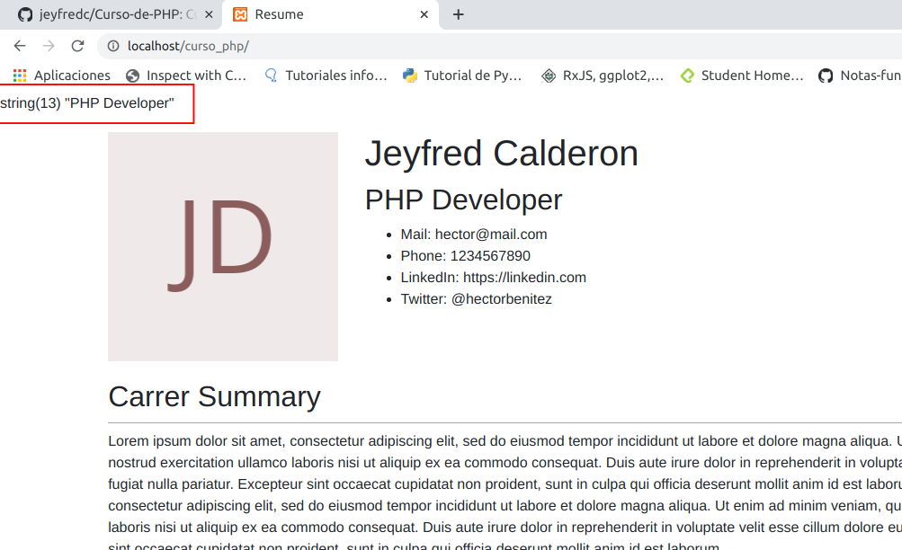

# Curso-de-PHP
Curso de php realizado en Platzi

[Clase 1 Presentación del curso](#Clase-1-Presentación-del-curso)

[Clase 2 ¿Qué es PHP?](#Clase-2-¿Qué-es-PHP?)

[Clase 3 Setup y Herramientas](#Clase-3-Setup-y-Herramientas)

[Clase 4 Revisando el template que usaremos](#Clase-4-Revisando-el-template-que-usaremos)

[Clase 5 Sintaxis de PHP](#Clase-5-Sintaxis-de-PHP)

[Clase 6 Variables tipos de datos y cadenas](#Clase-6-Variables-tipos-de-datos-y-cadenas)

[Clase 7 Tipos de Datos en PHP](Clase-7-Tipos-de-Datos-en-PHP)

[Clase 8 Arreglos](#Clase-8-Arreglos)

[Clase 9 Condicionales y Ciclos](#Clase-9-Condicionales-y-Ciclos)

[]()

[]()

[]()

[]()


## Clase 1 Presentación del curso

En este curso veremos:

- Programación orientada a Objetos.

- Conexión a bases de datos.

- Usaremos los estándares de PHP.

- Implementaremos librerías de terceros.

- Estructuraremos nuestro proyecto de una forma muy profesional que te servirá para futuros proyectos.

## Clase 2 ¿Qué es PHP?

PHP es un lenguaje de programación de propósito general de alto nivel que fue diseñado especialmente para el desarrollo de aplicaciones web.

Es interpretado lo cual quiere decir que a diferencia de otros lenguajes de programacion como JAVA en el cual se genera un paquete que puede ser distribuido. PHP lo que hace es que recibe el codigo y requiere de la instalacion del interprete de PHP en el computador donde se quiere ejecutar el codigo, es decir cuando se quiere ejecutar una aplicacion de PHP lo que se hace es utilizar en un servidor web, un servidor APACHE o ENGINEX y a ese se le agrega el interprete PHP. Quiere decir que cuando alguien manda a llamar la pagina se va a empezar a interpretar PHP en ese momento y lanzar la salida hacia el cliente.

PHP es un lenguaje multiplataforma, open source, el cual ha sido muy popular en los últimos años.

**¿Qué NO es PHP?**

- No es un lenguaje compilado, por lo cual siempre tendrás que llevar juntos tu código y tu interprete.

- No esta diseñado para realizar aplicaciones de escritorio.

Para trabajar con PHP instalaremos un entorno de desarrollo llamado XAMPP, no es un entorno pensado para producción.

## Clase 3 Setup y Herramientas

Antes de trabajar con PHP lo primero que se debe hacer es preparar todo el entorno para poder trabajar con este. la herramienta a usar es XAMPP, la **X** viene porque puede ser utilizado en cualquier **sistema operativo**, la **A** viene porque tiene incluido **APACHE**, la **M** porque tiene incluido **MariaDB** (la cual es una derivación que viene de Mysql que funciona igual y utiliza las mismas herramientas), la **P** viene de **PHP** y la otra **P** viene de **Perl**

en el enlace esta la pagina de PHP https://www.apachefriends.org/index.html

**Realizar instalación en LINUX**

- Se debe ingresar a la pagina y seleccionar la opcion XAMPP for Linux, automaticamente empezara a descargar un archivo

- Abrir la terminal de linux con Ctrl + alt + t y luego ingresar a la carpeta donde se haya descargado el archivo

- ejecutar la siguiente instrucción

    ```
    chmod 755 xampp-linux-*-installer.run
    ```
el comando se utiliza para cambiar los permisos

- luego ejecutar el instalador con la siguiente instrucción

    ```
    sudo ./xampp-linux-*-installer.run
    ```
- luego se inicia el setup, dar en next


- Desmarcar la opcion de XAMPP Developer y dar en next


- Siguiente ventana informa que XAMPP se va a instalar en el directorio 

    ```
    /opt/lampp
    ```
Luego dar en next a las siguientes opciones

luego de terminar de realizar la instalación dar en finish con la opcion de **Launch XAMPP** marcada y a continuación se va a abrir la siguiente ventana


con la opcion marcada en la pestaña de Manage Services se puede ver que servicios estan encendidos o apagados, estos servicios se pueden iniciar o detener con **Start** o **Stop**, inicialmente los servicios a tener instalados son **Apache Web Server** y **mySQL Database**

luego de esto se puede abrir el navegador web escribir localhost y a continuación aparecera esta pantalla


en **PHPInfo** se puede ver toda la información respecto a la instalación realiazada

en **phpMyAdmin** se puede ingresar a un cliente que permite la conexion a base de datos

para volver a abrir la ventana en linux se debe ejecutar en la terminal con el siguiente comando siempre que se quiera iniciar o detener un servicio

```
sudo /opt/lampp/manager-linux-x64.run
```

## Clase 4 Revisando el template que usaremos

Descargar en el repositorio  en la carpeta **archivos_descarga** el archivo llamado **index.html** y **style.css**, los cuales se empezaran a modificar a medida que avance el curso 

el archivo en **linux** se debe descargar en el sistema de archivos

```
/opt/lampp/htdocs
```
en caso de no tener permisos para crear carpetas y documentos en esta direccion ejecutar esta linea de comando en la terminal y cambiar username por el nombre de usuario que tenga establecido, en mi caso es jeyfred y por tanto iria **sudo chown -R jeyfred:jeyfred /opt/lampp/htdocs**

```
sudo chown -R username:username /opt/lampp/htdocs
```
despues de esto crear una carpeta dentro de htdocs llamada **curso_php** y copiar el archivo **index.html** y **style.css**, el cual esta en el repositorio, abrir con el editor de texto de preferencia para visualizar los archivos puede ser en **Visual Studio Code** 

posterior a esto abrir el navegador en google Chrome y abrir la siguiente direccion 

```
http://localhost/curso_php/
```

si todo quedo correcto ya es posible visualizar la pagina que se muestra en el curso


## Clase 5 Sintaxis de PHP

en la carpeta **curso_php** crear un nuevo archivo llamado **hello.php**, dentro del archivo la forma para indicar que se abre php es con la siguiente sintaxis, los comentarios se hacen escriben de la siguiente forma **/* */** para varias lineas o para una linea **//**

```
<?php
/* Todo lo que este dentro de los dos simbolos sera lo que el servidor va a interpretar y sera lo que va a funcionar con el lenguaje de programacion*/
?>
```

Ahora con la instruccion `echo` escribir 'hello PHP'; 


y en el navegador cambiar la ruta **http://localhost/curso_php/**, esta ruta esta buscando directamente a **index.html**, cambiarla por 

```
http://localhost/curso_php/hello.php
```

y a continuacion mostrara en el navegador lo que acabamos de escribir en el archivo **hello.php**


Ahora se pasa a modificar el archivo **index.html**

en la linea 24 donde aparece `<h1>Hector Benitez</h1>` borrar el nombre y probar con el suyo, pero modificandolo asi 

```
<?php echo 'Jeyfred Calderon'; ?>
```


para que el navegador pueda interpretar PHP el archivo **index.html** se debe renombrar o cambiar su extension por **index.php**


guardar cambios y nuevamente recargar la ruta anterior **http://localhost/curso_php/**

y de esta forma empezaran a aplicarse los cambios al navegador, si se deja la extension .html no va a aparecer el nombre que se cambio en el archivo


https://github.com/jeyfredc/Curso-de-PHP#Clase-5-Sintaxis-de-PHP


## Clase 6 Variables tipos de datos y cadenas

Una variable puede ser una pequeña cajita en la que puedes almacenar un valor y este lo pueden usar para realizar alguna operación.

Para declararla usaremos el símbolo de $ y en seguida el nombre, este puede ser un _ o una letra.

PHP no es estáticamente tipado, es decir que no tenemos que decirle qué tipo de dato es esa variable. Además, es débilmente tipado porque podemos fácilmente cambiar el tipo de dato, es decir PHP ejecuta una conversión de datos interna.

Al momento de trabajar con PHP una cosa muy importante es hacer debugging a nuestras variables, para ello utilizamos la función var_dump(); pasándole por parámetro la variable a revisar.

Una practica comun que se usaba, era usar php al principio del documento para no mezclar logica de codigo php con la de html,

A continuacion un ejemplo que se realiza en el archivo **index.php**, donde en las primeras lineas se agrega codigo de


haciendo que ahora se cargue nuevamente el nombre pero como una variable, al comprobar en la pagina no se deben notar cambios en el momento 


si en el archivo se re asignara la variable `$name` con un numero, o otra palabra, PHP va a cargar la ultima que se asigne, el codigo se lee de arriba hacia abajo, por ejemplo, en el ejemplo siguiente la ultima cosa en cargar seria `Jeyfred` y no `Jeyfred Calderon` y si se colocara un numero debajo de la ultima asignacion con la misma variable eso seria lo que apareceria en el navegador

```
<?php
$var1 = 1;
$name = 'Jeyfred Calderon';

$name = 'Jeyfred';
?>
```

la funcion `var_dump()` sirve para debuggear, saber que esta pasando por ejemplo con una variable

```
<?php
$name = 'Jeyfred Calderon';
var_dump($name);
?>
```

Al guardar y cargar esta pagina en el navegador aparecera la informacion que contiene la variable, es decir que es un string con la longitud del texto


En PHP tenemos dos tipos de cadenas, las que son con comillas simples y las de comillas dobles. La diferencia entre estas dos cadenas es que la de comillas simples recibe de forma literal lo que le escribas mientras que la de comillas dobles intenta interpretar cualquier variable dentro de ella.

la primer forma de concatenar es con comillas simples, colocando un punto y la variable como en el siguiente ejemplo

```
<?php
$lastName = 'Calderon';
$name = 'Jeyfred ' . $lastName;
?>
```

la segunda forma es con comillas dobles, estas intentan interpretar cualquier cosa que se encuentre dentro de ellas, si se colocara lo mismo pero entre comillas simples el navegador va imprimir literalmente `Jeyfred $lastName`

```
<?php
$lastName = 'Calderon';
$name = "Jeyfred $lastName";
?>
```

## Clase 7 Tipos de Datos en PHP

PHP cuenta con muchos tipos de datos, sin embargo, en este momento nos vamos a enfocar en los más importantes y utilizados que son boolean, integer, float, string, array y NULL.

**Tipos escalares:**

**boolean:**

Representa solamente un valor verdadero o falso. http://php.net/manual/es/language.types.boolean.php
Valores válidos: true (verdadero) false (falso)

```
<?php
$a = true; 
$b = false; 
?>
```

**Integer:**

Representa un número entero positivo, negativo o 0. http://php.net/manual/es/language.types.integer.php

```
<?php
$a = -123;
$b = 0;
$c = 7763;
?>
```

**float o double:**

Representa un número de punto flotante, existen problemas de precisión con los números flotantes debido a la naturaleza binaria de las computadoras. http://php.net/manual/es/language.types.float.php
```
<?php
$a = 12.24; 
$b = 1.5e3; 
$c = 7E-10;
?> 
```

**string:**

– Representa una cadena de caracteres.
– Existen 4 formas de representar una cadena. Las 2 principales son usando comillas simples o comillas dobles.
---- Usando comillas simples donde el texto será exactamente como se escribe.
---- Usando comillas dobles permite usar caracteres de escape y además expanden los nombres de las variables, es decir sustituye el valor de las variables dentro de las cadenas.
– Hay 2 formas adicionales llamadas Heredoc y Nowdoc que sirven para crear cadenas de múltiples líneas.

Si quieres conocer más de este tipo de dato da click aquí https://www.php.net/manual/es/language.types.string.php#language.types.string.details.

```
<?php
$a = ”Hola”; 
$b = ‘Mundo’; 
?>
```
**Tipos compuestos:**

**array:**

Representa una colección de valores, aunque por defecto PHP usara índices numéricos, la realidad es que la estructura se representa como un mapa que colecciona pares llave-valor. La sintaxis para definir un arreglo será a partir de corchetes cuadrados, aunque en versiones anteriores de PHP era necesario usar la función array(). Las llaves pueden ser enteros o cadenas y los valores pueden ser de cualquier tipo de PHP, incluso de tipo array. http://php.net/manual/es/language.types.array.php
```
<?php
$array = array(
    "curso1" => "php",
    "curso2" => "js",
);

// a partir de PHP 5.4
$array = [
    "curso1" => "php",
    "curso2" => "js",
];

// índices numéricos
$array = [
    "php",
    "js",
];
?>
```

**object:**

Representa una instancia de una clase. Este tema lo veremos más a fondo en la clase de Programación Orientada a Objetos.

```
<?php
class Car
{
    function move()
    {
        echo "Going forward..."; 
    }
}

$myCar = new Car();
$myCar->move();
?>
```

**callable:**

Es un tipo de dato especial que representa a algo que puede ser “llamado”, por ejemplo una función o un método.

```
<?php
// Variable que guarda un callable
$firstOfArray = function(array $array) {
    if (count($array) == 0) { return null; }
    return $array[0];
};

// Este es nuestro arreglo
$values = [3, 2, 1];

// Usamos nuestro callable y se imprime el valor 3
echo $firstOfArray($values);
?>
```

**iterable:**

A partir de PHP 7.1 iterable es un pseudo tipo de datos que puede ser recorrido.

```
<?php

function foo(iterable $iterable) {
    foreach ($iterable as $valor) {
        // ...
    } 
}

?>
```

**Tipos especiales:**

**resource:**

Es un tipo de dato especial que representa un recurso externo, por ejemplo un archivo externo a tu aplicación.

```
<?php
$res = fopen("c:\\dir\\file.txt", "r");
?>
```

**NULL:**

Es un valor especial que se usa para representar una variable sin valor. http://php.net/manual/es/language.types.null.php

```
<?php
$a = null; 
?>
```

## Clase 8 Arreglos

Como vimos en la clase anterior almacenamos datos en una variable, ahora trataremos de almacenar más datos en una misma variable.

Estas variables que almacenan más de un dato se conocen como arreglos y su sintaxis se va a indicar con [ ] (corchetes).

PHP utiliza índices para localizar a los elementos dentro de la variable.

La estructura de arreglos en PHP es conocida como mapa, lo que quiere decir que tiene una composición de llave valor. Además, un arreglo puede contener más arreglos y cada uno de ellos seguirá la misma estructura.

continuando con el archivo **index.php** se estructura el siguiente codigo

```
<?php
$name = "Jeyfred Calderon";
$jobs = [
  'PHP Developer',
  'Python Dev',
  'Devops'
];
?>

```

La forma de poder acceder al arreglo o array jobs es a traves de indices, siendo la primer posicion 0, continuando con el ejemplo se establece un `var_dump` para ver su contenido

```
<?php
$name = "Jeyfred Calderon";
$jobs = [
  'PHP Developer',
  'Python Dev',
  'Devops'
];

?>

```

Al refrescar el navegador sale la primer posicion



y si por ejemplo se quita `[0]` y se deja solo jobs sin los corchetes se va a imprimir toda la cadena indicando cuantos elementos tiene y cada una de las posiciones con su respectiva longitud


Tambien es posible pasar los valores en el html en la parte de **Work position** reemplazar el titulo con etiqueta `h5` por 

```
<h5><?php echo $jobs[0]?></h5>
```

y realizarlo para las siguientes con cada una de las posiciones


Tambien existe otra forma de acceder a los arreglos, y se pueden tener arreglos dentro de arreglos.

Nuevamente se modifica el codigo por lo siguiente

```
<?php
$name = "Jeyfred Calderon";
$jobs = [
  ['title' => 'PHP Developer',
    'description' => 'Este es un trabajo asombroso'],
  ['title' => 'Python Dev'],
  ['title' => 'Devops']
];
?>
```

y nuevamente se reemplazan en la parte de **Work position** por

```
<h5><?php echo $jobs[0]['title']?></h5>
<p><?php echo $jobs[0]['description']?></p>
```


al recargar el navegador estos valores deben aparecer actualizados


## Clase 9 Condicionales y Ciclos

Las condiciones nos permiten tomar decisiones en el código, si se cumple la condición entonces se ejecutarán ciertas instrucciones sino se cumple se ejecutarán otras. Estas se denotan por la instrucción **if else**.

```
<?php
$name = "Jeyfred Calderon";
$jobs = [
  ['title' => 'PHP Developer',
    'description' => 'Este es un trabajo asombroso'],
  ['title' => 'Python Dev'],
  ['title' => 'Devops']
];

$var1 = 2;
if($var1 > 2){// tiene asignado el signo de mayor que , if se lee como si la(condicion) sucede {entonces}
  echo 'Es mayor que 2';
}
elseif($var1 == 2){// tiene asignado el signo de comparacion que esta definido por un doble igual, elseif se lee como si,no(condicion) {entonces}
  echo 'Es igual que 2';
}
else{ // No tiene asignado un simbolo porque ya no se cumple si es mayor o igual , else se lee como de lo contrario la(condicion) sucede {entonces}
  echo 'Es menor que 2';
}
?>
```
practicar primero con estos y luego comentarlos con **/* */**, se puede seleccionar todo, en linux con **ctrl + Shift + a** y queda ese pedazo de codigo comentado

```
/* $var1 = 2;
if($var1> 2){
  echo 'Es mayor que 2';
}
elseif($var1 == 2){
  echo 'Es igual que 2';
}
else{
  echo 'Es menor que 2';
} */
```

Los ciclos funcionan de la mano con las condiciones, en este caso si se cumple la instrucción se estará ejecutando repetidas veces una instrucción dada.

Hemos agregado los jobs de forma manual accediendo al arreglo a través de sus índices, hacer esto podría traer errores y no podríamos controlarlo si tuviéramos muchos jobs. Ahora veamos una mejor forma de hacerlo con ciclos.

- El primero que tenemos es do while que va a involucrar la inicialización de variables y condiciones. la forma en que se lee es haga mientras algo suceda

en el codigo de **index.php** se va a reemplazar con la siguiente linea de codigo lo que anteriormente se habia hecho en **work-position** por lo siguiente **tener en cuenta** que lo que se esta reemplazanda son las 3 secciones de **work-position**

```
            <?php
            $idx = 0;
            do{
              echo '<li class="work-position">';
              echo '<h5>' . $jobs[$idx]['title'] . '</h5>'; //La posicion inicia en 0 y cada vez que llega a while cambia, despues es 1, despues es 2 y despues se rompe la operacion 
              echo '<p>' . $jobs[$idx]['description'] . '</p>'; 
              echo '<strong>Achievements:</strong>';
              echo '<ul>';
              echo '<li>Lorem ipsum dolor sit amet, 80% consectetuer adipiscing elit.</li>';
              echo '<li>Lorem ipsum dolor sit amet, 80% consectetuer adipiscing elit.</li>';
              echo '<li>Lorem ipsum dolor sit amet, 80% consectetuer adipiscing elit.</li>';
              echo '</ul>';
              echo '</li>';
              $idx = $idx +1; // mientras la variable sea menor que 3 es decir posicion 0, 1 y 2 
            }while($idx < 3);
          ?>
```


Al recargar la pagina la descripcion no va a aparecer porque la descripcion para Python Dev y Devops no se ha creado aun


- El segundo que veremos es for que es una forma más simplificada de usar todos los elementos que componen los ciclos.

se trabaja sobre el mismo de la siguiente forma

```
            <?php
            
            for($idx=0; $idx < count($jobs); $idx++){ // El codigo dice para cada posicion mientras que sea menor que 3, (count(jobs) esta contando las posiciones del arreglo, las cuales por el momento son 3) aumente la posicion de 1 en 1  $idx = $idx + 1, se puede sustituir por $idx ++, significa lo mismo
              echo '<li class="work-position">';
              echo '<h5>' . $jobs[$idx]['title'] . '</h5>'; //La posicion inicia en 0 cuando llega hasta el cierre del corchete }, despues es 1, despues es 2 y despues se rompe la operacion 
              echo '<p>' . $jobs[$idx]['description'] . '</p>'; 
              echo '<strong>Achievements:</strong>';
              echo '<ul>';
              echo '<li>Lorem ipsum dolor sit amet, 80% consectetuer adipiscing elit.</li>';
              echo '<li>Lorem ipsum dolor sit amet, 80% consectetuer adipiscing elit.</li>';
              echo '<li>Lorem ipsum dolor sit amet, 80% consectetuer adipiscing elit.</li>';
              echo '</ul>';
              echo '</li>';
            }
          ?>
```

y se obtiene el mismo resultado que antes pero ahorrando codigo

