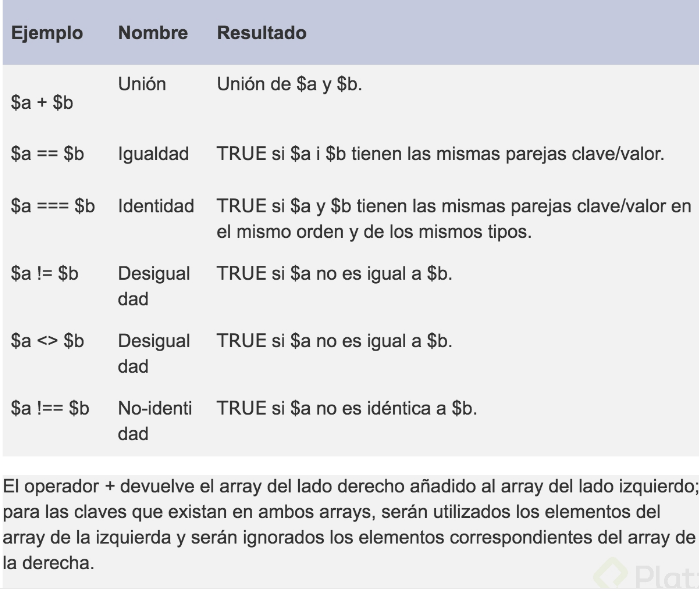
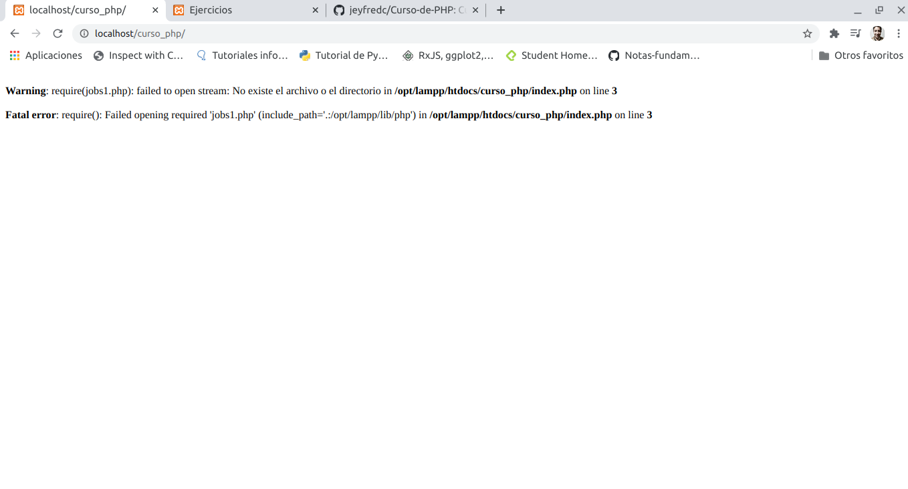
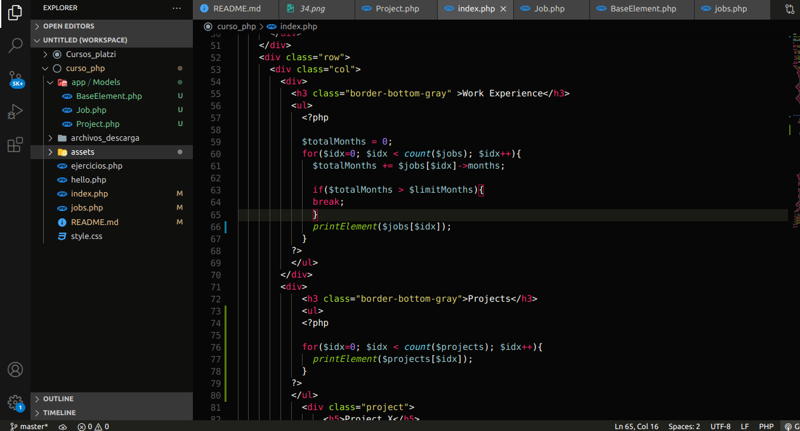
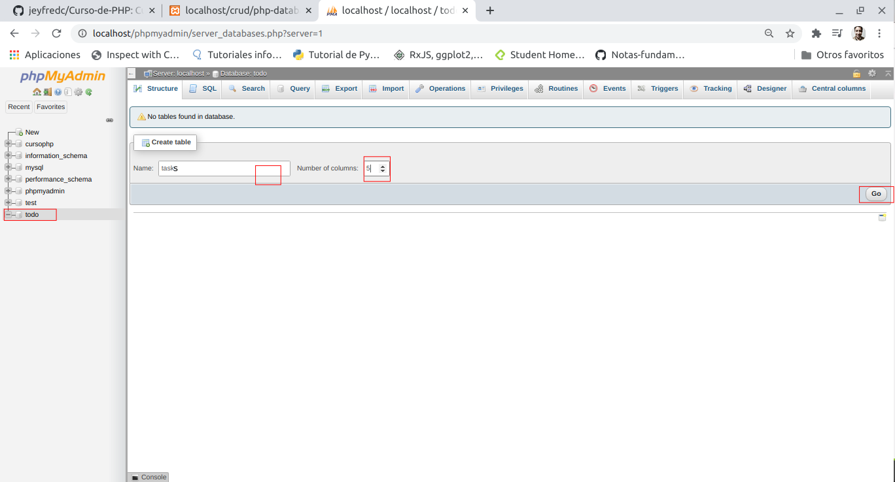
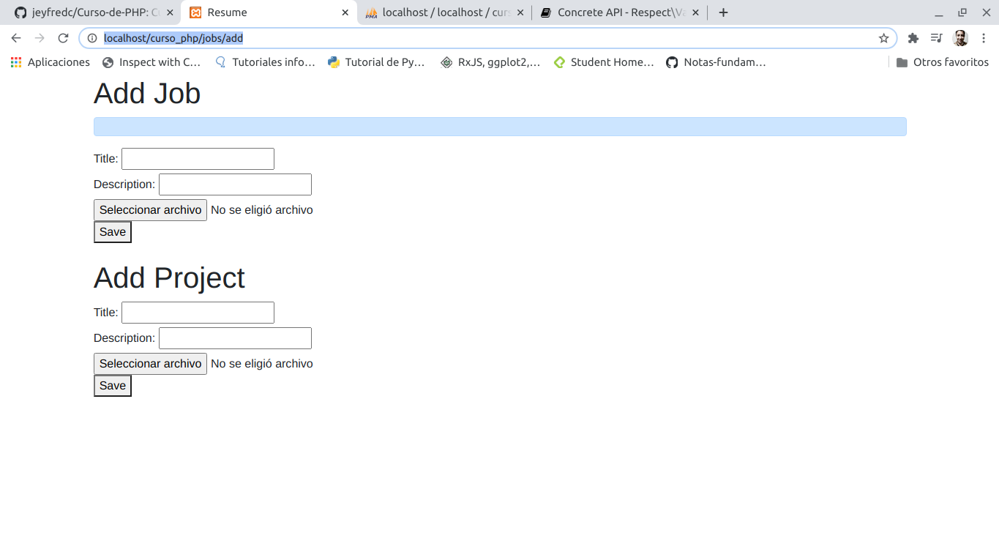

# Curso-de-PHP
Curso de php realizado en Platzi

[Clase 1 Presentación del curso](#Clase-1-Presentación-del-curso)

[Clase 2 ¿Qué es PHP?](#Clase-2-¿Qué-es-PHP?)

[Clase 3 Setup y Herramientas](#Clase-3-Setup-y-Herramientas)

[Clase 4 Revisando el template que usaremos](#Clase-4-Revisando-el-template-que-usaremos)

[Clase 5 Sintaxis de PHP](#Clase-5-Sintaxis-de-PHP)

[Clase 6 Variables tipos de datos y cadenas](#Clase-6-Variables-tipos-de-datos-y-cadenas)

[Clase 7 Tipos de Datos en PHP](Clase-7-Tipos-de-Datos-en-PHP)

[Clase 8 Arreglos](#Clase-8-Arreglos)

[Clase 9 Condicionales y Ciclos](#Clase-9-Condicionales-y-Ciclos)

[Clase 10 Ejercicios Arreglos](#Clase-10-Ejercicios-Arreglos)

[Clase 11 While vs. Do While](#Clase-11-While-vs-Do-While)

[Clase 12 Operadores, Condicionales, Continue y Break](#Clase-12-Operadores-Condicionales-Continue-y-Break)

[Clase 13 Operadores](#Clase-13-Operadores)

[Clase 14 Ejercicios Operadores](#Clase-14-Ejercicios-Operadores)

[Clase 15 Funciones](#Clase-15-Funciones)

[Clase 16 Agregando archivos externos](#Clase-16-Agregando-archivos-externos)

[Clase 17 Programación Orientada a Objetos](#Clase-17-Programación-Orientada-a-Objetos)

[Clase 18 Constructor y Métodos](#Clase-18-Constructor-y-Métodos)

[Clase 19 Herencia](#Clase-19-Herencia)

[Clase 20 Herencia y polimorfismo](#Clase-20-Herencia-y-polimorfismo)

[Clase 21 Interfaces](#Clase-21-Interfaces)

[Clase 22 Namespaces](#Clase-22-Namespaces)

[Clase 23 PSR y PHPFIG](#Clase-23-PSR-y-PHPFIG)

[Clase 24 Composer](#Clase-24-Composer)

[Clase 25 Introducción a las Bases de Datos](#Clase-25-Introducción-a-las-Bases-de-Datos)

[Clase 26 ORM](#Clase-26-ORM)

[Clase 27 Formularios](#Clase-27-Formularios)

[Clase 28 Eloquent](#Clase-28-Eloquent)

[Clase 29 Listar registros de la base de datos con Eloquent](#Clase-29-Listar-registros-de-la-base-de-datos-con-Eloquent)

[Clase 30 Insertar datos en MySql con PHP](#Clase-30-Insertar-datos-en-MySql-con-PHP)

[Clase 31 Front Controller](#Clase-31-Front-Controller)

[Clase 32 PSR7](#Clase-32-PSR7)

[Clase 33 Router](#Clase-33-Router)

[Clase 34 MVC, Creando Controllers](#Clase-34-MVC-Creando-Controllers)

[Clase 35 MVC Reestructurando Vistas y Controladores](#Clase-35-MVC-Reestructurando-Vistas-y-Controladores)

[Clase 36 MVC Controller de la entidad Job](#Clase-36-MVC-Controller-de-la-entidad-Job)

[Clase 37 Template engines](#Clase-37-Template-engines)

[Clase 38 Twig](#Clase-38-Twig)

[Clase 39 Templates con Twig](#Clase-39-Templates-con-Twig)

[Clase 40 Extendiendo Templates con Twig](#Clase-40-Extendiendo-Templates-con-Twig)

[Clase 41 Validaciones](#Clase-41-Validaciones)

[Clase 42 Ejemplo de subida de archivos](#Clase-42-Ejemplo-de-subida-de-archivos)

[]()

[]()

[]()

[]()

[]()

[]()

[]()

[]()


## Clase 1 Presentación del curso

En este curso veremos:

- Programación orientada a Objetos.

- Conexión a bases de datos.

- Usaremos los estándares de PHP.

- Implementaremos librerías de terceros.

- Estructuraremos nuestro proyecto de una forma muy profesional que te servirá para futuros proyectos.

## Clase 2 ¿Qué es PHP?

PHP es un lenguaje de programación de propósito general de alto nivel que fue diseñado especialmente para el desarrollo de aplicaciones web.

Es interpretado lo cual quiere decir que a diferencia de otros lenguajes de programacion como JAVA en el cual se genera un paquete que puede ser distribuido. PHP lo que hace es que recibe el codigo y requiere de la instalacion del interprete de PHP en el computador donde se quiere ejecutar el codigo, es decir cuando se quiere ejecutar una aplicacion de PHP lo que se hace es utilizar en un servidor web, un servidor APACHE o ENGINEX y a ese se le agrega el interprete PHP. Quiere decir que cuando alguien manda a llamar la pagina se va a empezar a interpretar PHP en ese momento y lanzar la salida hacia el cliente.

PHP es un lenguaje multiplataforma, open source, el cual ha sido muy popular en los últimos años.

**¿Qué NO es PHP?**

- No es un lenguaje compilado, por lo cual siempre tendrás que llevar juntos tu código y tu interprete.

- No esta diseñado para realizar aplicaciones de escritorio.

Para trabajar con PHP instalaremos un entorno de desarrollo llamado XAMPP, no es un entorno pensado para producción.

## Clase 3 Setup y Herramientas

Antes de trabajar con PHP lo primero que se debe hacer es preparar todo el entorno para poder trabajar con este. la herramienta a usar es XAMPP, la **X** viene porque puede ser utilizado en cualquier **sistema operativo**, la **A** viene porque tiene incluido **APACHE**, la **M** porque tiene incluido **MariaDB** (la cual es una derivación que viene de Mysql que funciona igual y utiliza las mismas herramientas), la **P** viene de **PHP** y la otra **P** viene de **Perl**

en el enlace esta la pagina de PHP https://www.apachefriends.org/index.html

**Realizar instalación en LINUX**

- Se debe ingresar a la pagina y seleccionar la opcion XAMPP for Linux, automaticamente empezara a descargar un archivo

- Abrir la terminal de linux con Ctrl + alt + t y luego ingresar a la carpeta donde se haya descargado el archivo

- ejecutar la siguiente instrucción

    ```
    chmod 755 xampp-linux-*-installer.run
    ```
el comando se utiliza para cambiar los permisos

- luego ejecutar el instalador con la siguiente instrucción

    ```
    sudo ./xampp-linux-*-installer.run
    ```
- luego se inicia el setup, dar en next


- Desmarcar la opcion de XAMPP Developer y dar en next


- Siguiente ventana informa que XAMPP se va a instalar en el directorio 

    ```
    /opt/lampp
    ```
Luego dar en next a las siguientes opciones

luego de terminar de realizar la instalación dar en finish con la opcion de **Launch XAMPP** marcada y a continuación se va a abrir la siguiente ventana


con la opcion marcada en la pestaña de Manage Services se puede ver que servicios estan encendidos o apagados, estos servicios se pueden iniciar o detener con **Start** o **Stop**, inicialmente los servicios a tener instalados son **Apache Web Server** y **mySQL Database**

luego de esto se puede abrir el navegador web escribir localhost y a continuación aparecera esta pantalla


en **PHPInfo** se puede ver toda la información respecto a la instalación realiazada

en **phpMyAdmin** se puede ingresar a un cliente que permite la conexion a base de datos

para volver a abrir la ventana en linux se debe ejecutar en la terminal con el siguiente comando siempre que se quiera iniciar o detener un servicio

```
sudo /opt/lampp/manager-linux-x64.run
```

## Clase 4 Revisando el template que usaremos

Descargar en el repositorio  en la carpeta **archivos_descarga** el archivo llamado **index.html** y **style.css**, los cuales se empezaran a modificar a medida que avance el curso 

el archivo en **linux** se debe descargar en el sistema de archivos

```
/opt/lampp/htdocs
```
en caso de no tener permisos para crear carpetas y documentos en esta direccion ejecutar esta linea de comando en la terminal y cambiar username por el nombre de usuario que tenga establecido, en mi caso es jeyfred y por tanto iria **sudo chown -R jeyfred:jeyfred /opt/lampp/htdocs**

```
sudo chown -R username:username /opt/lampp/htdocs
```
despues de esto crear una carpeta dentro de htdocs llamada **curso_php** y copiar el archivo **index.html** y **style.css**, el cual esta en el repositorio, abrir con el editor de texto de preferencia para visualizar los archivos puede ser en **Visual Studio Code** 

posterior a esto abrir el navegador en google Chrome y abrir la siguiente direccion 

```
http://localhost/curso_php/
```

si todo quedo correcto ya es posible visualizar la pagina que se muestra en el curso


## Clase 5 Sintaxis de PHP

en la carpeta **curso_php** crear un nuevo archivo llamado **hello.php**, dentro del archivo la forma para indicar que se abre php es con la siguiente sintaxis, los comentarios se hacen escriben de la siguiente forma **/* */** para varias lineas o para una linea **//**

```
<?php
/* Todo lo que este dentro de los dos simbolos sera lo que el servidor va a interpretar y sera lo que va a funcionar con el lenguaje de programacion*/
?>
```

Ahora con la instruccion `echo` escribir 'hello PHP'; 


y en el navegador cambiar la ruta **http://localhost/curso_php/**, esta ruta esta buscando directamente a **index.html**, cambiarla por 

```
http://localhost/curso_php/hello.php
```

y a continuacion mostrara en el navegador lo que acabamos de escribir en el archivo **hello.php**


Ahora se pasa a modificar el archivo **index.html**

en la linea 24 donde aparece `<h1>Hector Benitez</h1>` borrar el nombre y probar con el suyo, pero modificandolo asi 

```
<?php echo 'Jeyfred Calderon'; ?>
```


para que el navegador pueda interpretar PHP el archivo **index.html** se debe renombrar o cambiar su extension por **index.php**


guardar cambios y nuevamente recargar la ruta anterior **http://localhost/curso_php/**

y de esta forma empezaran a aplicarse los cambios al navegador, si se deja la extension .html no va a aparecer el nombre que se cambio en el archivo


https://github.com/jeyfredc/Curso-de-PHP#Clase-5-Sintaxis-de-PHP


## Clase 6 Variables tipos de datos y cadenas

Una variable puede ser una pequeña cajita en la que puedes almacenar un valor y este lo pueden usar para realizar alguna operación.

Para declararla usaremos el símbolo de $ y en seguida el nombre, este puede ser un _ o una letra.

PHP no es estáticamente tipado, es decir que no tenemos que decirle qué tipo de dato es esa variable. Además, es débilmente tipado porque podemos fácilmente cambiar el tipo de dato, es decir PHP ejecuta una conversión de datos interna.

Al momento de trabajar con PHP una cosa muy importante es hacer debugging a nuestras variables, para ello utilizamos la función var_dump(); pasándole por parámetro la variable a revisar.

Una practica comun que se usaba, era usar php al principio del documento para no mezclar logica de codigo php con la de html,

A continuacion un ejemplo que se realiza en el archivo **index.php**, donde en las primeras lineas se agrega codigo de


haciendo que ahora se cargue nuevamente el nombre pero como una variable, al comprobar en la pagina no se deben notar cambios en el momento 


si en el archivo se re asignara la variable `$name` con un numero, o otra palabra, PHP va a cargar la ultima que se asigne, el codigo se lee de arriba hacia abajo, por ejemplo, en el ejemplo siguiente la ultima cosa en cargar seria `Jeyfred` y no `Jeyfred Calderon` y si se colocara un numero debajo de la ultima asignacion con la misma variable eso seria lo que apareceria en el navegador

```
<?php
$var1 = 1;
$name = 'Jeyfred Calderon';

$name = 'Jeyfred';
?>
```

la funcion `var_dump()` sirve para debuggear, saber que esta pasando por ejemplo con una variable

```
<?php
$name = 'Jeyfred Calderon';
var_dump($name);
?>
```

Al guardar y cargar esta pagina en el navegador aparecera la informacion que contiene la variable, es decir que es un string con la longitud del texto


En PHP tenemos dos tipos de cadenas, las que son con comillas simples y las de comillas dobles. La diferencia entre estas dos cadenas es que la de comillas simples recibe de forma literal lo que le escribas mientras que la de comillas dobles intenta interpretar cualquier variable dentro de ella.

la primer forma de concatenar es con comillas simples, colocando un punto y la variable como en el siguiente ejemplo

```
<?php
$lastName = 'Calderon';
$name = 'Jeyfred ' . $lastName;
?>
```

la segunda forma es con comillas dobles, estas intentan interpretar cualquier cosa que se encuentre dentro de ellas, si se colocara lo mismo pero entre comillas simples el navegador va imprimir literalmente `Jeyfred $lastName`

```
<?php
$lastName = 'Calderon';
$name = "Jeyfred $lastName";
?>
```

## Clase 7 Tipos de Datos en PHP

PHP cuenta con muchos tipos de datos, sin embargo, en este momento nos vamos a enfocar en los más importantes y utilizados que son boolean, integer, float, string, array y NULL.

**Tipos escalares:**

**boolean:**

Representa solamente un valor verdadero o falso. http://php.net/manual/es/language.types.boolean.php
Valores válidos: true (verdadero) false (falso)

```
<?php
$a = true; 
$b = false; 
?>
```

**Integer:**

Representa un número entero positivo, negativo o 0. http://php.net/manual/es/language.types.integer.php

```
<?php
$a = -123;
$b = 0;
$c = 7763;
?>
```

**float o double:**

Representa un número de punto flotante, existen problemas de precisión con los números flotantes debido a la naturaleza binaria de las computadoras. http://php.net/manual/es/language.types.float.php
```
<?php
$a = 12.24; 
$b = 1.5e3; 
$c = 7E-10;
?> 
```

**string:**

– Representa una cadena de caracteres.
– Existen 4 formas de representar una cadena. Las 2 principales son usando comillas simples o comillas dobles.
---- Usando comillas simples donde el texto será exactamente como se escribe.
---- Usando comillas dobles permite usar caracteres de escape y además expanden los nombres de las variables, es decir sustituye el valor de las variables dentro de las cadenas.
– Hay 2 formas adicionales llamadas Heredoc y Nowdoc que sirven para crear cadenas de múltiples líneas.

Si quieres conocer más de este tipo de dato da click aquí https://www.php.net/manual/es/language.types.string.php#language.types.string.details.

```
<?php
$a = ”Hola”; 
$b = ‘Mundo’; 
?>
```
**Tipos compuestos:**

**array:**

Representa una colección de valores, aunque por defecto PHP usara índices numéricos, la realidad es que la estructura se representa como un mapa que colecciona pares llave-valor. La sintaxis para definir un arreglo será a partir de corchetes cuadrados, aunque en versiones anteriores de PHP era necesario usar la función array(). Las llaves pueden ser enteros o cadenas y los valores pueden ser de cualquier tipo de PHP, incluso de tipo array. http://php.net/manual/es/language.types.array.php
```
<?php
$array = array(
    "curso1" => "php",
    "curso2" => "js",
);

// a partir de PHP 5.4
$array = [
    "curso1" => "php",
    "curso2" => "js",
];

// índices numéricos
$array = [
    "php",
    "js",
];
?>
```

**object:**

Representa una instancia de una clase. Este tema lo veremos más a fondo en la clase de Programación Orientada a Objetos.

```
<?php
class Car
{
    function move()
    {
        echo "Going forward..."; 
    }
}

$myCar = new Car();
$myCar->move();
?>
```

**callable:**

Es un tipo de dato especial que representa a algo que puede ser “llamado”, por ejemplo una función o un método.

```
<?php
// Variable que guarda un callable
$firstOfArray = function(array $array) {
    if (count($array) == 0) { return null; }
    return $array[0];
};

// Este es nuestro arreglo
$values = [3, 2, 1];

// Usamos nuestro callable y se imprime el valor 3
echo $firstOfArray($values);
?>
```

**iterable:**

A partir de PHP 7.1 iterable es un pseudo tipo de datos que puede ser recorrido.

```
<?php

function foo(iterable $iterable) {
    foreach ($iterable as $valor) {
        // ...
    } 
}

?>
```

**Tipos especiales:**

**resource:**

Es un tipo de dato especial que representa un recurso externo, por ejemplo un archivo externo a tu aplicación.

```
<?php
$res = fopen("c:\\dir\\file.txt", "r");
?>
```

**NULL:**

Es un valor especial que se usa para representar una variable sin valor. http://php.net/manual/es/language.types.null.php

```
<?php
$a = null; 
?>
```

## Clase 8 Arreglos

Como vimos en la clase anterior almacenamos datos en una variable, ahora trataremos de almacenar más datos en una misma variable.

Estas variables que almacenan más de un dato se conocen como arreglos y su sintaxis se va a indicar con [ ] (corchetes).

PHP utiliza índices para localizar a los elementos dentro de la variable.

La estructura de arreglos en PHP es conocida como mapa, lo que quiere decir que tiene una composición de llave valor. Además, un arreglo puede contener más arreglos y cada uno de ellos seguirá la misma estructura.

continuando con el archivo **index.php** se estructura el siguiente codigo

```
<?php
$name = "Jeyfred Calderon";
$jobs = [
  'PHP Developer',
  'Python Dev',
  'Devops'
];
?>

```

La forma de poder acceder al arreglo o array jobs es a traves de indices, siendo la primer posicion 0, continuando con el ejemplo se establece un `var_dump` para ver su contenido

```
<?php
$name = "Jeyfred Calderon";
$jobs = [
  'PHP Developer',
  'Python Dev',
  'Devops'
];

?>

```

Al refrescar el navegador sale la primer posicion


y si por ejemplo se quita `[0]` y se deja solo jobs sin los corchetes se va a imprimir toda la cadena indicando cuantos elementos tiene y cada una de las posiciones con su respectiva longitud


Tambien es posible pasar los valores en el html en la parte de **Work position** reemplazar el titulo con etiqueta `h5` por 

```
<h5><?php echo $jobs[0]?></h5>
```

y realizarlo para las siguientes con cada una de las posiciones


Tambien existe otra forma de acceder a los arreglos, y se pueden tener arreglos dentro de arreglos.

Nuevamente se modifica el codigo por lo siguiente

```
<?php
$name = "Jeyfred Calderon";
$jobs = [
  ['title' => 'PHP Developer',
    'description' => 'Este es un trabajo asombroso'],
  ['title' => 'Python Dev'],
  ['title' => 'Devops']
];
?>
```

y nuevamente se reemplazan en la parte de **Work position** por

```
<h5><?php echo $jobs[0]['title']?></h5>
<p><?php echo $jobs[0]['description']?></p>
```


al recargar el navegador estos valores deben aparecer actualizados


## Clase 9 Condicionales y Ciclos

Las condiciones nos permiten tomar decisiones en el código, si se cumple la condición entonces se ejecutarán ciertas instrucciones sino se cumple se ejecutarán otras. Estas se denotan por la instrucción **if else**.

```
<?php
$name = "Jeyfred Calderon";
$jobs = [
  ['title' => 'PHP Developer',
    'description' => 'Este es un trabajo asombroso'],
  ['title' => 'Python Dev'],
  ['title' => 'Devops']
];

$var1 = 2;
if($var1 > 2){// tiene asignado el signo de mayor que , if se lee como si la(condicion) sucede {entonces}
  echo 'Es mayor que 2';
}
elseif($var1 == 2){// tiene asignado el signo de comparacion que esta definido por un doble igual, elseif se lee como si,no(condicion) {entonces}
  echo 'Es igual que 2';
}
else{ // No tiene asignado un simbolo porque ya no se cumple si es mayor o igual , else se lee como de lo contrario la(condicion) sucede {entonces}
  echo 'Es menor que 2';
}
?>
```
practicar primero con estos y luego comentarlos con **/* */**, se puede seleccionar todo, en linux con **ctrl + Shift + a** y queda ese pedazo de codigo comentado

```
/* $var1 = 2;
if($var1> 2){
  echo 'Es mayor que 2';
}
elseif($var1 == 2){
  echo 'Es igual que 2';
}
else{
  echo 'Es menor que 2';
} */
```

Los ciclos funcionan de la mano con las condiciones, en este caso si se cumple la instrucción se estará ejecutando repetidas veces una instrucción dada.

Hemos agregado los jobs de forma manual accediendo al arreglo a través de sus índices, hacer esto podría traer errores y no podríamos controlarlo si tuviéramos muchos jobs. Ahora veamos una mejor forma de hacerlo con ciclos.

- El primero que tenemos es do while que va a involucrar la inicialización de variables y condiciones. la forma en que se lee es haga mientras algo suceda

en el codigo de **index.php** se va a reemplazar con la siguiente linea de codigo lo que anteriormente se habia hecho en **work-position** por lo siguiente **tener en cuenta** que lo que se esta reemplazanda son las 3 secciones de **work-position**

```
            <?php
            $idx = 0;
            do{
              echo '<li class="work-position">';
              echo '<h5>' . $jobs[$idx]['title'] . '</h5>'; //La posicion inicia en 0 y cada vez que llega a while cambia, despues es 1, despues es 2 y despues se rompe la operacion 
              echo '<p>' . $jobs[$idx]['description'] . '</p>'; 
              echo '<strong>Achievements:</strong>';
              echo '<ul>';
              echo '<li>Lorem ipsum dolor sit amet, 80% consectetuer adipiscing elit.</li>';
              echo '<li>Lorem ipsum dolor sit amet, 80% consectetuer adipiscing elit.</li>';
              echo '<li>Lorem ipsum dolor sit amet, 80% consectetuer adipiscing elit.</li>';
              echo '</ul>';
              echo '</li>';
              $idx = $idx +1; // mientras la variable sea menor que 3 es decir posicion 0, 1 y 2 
            }while($idx < 3);
          ?>
```


Al recargar la pagina la descripcion no va a aparecer porque la descripcion para Python Dev y Devops no se ha creado aun


- El segundo que veremos es for que es una forma más simplificada de usar todos los elementos que componen los ciclos.

se trabaja sobre el mismo de la siguiente forma

```
            <?php
            
            for($idx=0; $idx < count($jobs); $idx++){ // El codigo dice para cada posicion mientras que sea menor que 3, (count(jobs) esta contando las posiciones del arreglo, las cuales por el momento son 3) aumente la posicion de 1 en 1  $idx = $idx + 1, se puede sustituir por $idx ++, significa lo mismo
              echo '<li class="work-position">';
              echo '<h5>' . $jobs[$idx]['title'] . '</h5>'; //La posicion inicia en 0 cuando llega hasta el cierre del corchete }, despues es 1, despues es 2 y despues se rompe la operacion 
              echo '<p>' . $jobs[$idx]['description'] . '</p>'; 
              echo '<strong>Achievements:</strong>';
              echo '<ul>';
              echo '<li>Lorem ipsum dolor sit amet, 80% consectetuer adipiscing elit.</li>';
              echo '<li>Lorem ipsum dolor sit amet, 80% consectetuer adipiscing elit.</li>';
              echo '<li>Lorem ipsum dolor sit amet, 80% consectetuer adipiscing elit.</li>';
              echo '</ul>';
              echo '</li>';
            }
          ?>
```

y se obtiene el mismo resultado que antes pero ahorrando codigo


## Clase 10 Ejercicios Arreglos

**Ejercicio 1.**

Escribe el código necesario para generar la cadena final usando el arreglo dado

```
$arreglo = [

	‘keyStr1’ => ‘lado’,
	0 => ‘ledo’,

	‘keyStr2’ => ‘lido’,
	1 => ‘lodo’,
	2 => ‘ludo’

];

```

Lado, ledo, lido, lodo, ludo,
decirlo al revés lo dudo.
Ludo, lodo, lido, ledo, lado,
¡Qué trabajo me ha costado!

**Ejercicio 2.**

Crea un arreglo que contenga como clave los nombres de 5 países y como valor otro arreglo con 3 ciudades que pertenezcan a ese país, después utiliza un ciclo foreach, para imprimir el nombre del país seguido de las ciudades que definiste:

Ejemplo,

México: Monterrey Querétaro Guadalajara
Colombia: Bogota Cartagena Medellin

**Ejercicio 3.**

Escribe el código necesario para encontrar los 3 números más grandes y los 3 números más bajos de la siguiente lista:

```
$valores = [23, 54, 32, 67, 34, 78, 98, 56, 21, 34, 57, 92, 12, 5, 61]
```

## Clase 11 While vs. Do While

**ciclos**

Como mencionamos en nuestra clase anterior, los ciclos o bucles son de total importancia cuando desarrollamos software pues nos permiten repetir un bloque de acciones y en consecuencia re-utilizar mejor nuestro código, en este momento ya hablamos de cómo funciona el ciclo for y el ciclo do-while.

Ahora vamos a revisar un par de ciclos adicionales en PHP los cuales también es importante conocer. Toma en cuenta que la mayoría de las cosas se pueden hacer de diferentes maneras por lo tanto es importante que elijas bien cual es el ciclo que mejor se adapta a tu problema.

**while vs. do… while**

En la clase anterior hablamos del ciclo do while, aquí lo compararemos con otro ciclo llamado while, recapitulemos el funcionamiento de do… while:

Cuando creamos un ciclo do… while, le decimos a PHP que ejecute cierto bloque de código siempre y cuando la condición que tengas dentro se siga evaluando como verdadera.

Esta es la sintaxis de un ciclo do… while

```
do {
   codigo…
} while (condicion)
```

El ciclo while funciona de la misma manera, pero la diferencia principal es que la evaluación se llevará a cabo al iniciar el ciclo:

```
while (condicion) {
   codigo...
}
```

La principal diferencia es que el ciclo do while garantiza que el código interno se ejecutará al menos 1 vez, mientras que en el ciclo while si la condición es falsa desde un inicio, es posible que el ciclo nunca se ejecute

http://php.net/manual/es/control-structures.while.php
http://php.net/manual/es/control-structures.do.while.php

**foreach**

El ciclo foreach nos brinda una solución simple para iterar sobre los valores de un arreglo, la sintaxis es la siguiente:

```
foreach ($array as $valor) {
    sentencias que pueden usar $valor
}
```

En esta sintaxis nos encontramos con 4 partes:

- La palabra reservada foreach simplemente indica el inicio de nuestro bloque

- Dentro de paréntesis se escribe el nombre del arreglo que vamos a estar iterando, este arreglo debe estar definido previamente, en este ejemplo es $arreglo

- La palabra “as” seguido de un nombre de variable que usaremos para acceder al elemento del arreglo que estamos accediendo, esta variable no debe existir previamente y solo la podrán usar dentro de este bloque. En el ejemplo es $valor.

- Entre llaves “{ }” todas las acciones que queremos repetir, en el momento en que se ejecute el ciclo la variable que definimos para iterar (en el ejemplo $valor) ya existe y podrá ser usada en esta sección, piensa que el valor de esta variable estará cambiando en cada iteración.

Suponiendo que en el ejemplo anterior $array = [‘uno’, ‘dos’, ‘tres’], el ciclo se repetirá 3 veces y en cada iteración la variable $valor contendrá el elemento del arreglo correspondiente, es decir, en la primera iteración $valor será igual a ‘uno’, en la segunda $valor será igual a ‘dos’ y en la tercera $valor será igual a ‘tres’.

Existe una sintaxis alternativa que nos permite no solo conocer el valor, también nos permitirá conocer la llave, de este modo tendremos acceso tanto a la llave como al valor del elemento del arreglo:

```
foreach ($array as $llave => $valor) {
    sentencias que pueden usar $llave y $valor
}
```
http://php.net/manual/es/control-structures.foreach.php

## Clase 12 Operadores, Condicionales, Continue y Break

En PHP existen cuatro tipos principales de operadores:

- Aritméticos.( +, -, /, *)

- Asignación. (=)

- Condicionales.(if, else, elseif)

- Comparación (> mayor que, < menor que , == igual a , != diferente de)

- Incremento (i++ o  i = i + 1).

Aprovechemos para practicar y veamos más sobre condiciones, en PHP tenemos el operador de comparación (==) y diferente de (!=).

Tenemos la sentencia **continue** la cuál al ejecutarse hará que se itere a la siguiente línea del arreglo. Y la sentencia **break** que hará que el ciclo se termine.

En el archivo **index.php** en el array jobs agregar el siguiente codigo donde `'visible'` utiliza tipos de dato Booleano, falso o verdadero

```
<?php
$name = "Jeyfred Calderon";
$jobs = [
  ['title' => 'PHP Developer',
    'description' => 'Este es un trabajo asombroso',
    'visible' => true],
  ['title' => 'Python Dev',
  'visible' => false],
  ['title' => 'Devops',
  'visible' => false],
  ['title' => 'Node Dev',
  'visible' => true],
  ['title' => 'Frontend Dev',
  'visible' => true]  
];
/* $var1 = 2;
if($var1> 2){
  echo 'Es mayor que 2';
}
elseif($var1 == 2){
  echo 'Es igual que 2';
}
else{
  echo 'Es menor que 2';
} */

?>
```

ahora donde se estaba haciendo el for para los work-position, donde si `'visible'` es `True` o verdadero se va a mostrar eso en Work Experiencie al volver a cargar la pagina

```
            <?php

            for($idx=0; $idx < count($jobs); $idx++){ 
              if($jobs[$idx]['visible'] == true){
                echo '<li class="work-position">';
                echo '<h5>' . $jobs[$idx]['title'] . '</h5>';  
                echo '<p>' . $jobs[$idx]['description'] . '</p>'; 
                echo '<strong>Achievements:</strong>';
                echo '<ul>';
                echo '<li>Lorem ipsum dolor sit amet, 80% consectetuer adipiscing elit.</li>';
                echo '<li>Lorem ipsum dolor sit amet, 80% consectetuer adipiscing elit.</li>';
                echo '<li>Lorem ipsum dolor sit amet, 80% consectetuer adipiscing elit.</li>';
                echo '</ul>';
                echo '</li>';
              }
            }
            ?>
```

Modificando el codigo anterior, a este se le va a agregar **continue** y visible va a pasar ahora a ser `false`, lo que significa es que si la visibilidad del trabajo es falsa continue y ejecute la siguiente instruccion

```
            <?php

            for($idx=0; $idx < count($jobs); $idx++){ 
              if($jobs[$idx]['visible'] == false){
                continue;
              }
              echo '<li class="work-position">';
              echo '<h5>' . $jobs[$idx]['title'] . '</h5>';  
              echo '<p>' . $jobs[$idx]['description'] . '</p>'; 
              echo '<strong>Achievements:</strong>';
              echo '<ul>';
              echo '<li>Lorem ipsum dolor sit amet, 80% consectetuer adipiscing elit.</li>';
              echo '<li>Lorem ipsum dolor sit amet, 80% consectetuer adipiscing elit.</li>';
              echo '<li>Lorem ipsum dolor sit amet, 80% consectetuer adipiscing elit.</li>';
              echo '</ul>';
              echo '</li>';
            }
            ?>
```

al recargar la pagina no existira una diferencia con respecto a la primera isntruccion del for

ahora a el array jobs se le van agregar los meses de experiencia en cada trabajo, el array queda de la siguiente forma

```
<?php
$name = "Jeyfred Calderon";
$limitMonths = 12;
$jobs = [
  ['title' => 'PHP Developer',
    'description' => 'Este es un trabajo asombroso',
    'visible' => true,
    'months' => 6],
  ['title' => 'Python Dev',
  'visible' => false,
  'months' => 4],
  ['title' => 'Devops',
  'visible' => false,
  'months' => 5],
  ['title' => 'Node Dev',
  'visible' => true,
  'months' => 2],
  ['title' => 'Frontend Dev',
  'visible' => true,
    'months' => 3]  
];

/* $var1 = 2;
if($var1> 2){
  echo 'Es mayor que 2';
}
elseif($var1 == 2){
  echo 'Es igual que 2';
}
else{
  echo 'Es menor que 2';
} */

?>
```

y ahora en el for se va agregar otra condicion donde se le va indicar que solo aparezcan trabajos donde haya trabajado en los ultimos 12 meses, para eso antes del array jobs se crea una variable llamda `$limitMonths = 12;`, y ahora antes del for, se crea la variable `$totalMonths = 0;`, la cual va a funcionar como un contador y este se tiene que inicializar en 0, posteriormente entre el for y el if se agrega la siguiente instruccion `$totalMonths = $totalMonths + $jobs[$idx]['months']`, lo que esta haciendo esta es que `$idx` hace la iteracion sobre los meses y la variable `$totalMonths` va sumando los meses, como lo que se quiere es imprimir trabajos no superiores a 12 meses se agrega otro if statements `if($totalMonths > $limitMonths){break;}` el cual indica que si el total de meses llega a ser superior a 12 deje de ejecutar el codigo y continue hacia el siguiente if statements

```
            <?php
            
            $totalMonths = 0;
            for($idx=0; $idx < count($jobs); $idx++){ 
              $totalMonths += $jobs[$idx]['months'];

              if($totalMonths > $limitMonths){
              break;
              }

              if($jobs[$idx]['visible'] != true){
                continue;
              }
              echo '<li class="work-position">';
              echo '<h5>' . $jobs[$idx]['title'] . '</h5>';  
              echo '<p>' . $jobs[$idx]['description'] . '</p>';
              echo '<p>' . $totalMonths . '</p>'; 
              echo '<strong>Achievements:</strong>';
              echo '<ul>';
              echo '<li>Lorem ipsum dolor sit amet, 80% consectetuer adipiscing elit.</li>';
              echo '<li>Lorem ipsum dolor sit amet, 80% consectetuer adipiscing elit.</li>';
              echo '<li>Lorem ipsum dolor sit amet, 80% consectetuer adipiscing elit.</li>';
              echo '</ul>';
              echo '</li>';
            }
          ?>
```

al recargar la pagina debe salir el primer trabajo el cual duro 6 meses + el segundo que fueron 4 meses, el tercero suma a 15 por tanto se detiene en 10 meses y no imprime mas trabajos


## Clase 13 Operadores

Antes de continuar hablando de operadores es importante mencionar que existe un concepto conocido como precedencia de operadores el cual nos permitirá saber en qué orden se deben ejecutar los operadores que se encuentren en una sola sentencia.

Por ejemplo, en la sentencia:

**1 + 2 * 3**

Se ejecutará primero la operación **2 * 3**
Luego se ejecutará la suma con **1**

Esto es debido a que * tiene más valor en la precedencia que el +.

Una forma sencilla de controlar la precedencia es utilizando () paréntesis, de esta forma podemos forzar el orden que nosotros queramos, por ejemplo (1 + 2) * 3 será una versión diferente y se ejecutará primero la suma y luego la multiplicación.

Te dejo el enlace por si quieres consultar más información al respecto. http://php.net/manual/es/language.operators.precedence.php

Ahora continuemos hablando sobre los tipos de operadores, algunos ya los vimos, pero de igual forma vamos a reforzarlos enfocándonos en los más importantes.

**Operadores aritméticos**

http://php.net/manual/es/language.operators.arithmetic.php

Funcionan para realizar operaciones aritméticas.


**Operadores de asignación**

http://php.net/manual/es/language.operators.assignment.php

El operador principal de asignación es el símbolo = (igual). Es importante tener en cuenta que este operador no sirve para comparar, normalmente del lado izquierdo del operador tendremos una variable, y este operador sirve para asignar el resultado de lo que se encuentre a la derecha a dicha variable.

$variable = 5;

Lo que tenemos en la derecha puede ser un valor, otra variable, o el resultado de una operación o función.

También existen otros operadores de asignación que se combinan con operadores aritméticos o para strings y nos permiten simplificar algunas sentencias dentro de PHP. Estos son ejemplos de cómo funcionan:

$a += $b
$a = $a + $b

$a -= $b
$a = $a - $b

$a *= $b
$a = $a * $b

$a /= $b
$a = $a / $b

$a %= $b
$a = $a % $b

$a .= $b
$a = $a . $b

**Operadores de comparación**

http://php.net/manual/es/language.operators.comparison.php

Nos permiten comparar valores.


**Operadores de incremento/decremento**

http://php.net/manual/es/language.operators.increment.php

Permiten incrementar o decrementar un valor en 1.


Es muy importante entender cómo afecta el lugar donde se establece el operador, ejemplo:

```
$a = 1;
echo $a++;
echo $a;
echo ++$a;
echo $a;
```

imprime

```
1
2
3
3
```

**Operadores lógicos**

http://php.net/manual/es/language.operators.logical.php

Nos permiten combinar resultados de comparaciones.


**Operadores para strings**

Existen 2 operadores para strings el . (punto) que nos permite concatenar cadenas, y el .= que ya fue visto anteriormente y nos permite simplificar la sintaxis de concatenar algo a una misma cadena, ejemplo:

```
$var1 = ‘Hola ’ . ‘ php’;
$var1 .= ‘!!!’;
echo $var1;
```
imprime
```
Hola php!!!
```

**Operadores para arrays**

http://php.net/manual/es/language.operators.array.php



## Clase 14 Ejercicios Operadores

**Ejercicio 1.**

Calcula el resultado de 32+3 y 3(2+3). Escribe el procedimiento que empleaste en la sección de discusiones.

**Ejercicio 2.**

Tomando en cuenta que tenemos una variable llamada $valor, escribe en la sección de discusiones ¿Cómo sería un condicional para las siguientes opciones?

- $valor es mayor que 5 pero menor que 10

- $valor es mayor o igual a 0 pero menor o igual a 20

- $valor es igual a “10” asegurando que el tipo de dato sea cadena

- $valor es mayor a 0 pero menor a 5 o es mayor a 10 pero menor a 15

## Clase 15 Funciones

Las funciones en PHP se denotan por la palabra reservada function seguida por el nombre de la función, las funciones nos servirán para llamar y reutilizar código en nuestros proyectos.

Cuando trabajemos con funciones es muy importante cuidar el scope (alcance) de las variables pues, algunas podrían entrar en su scope y otras no.

Las funciones en PHP pueden o no regresar un dato particular. Si deseamos hacerlo podemos indicarlo con la palabra reservada return.

RETO: Utiliza condicionales para validar los años que tengan valor cero.

Las funciones son estructuras que permiten encapsular o reunir cierta funcionalidad para poderla re utilizar, en el archivo **index.php**, se va a declarar debajo del array jobs una funcion llamada `printJob` la cual va de esta forma inicialmente dentro de los parentesis () pueden ir o no parametros y despues  van las llaves en las cuales esta todo el contenido de la funcion

```
function printJob() {
  // Contenido de la funcion
}
```

al declarar esta funcion lo unico que se esta haciendo es declarar que se puede utilizar pero de momento no va a aparecer al recargar la pagina porque solo esta declarada y no se ha mandado a llamar

```
function printJob() {
  echo 'jobs';
}
```

para que se pueda utilizar se debe ejecutar la sentencia a continuacion

```
printJob();
```
en este caso ya se esta mandando a llamar


y ahora va aparecer cuando se recargue el navegador


y el codigo,se puede re utilizar cuantas veces se requiera

Ahora lo que se va a hacer es agregar un parametro a la funcion `printJob` que se llama `$job` y cambiar el codigo interno de la funcion

```
function printJob($job){

}
```

y ahora se agrega todo el codigo que anteriormente se estaba usando para imprimir sin el for, ni el if 

```
function printJob($job){
  echo '<li class="work-position">';
  echo '<h5>' . $jobs[$idx]['title'] . '</h5>';  
  echo '<p>' . $jobs[$idx]['description'] . '</p>';
  echo '<p>' . $totalMonths . '</p>'; 
  echo '<strong>Achievements:</strong>';
  echo '<ul>';
  echo '<li>Lorem ipsum dolor sit amet, 80% consectetuer adipiscing elit.</li>';
  echo '<li>Lorem ipsum dolor sit amet, 80% consectetuer adipiscing elit.</li>';
  echo '<li>Lorem ipsum dolor sit amet, 80% consectetuer adipiscing elit.</li>';
  echo '</ul>';
  echo '</li>';
}
```
y el codigo que se quito del for y el if se va a reemplazar por la funcion pasandole como parametro la variable con el iterador

```
            <?php
            
            $totalMonths = 0;
            for($idx=0; $idx < count($jobs); $idx++){ 
              $totalMonths += $jobs[$idx]['months'];

              if($totalMonths > $limitMonths){
              break;
              }

              if($jobs[$idx]['visible'] != true){
                continue;
              }
              printJob($jobs[$idx]);
            }
          ?>
```

pero si se pasa la variable `$jobs` en la funcion, va a marcar un error porque aun no existe dentro de la funcion y a esto se le conoce como scope o alcance. y la funcion creada inicialmente tiene un scope interno, por tanto en la funcion se debe cambiar `jobs[$idx]` por `job`, porque es lo que esta recibiendo la funcion, ademas tambien se cancela o se comentarea `$totalMonths` porque desde la funcion ya no se tiene acceso a la variable 

```
function printJob($job) {
  echo '<li class="work-position">';
  echo '<h5>' . $job['title'] . '</h5>';  
  echo '<p>' . $job['description'] . '</p>';
  //echo '<p>' . $totalMonths . '</p>'; 
  echo '<strong>Achievements:</strong>';
  echo '<ul>';
  echo '<li>Lorem ipsum dolor sit amet, 80% consectetuer adipiscing elit.</li>';
  echo '<li>Lorem ipsum dolor sit amet, 80% consectetuer adipiscing elit.</li>';
  echo '<li>Lorem ipsum dolor sit amet, 80% consectetuer adipiscing elit.</li>';
  echo '</ul>';
  echo '</li>';
}
```
al recargar la pagina ya se pueden ver los trabajos nuevamente ademas si la variable `$limitMonths` pasa de 12a a 24 meses .

Ahora antes de la funcion `printJob` se va a generar otra funcion para generar cual es la duracion que tenemos o tuvimos en cada trabajo, esta funcion se va a llamar `function getDuration()`, en esta se va a generar una cadena, que va a tener cuantos años y meses son los de cada trabajo, que se establecieron en un principio en el array y tambien se va a añadir una modificacion a la funcion `printJob` que va a llamar la funcion que acabamos de crear, el codigo queda asi

```
<?php
$name = "Jeyfred Calderon";
$limitMonths = 24;
$jobs = [
  ['title' => 'PHP Developer',
    'description' => 'Este es un trabajo asombroso',
    'visible' => true,
    'months' => 6],
  ['title' => 'Python Dev',
  'visible' => true,
  'months' => 4],
  ['title' => 'Devops',
  'visible' => true,
  'months' => 5],
  ['title' => 'Node Dev',
  'visible' => true,
  'months' => 2],
  ['title' => 'Frontend Dev',
  'visible' => true,
    'months' => 3]  
];

function getDuration($months){
  return "$months months";
}

function printJob($job) {
  echo '<li class="work-position">';
  echo '<h5>' . $job['title'] . '</h5>';  
  echo '<p>' . $job['description'] . '</p>';
  echo '<p>' . getDuration($job['months']) . '<p>';
  echo '<strong>Achievements:</strong>';
  echo '<ul>';
  echo '<li>Lorem ipsum dolor sit amet, 80% consectetuer adipiscing elit.</li>';
  echo '<li>Lorem ipsum dolor sit amet, 80% consectetuer adipiscing elit.</li>';
  echo '<li>Lorem ipsum dolor sit amet, 80% consectetuer adipiscing elit.</li>';
  echo '</ul>';
  echo '</li>';
}

```

y al recargar la pagina, ya va a aparecer la informacion de cada trabajo, con el numero de meses 


## Clase 16 Agregando archivos externos

Organizaremos mejor nuestro código para ello lo separaremos en otro archivo llamado jobs.php.

Usaremos la palabra reservada include para hacer que el archivo index incluya el archivo jobs.php, si lo encuentra lo incluye, pero si no nos mostrará un warning. Existe otro llamado require que si no lo encuentra nos muestra un error en todo el archivo.

Los métodos include y require ejecutan el código del archivo cada vez que lo incluyen, esto puede traer errores en la ejecución de tu código si tienes archivos con funciones pues te dirá que no puedes declarar dos veces una función con el mismo nombre. Para resolver esto existen include_once y require_once que obligan a incluir una sola vez el archivo.

A medida que la aplicacion empieza a crecer se vuelve mas compleja de controlar y por tanto es mejor dividir la aplicacion en diferentes archivos e ir dividiendo las funcionalidades o ir creando pequeños modulos de informacion para que se puedan utilizar,

para realizar esto toda la parte del array de jobs se va a sacar a otra archivo que se llame **jobs.php** el cual va a ser creado dentro de la carpeta **curso_php** .

**Nota** cuando el archivo es netamente de php no es necesario dar una etiqueta de cierre `?>`

ahora el archivo de **jobs.php** queda con todo el array y para poder llamarlo desde **index.php** se debe llamar en el principio con `include` el cual recibe como parametro el nombre del nuevo archivo, asi es como va quedando el archivo

```
<?php

include('jobs.php');

$name = "Jeyfred Calderon";
$limitMonths = 2000;

function getDuration($months){
  $years = floor($months / 12);
  $extraMonths = $months % 12;

  if($years == 0){
    return "$extraMonths months";
  }else{
    return "$years years $extraMonths months";
  }
  
}

function printJob($job) {

  if($job['visible'] == false){
    return;
  }

  echo '<li class="work-position">';
  echo '<h5>' . $job['title'] . '</h5>';  
  echo '<p>' . $job['description'] . '</p>';
  echo '<p>' . getDuration($job['months']) . '<p>';
  echo '<strong>Achievements:</strong>';
  echo '<ul>';
  echo '<li>Lorem ipsum dolor sit amet, 80% consectetuer adipiscing elit.</li>';
  echo '<li>Lorem ipsum dolor sit amet, 80% consectetuer adipiscing elit.</li>';
  echo '<li>Lorem ipsum dolor sit amet, 80% consectetuer adipiscing elit.</li>';
  echo '</ul>';
  echo '</li>';
}

?>

<!doctype html>
<html lang="en">

<head>
  <!-- Required meta tags -->
  <meta charset="utf-8">
  <meta name="viewport" content="width=device-width, initial-scale=1, shrink-to-fit=no">

  <!-- Bootstrap CSS -->
  <link rel="stylesheet" href="https://stackpath.bootstrapcdn.com/bootstrap/4.1.2/css/bootstrap.min.css" integrity="sha384-Smlep5jCw/wG7hdkwQ/Z5nLIefveQRIY9nfy6xoR1uRYBtpZgI6339F5dgvm/e9B"
    crossorigin="anonymous">
  <link rel="stylesheet" href="style.css">

  <title>Resume</title>
</head>

<body>
  <div class="container">
    <div id="resume-header" class="row">
      <div class="col-3">
        
      </div>
      <div class="col">
        <h1><?php echo $name; ?></h1>
        <h2>PHP Developer</h2>
        <ul>
          <li>Mail: hector@mail.com</li>
          <li>Phone: 1234567890</li>
          <li>LinkedIn: https://linkedin.com</li>
          <li>Twitter: @hectorbenitez</li>
        </ul>
      </div>
    </div>
    <div class="row">
      <div class="col">
        <h2 class="border-bottom-gray" >Carrer Summary</h2>
        <p>
          Lorem ipsum dolor sit amet, consectetur adipiscing elit, sed do eiusmod tempor incididunt ut labore et dolore magna aliqua. Ut enim ad minim veniam, quis nostrud exercitation ullamco laboris nisi ut aliquip ex ea commodo consequat. Duis aute irure dolor in reprehenderit in voluptate velit esse cillum dolore eu fugiat nulla pariatur. Excepteur sint occaecat cupidatat non proident, sunt in culpa qui officia deserunt mollit anim id est laborum.
          Lorem ipsum dolor sit amet, consectetur adipiscing elit, sed do eiusmod tempor incididunt ut labore et dolore magna aliqua. Ut enim ad minim veniam, quis nostrud exercitation ullamco laboris nisi ut aliquip ex ea commodo consequat. Duis aute irure dolor in reprehenderit in voluptate velit esse cillum dolore eu fugiat nulla pariatur. Excepteur sint occaecat cupidatat non proident, sunt in culpa qui officia deserunt mollit anim id est laborum.
        </p>
      </div>
    </div>
    <div class="row">
      <div class="col">
        <div>
          <h3 class="border-bottom-gray" >Work Experience</h3>
          <ul>
            <?php
            
            $totalMonths = 0;
            for($idx=0; $idx < count($jobs); $idx++){ 
              $totalMonths += $jobs[$idx]['months'];

              if($totalMonths > $limitMonths){
              break;
              }
              printJob($jobs[$idx]);
            }
          ?>
          </ul>
        </div>
        <div>
            <h3 class="border-bottom-gray">Projects</h3>
            <div class="project">
                <h5>Project X</h5>
                <div class="row">
                    <div class="col-3">
                        
                      </div>
                      <div class="col">
                        <p>Lorem ipsum dolor sit amet consectetur adipisicing elit. Eius earum corporis at accusamus quisquam hic quos vel? Tenetur, ullam veniam consequatur esse quod cum, quam cupiditate assumenda natus maiores aperiam.</p>
                        <strong>Technologies used:</strong>
                        <span class="badge badge-secondary">PHP</span>
                        <span class="badge badge-secondary">HTML</span>
                        <span class="badge badge-secondary">CSS</span>
                      </div>
                </div>
            </div>
            <div class="project">
                <h5>Project X</h5>
                <div class="row">
                    <div class="col-3">
                        
                      </div>
                      <div class="col">
                        <p>Lorem ipsum dolor sit amet consectetur adipisicing elit. Eius earum corporis at accusamus quisquam hic quos vel? Tenetur, ullam veniam consequatur esse quod cum, quam cupiditate assumenda natus maiores aperiam.</p>
                        <strong>Technologies used:</strong>
                        <span class="badge badge-secondary">PHP</span>
                        <span class="badge badge-secondary">HTML</span>
                        <span class="badge badge-secondary">CSS</span>
                      </div>
                </div>
            </div>
          </div>
      </div>
      <div class="col-3">
        <h3 class="border-bottom-gray" >Skills & Tools</h3>
        <h4>Backend</h4>
        <ul>
          <li>PHP</li>
        </ul>
        <h4>Frontend</h4>
        <ul>
            <li>HTML</li>
            <li>CSS</li>
        </ul>
        <h4>Frameworks</h4>
        <ul>
          <li>Laravel</li>
          <li>Bootstrap</li>
        </ul>
        <h3 class="border-bottom-gray" >Languages</h3>
        <ul>
          <li>Spanish</li>
          <li>English</li>
        </ul>
      </div>
    </div>
    <div id="resume-footer" class="row">
      <div class="col">
          Designed by @hectorbenitez
      </div>
    </div>
  </div>

  <!-- Optional JavaScript -->
  <!-- jQuery first, then Popper.js, then Bootstrap JS -->
  <script src="https://code.jquery.com/jquery-3.3.1.slim.min.js" integrity="sha384-q8i/X+965DzO0rT7abK41JStQIAqVgRVzpbzo5smXKp4YfRvH+8abtTE1Pi6jizo"
    crossorigin="anonymous"></script>
  <script src="https://cdnjs.cloudflare.com/ajax/libs/popper.js/1.14.3/umd/popper.min.js" integrity="sha384-ZMP7rVo3mIykV+2+9J3UJ46jBk0WLaUAdn689aCwoqbBJiSnjAK/l8WvCWPIPm49"
    crossorigin="anonymous"></script>
  <script src="https://stackpath.bootstrapcdn.com/bootstrap/4.1.2/js/bootstrap.min.js" integrity="sha384-o+RDsa0aLu++PJvFqy8fFScvbHFLtbvScb8AjopnFD+iEQ7wo/CG0xlczd+2O/em"
    crossorigin="anonymous"></script>
</body>

</html>
```

al recargar la pagina va aparecer la pagina sin ninguna complicacion


pero si se llega a cargar mal en el include, la pagina va a aparecer con varios mensajes de error, como por ejemplo colocar

`include('jobs1.php');`


y si se cambia por la palabra require

`require('jobs1.php');`

va a aparecer un error fatal en toda la pagina



si se llegase a duplicar el require en **index.php**, lo que va a pasar internamente es que lo que esta en **jobs.php**, se va a cargar 2 veces en el navegador, el ejemplo se puede ver si en **jobs.php** se coloca un `echo 'Llamando a jobs.php'`.


las funciones creadas antes tambien se pueden pasar a **jobs.php** para dejar el archivo index un poco mas limpio.

Existe tambien otro llamado que es `require_once` y `include_once`, lo que hacen es que si por ejemplo se esta llamando el archivo 2 veces el navegador solo lo va a pasar una vez y esto permite que no tengamos errores al hacer el llamado de un archivoy no volverlo a repetir

## Clase 17 Programación Orientada a Objetos

La programación orientada a objetos nos ayudará a estructurar mejor nuestros programas. PHP a partir de su versión 5 tiene implementaciones orientadas a objetos, lo que lo hace tener código más reutilizable y mantenible.

Una clase es una plantilla o definición de algo. Y una instancia es la representación concreta de la clase.

Encapsulamiento será el nivel de visibilidad que queramos darle a alguna variable, para ello podemos utilizar los modificadores de acceso private, public y protected.

Con la palabra reservada this estaremos haciendo referencia a la variable que pertenece a la clase.

En esta clase se va a instanciar un objeto de la clase Job. 

La clase Job tiene declaradas unas variables de forma publica, estas variables son las que se habian venido trabajando en el array

```
class Job{
    public $title;
    public $description;
    public $visible;
    public $months;
}
```

para poder instanciar un nuevo objeto de job se declara de esta forma

```
$job1 = new Job();
```

si se requiere crear mas objetos, se creara 

```
$job1 = new Job();
$job2 = new Job();
.
.
.
$jobn = new Job();
```

y en el array se va a comentar todo los valores que se habian establecido y solo se va a pasar la primer instancia del objeto Job

```
$jobs = [
    $job1
//     ['title' => 'PHP Developer',
//       'description' => 'Este es un trabajo asombroso',
//       'visible' => true,
//       'months' => 16],
//     ['title' => 'Python Dev',
//     'visible' => false,
//     'months' => 4],
//     ['title' => 'Devops',
//     'visible' => true,
//     'months' => 6],
//     ['title' => 'Node Dev',
//     'visible' => true,
//     'months' => 2],
//     ['title' => 'Frontend Dev',
//     'visible' => true,
//     'months' => 13]  
   ];
```

Mientras las variables de la clase Job sean publicas se pueden crear propiedades de las variables de la siguiente forma

```
$job1 = new Job();
$job1->title = 'PHP Developer';
$job1->description = 'Este es un trabajo asombroso';
$job1->visible = true;
$job1->months = 16;
```

y asi mismo se debe establecer donde se llamen estas variables de la clase Job

```

  function getDuration($months){
    $years = floor($months / 12);
    $extraMonths = $months % 12;
  
    if($years == 0){
      return "$extraMonths months";
    }else{
      return "$years years $extraMonths months";
    }
    
  }
  
  function printJob($job) {
  
    if($job->visible == false){
      return;
    }
  
    echo '<li class="work-position">';
    echo '<h5>' . $job->title . '</h5>';  
    echo '<p>' . $job->description . '</p>';
    echo '<p>' . getDuration($job->months) . '<p>';
    echo '<strong>Achievements:</strong>';
    echo '<ul>';
    echo '<li>Lorem ipsum dolor sit amet, 80% consectetuer adipiscing elit.</li>';
    echo '<li>Lorem ipsum dolor sit amet, 80% consectetuer adipiscing elit.</li>';
    echo '<li>Lorem ipsum dolor sit amet, 80% consectetuer adipiscing elit.</li>';
    echo '</ul>';
    echo '</li>';
  }
```

Pero la POO permite encapsular las variables y en vez de tenerlas publicas volverlas privadas con la palabra `private`

```
class Job{
    private $title;
    public $description;
    public $visible;
    public $months;
}
```

de esta forma ya no se tiene acceso al titulo si no se establece un metodo.

Para poder acceder a la variable se crea un metodo publico dentro de la clase Job

Se crea el metodo getTitle y mediante el retur agregando la palabra `$this`, lo que esta indicando es que acceda a la variable de la clase Job que es de tipo privado

```
class Job{
    private $title;
    public $description;
    public $visible;
    public $months;

    public function getTitle(){
        return $this->title;
    }
}
```

Ahora se va a crear otra instancia de la Clase Job con $job2 y ahora tenemos 2 objetos creados

```
$job1 = new Job();
$job1->title = 'PHP Developer';
$job1->description = 'Este es un trabajo asombroso';
$job1->visible = true;
$job1->months = 16;

$job2 = new Job();
$job2->title = 'Python Dev';
$job2->description = 'Este es un trabajo asombroso';
$job2->visible = true;
$job2->months = 16;
```

Ahora la nueva instancia tambien se puede agregar al array de `$jobs`

```
$jobs = [
    $job1,
    $job2
//     ['title' => 'PHP Developer',
//       'description' => 'Este es un trabajo asombroso',
//       'visible' => true,
//       'months' => 16],
//     ['title' => 'Python Dev',
//     'visible' => false,
//     'months' => 4],
//     ['title' => 'Devops',
//     'visible' => true,
//     'months' => 6],
//     ['title' => 'Node Dev',
//     'visible' => true,
//     'months' => 2],
//     ['title' => 'Frontend Dev',
//     'visible' => true,
//     'months' => 13]  
   ];
```

pero ahora se quiere poder modificar el valor del titulo, para eso se establece otro mentodo en la clase Job llamado setTitle el cual pasa el parametro del titulo, en ese caso `$title` se puede llamar de otra forma

```
class Job{
    private $title;
    public $description;
    public $visible;
    public $months;

    public function setTitle($title){
        this->title = $title;
    }

    public function getTitle(){
        return $this->title;
    }
}
```

Al realizar este cambio los objetos en la parte del title cambian y se cambian por los metodos establecidos asi

```
$job1 = new Job();
$job1->setTitle('PHP Developer');
$job1->description = 'Este es un trabajo asombroso';
$job1->visible = true;
$job1->months = 16;

$job2 = new Job();
$job2->setTitle('Python Dev');
$job2->description = 'Este es un trabajo asombroso';
$job2->visible = true;
$job2->months = 24;
```

y en la funcion printJob se debe cambiar la forma de obtener el title mediante `getTitle()`, porque la variable ahora es privada

```
  function getDuration($months){
    $years = floor($months / 12);
    $extraMonths = $months % 12;
  
    if($years == 0){
      return "$extraMonths months";
    }else{
      return "$years years $extraMonths months";
    }
    
  }
  
  function printJob($job) {
  
    if($job->visible == false){
      return;
    }
  
    echo '<li class="work-position">';
    echo '<h5>' . $job->getTitle() . '</h5>';  
    echo '<p>' . $job->description . '</p>';
    echo '<p>' . getDuration($job->months) . '<p>';
    echo '<strong>Achievements:</strong>';
    echo '<ul>';
    echo '<li>Lorem ipsum dolor sit amet, 80% consectetuer adipiscing elit.</li>';
    echo '<li>Lorem ipsum dolor sit amet, 80% consectetuer adipiscing elit.</li>';
    echo '<li>Lorem ipsum dolor sit amet, 80% consectetuer adipiscing elit.</li>';
    echo '</ul>';
    echo '</li>';
  }
```

## Clase 18 Constructor y Métodos

El método constructor nos permitirá inicializar valores por default, así como también pasar datos como parámetro al momento de inicializar un objeto.

Todas las funciones que tienen __ antes del nombre de la función se conocen como métodos mágicos, investiga más y crea un tutorial en la sección de Tutoriales del curso.

En esta clase la funcion `getDuration` se va a pasar para que haga parte de la clase, la estructura del codigo es la misma pero por ejemplo en el parametro de la funcion ya no es necesesario pasarle el parametro `($months)`, porque ya hace parte de la clase y para poder acceder a la variable es necesario colocar `$this`, de este modo accede a la variable de la clase y por el momento el codigo queda de la siguiente forma 

```
<?php

class Job{
    private $title;
    public $description;
    public $visible;
    public $months;

    public function setTitle($title){
        $this->title = $title;
    }

    public function getTitle(){
        return $this->title;
    }

    public function getDurationAsString(){
      $years = floor($this->months / 12);
      $extraMonths = $this->months % 12;
      
      if($years == 0){
        return "$extraMonths months";
      }else{
        return "$years years $extraMonths months";
      }
    }
}

$job1 = new Job();
$job1->setTitle('PHP Developer');
$job1->description = 'Este es un trabajo asombroso';
$job1->visible = true;
$job1->months = 16;

$job2 = new Job();
$job2->setTitle('Python Dev');
$job2->description = 'Este es un trabajo asombroso';
$job2->visible = true;
$job2->months = 24;

$jobs = [
    $job1,
    $job2
//     ['title' => 'PHP Developer',
//       'description' => 'Este es un trabajo asombroso',
//       'visible' => true,
//       'months' => 16],
//     ['title' => 'Python Dev',
//     'visible' => false,
//     'months' => 4],
//     ['title' => 'Devops',
//     'visible' => true,
//     'months' => 6],
//     ['title' => 'Node Dev',
//     'visible' => true,
//     'months' => 2],
//     ['title' => 'Frontend Dev',
//     'visible' => true,
//     'months' => 13]  
   ];
  
    
  
  function printJob($job) {
  
    if($job->visible == false){
      return;
    }
  
    echo '<li class="work-position">';
    echo '<h5>' . $job->getTitle() . '</h5>';  
    echo '<p>' . $job->description . '</p>';
    echo '<p>' . $job->getDurationAsString() . '<p>';
    echo '<strong>Achievements:</strong>';
    echo '<ul>';
    echo '<li>Lorem ipsum dolor sit amet, 80% consectetuer adipiscing elit.</li>';
    echo '<li>Lorem ipsum dolor sit amet, 80% consectetuer adipiscing elit.</li>';
    echo '<li>Lorem ipsum dolor sit amet, 80% consectetuer adipiscing elit.</li>';
    echo '</ul>';
    echo '</li>';
  }
```

Tambien con los metodos se pueden hacer validaciones, en este caso por ejemplo que en el metodo `public function setTitle($title){`, en uno de los trabajos no haya un campo de titulo de trabajo entonces a continuacion se crea otro obtejo el cual es `$job3`, el cual el title va a aser igual a un string vacio

la funcion puede establecer internamente una validacion donde si encuentra que el string es vacio imprima `N/A`

el objeto `$job3` queda asi 

```
$job3 = new Job();
$job3->setTitle('');
$job3->description = 'Este es un trabajo asombroso';
$job3->visible = true;
$job3->months = 32;
```

y la funcion `setTitle` queda asi

```
    public function setTitle($title){
      if($title == ''){
        $this->title = 'N/A';
      }else{
        $this->title = $title;
      }
    }
```

Finalmente el codigo completo y en orden queda asi 

```
<?php

class Job{
    private $title;
    public $description;
    public $visible;
    public $months;

    public function setTitle($title){
      if($title == ''){
        $this->title = 'N/A';
      }else{
        $this->title = $title;
      }
    }

    public function getTitle(){
        return $this->title;
    }

    public function getDurationAsString(){
      $years = floor($this->months / 12);
      $extraMonths = $this->months % 12;

      if($years == 0){
        return "$extraMonths months";
      }else{
        return "$years years $extraMonths months";
      }
    }
}

$job1 = new Job();
$job1->setTitle('PHP Developer');
$job1->description = 'Este es un trabajo asombroso';
$job1->visible = true;
$job1->months = 16;

$job2 = new Job();
$job2->setTitle('Python Dev');
$job2->description = 'Este es un trabajo asombroso';
$job2->visible = true;
$job2->months = 24;

$job3 = new Job();
$job3->setTitle('');
$job3->description = 'Este es un trabajo asombroso';
$job3->visible = true;
$job3->months = 32;

$jobs = [
    $job1,
    $job2,
    $job3
//     ['title' => 'PHP Developer',
//       'description' => 'Este es un trabajo asombroso',
//       'visible' => true,
//       'months' => 16],
//     ['title' => 'Python Dev',
//     'visible' => false,
//     'months' => 4],
//     ['title' => 'Devops',
//     'visible' => true,
//     'months' => 6],
//     ['title' => 'Node Dev',
//     'visible' => true,
//     'months' => 2],
//     ['title' => 'Frontend Dev',
//     'visible' => true,
//     'months' => 13]  
   ];
  
    
  
  function printJob($job) {
  
    if($job->visible == false){
      return;
    }
  
    echo '<li class="work-position">';
    echo '<h5>' . $job->getTitle() . '</h5>';  
    echo '<p>' . $job->description . '</p>';
    echo '<p>' . $job->getDurationAsString() . '<p>';
    echo '<strong>Achievements:</strong>';
    echo '<ul>';
    echo '<li>Lorem ipsum dolor sit amet, 80% consectetuer adipiscing elit.</li>';
    echo '<li>Lorem ipsum dolor sit amet, 80% consectetuer adipiscing elit.</li>';
    echo '<li>Lorem ipsum dolor sit amet, 80% consectetuer adipiscing elit.</li>';
    echo '</ul>';
    echo '</li>';
  }

```


En algunas ocasiones se requiere inicializar los valores o enviar valores como parametros y para eso se utilizar el metodo constructor el cual lleva la siguiente sintaxis

```
    public function __construct(){
      
    }
```

El codigo cambia nuevamente para ver como se establece el metodo constructor

    public function __construct($title, $description){
      $this->title = $title; 
      $this->description = $description;
    }

Esto obliga que al instanciar un objeto se pasen estos valores como parametro

```
$job1 = new Job('PHP Developer', 'Este es un trabajo asombroso');
$job1->visible = true;
$job1->months = 16;
```

y para no borrar los metodos que se estaban haciendo antes del constructor, tambien se pueden pasar las funciones dentro del constructor asi

```
    public function __construct($title, $description){
      $this->setTitle($title); 
      $this->description = $description;
    }
```

Finalmente el codigo que asi y funciona de la misma forma

```
<?php

class Job{
    private $title;
    public $description;
    public $visible = true;
    public $months;

    public function __construct($title, $description){
      $this->setTitle($title); 
      $this->description = $description;
    }


    public function setTitle($title){
      if($title == ''){
        $this->title = 'N/A';
      }else{
        $this->title = $title;
      }
    }

    public function getTitle(){
        return $this->title;
    }

    public function getDurationAsString(){
      $years = floor($this->months / 12);
      $extraMonths = $this->months % 12;

      if($years == 0){
        return "$extraMonths months";
      }else{
        return "$years years $extraMonths months";
      }
    }
}

$job1 = new Job('PHP Developer', 'Este es un trabajo asombroso');
$job1->months = 16;

$job2 = new Job('Python Dev','Este es un trabajo asombroso');
$job2->months = 24;

$job3 = new Job('','Este es un trabajo asombroso');e;
$job3->months = 32;

$jobs = [
    $job1,
    $job2,
    $job3
//     ['title' => 'PHP Developer',
//       'description' => 'Este es un trabajo asombroso',
//       'visible' => true,
//       'months' => 16],
//     ['title' => 'Python Dev',
//     'visible' => false,
//     'months' => 4],
//     ['title' => 'Devops',
//     'visible' => true,
//     'months' => 6],
//     ['title' => 'Node Dev',
//     'visible' => true,
//     'months' => 2],
//     ['title' => 'Frontend Dev',
//     'visible' => true,
//     'months' => 13]  
   ];
  
    
  
  function printJob($job) {
  
    if($job->visible == false){
      return;
    }
  
    echo '<li class="work-position">';
    echo '<h5>' . $job->getTitle() . '</h5>';  
    echo '<p>' . $job->description . '</p>';
    echo '<p>' . $job->getDurationAsString() . '<p>';
    echo '<strong>Achievements:</strong>';
    echo '<ul>';
    echo '<li>Lorem ipsum dolor sit amet, 80% consectetuer adipiscing elit.</li>';
    echo '<li>Lorem ipsum dolor sit amet, 80% consectetuer adipiscing elit.</li>';
    echo '<li>Lorem ipsum dolor sit amet, 80% consectetuer adipiscing elit.</li>';
    echo '</ul>';
    echo '</li>';
  }
```


**para saber mas sobre metodos magicos dar click en el siguiente enlace donde encontre una explicacion completa sobre estos** https://diego.com.es/metodos-magicos-en-php

## Clase 19 Herencia

La herencia permite que ciertas clases hereden características de una clase padre. Esta clase se llamará hijo.

Como una buena práctica en PHP lo mejor es tener dividido el código en diferentes archivos. Dentro de la carpeta del curso ahora se va a crear una subcarpeta llamada **app** y dentro de esta se crea una subcarpeta que se llamaara **Models** dentro de esta se va a crear la clase padre que va a tener un archivo llamado **BaseElement.php**. 

Y este va contener la clase `Job` que antes habiamos creado en el archivo de **jobs.php**, entonces cortar y pegar en el nuevo archivo y cambiar el nombre de la clase de `Job` por `BaseElement` el cual es igual al nombre del archivo, esto permite que sea mas facil encontrarlo 

```
<?php

class BaseElement{
    private $title;
    public $description;
    public $visible = true;
    public $months;

    public function __construct($title, $description){
      $this->setTitle($title); 
      $this->description = $description;
    }


    public function setTitle($title){
      if($title == ''){
        $this->title = 'N/A';
      }else{
        $this->title = $title;
      }
    }

    public function getTitle(){
        return $this->title;
    }

    public function getDurationAsString(){
      $years = floor($this->months / 12);
      $extraMonths = $this->months % 12;

      if($years == 0){
        return "$extraMonths months";
      }else{
        return "$years years $extraMonths months";
      }
    }
}
```

Ahora dentro de la carpeta **Models** crear otro archivo llamado **Job.php**

La herencia la expresaremos con la palabra reservada extends y esto es lo que se va a realizar en este nuevo archivo que contiene el siguiente codigo y hereda de `BaseElement`

```
<?php

require 'BaseElement.php';

class Job extends BaseElement{

}
```

Ahora dentro del archivo **jobs.php**, lo que se debe hacer es mandar a llamar al archivo **Job.php** para poder utilizar la clase `Job`

Es muy conveniente utilizar require_once cuando queremos utilizar herencia e incluir clases que están en otros archivos.

```
<?php

require 'app/Models/Job.php';

$job1 = new Job('PHP Developer', 'Este es un trabajo asombroso');
$job1->months = 16;

$job2 = new Job('Python Dev','Este es un trabajo asombroso');
$job2->months = 24;

$job3 = new Job('','Este es un trabajo asombroso');
$job3->months = 32;

$jobs = [
    $job1,
    $job2,
    $job3
//     ['title' => 'PHP Developer',
//       'description' => 'Este es un trabajo asombroso',
//       'visible' => true,
//       'months' => 16],
//     ['title' => 'Python Dev',
//     'visible' => false,
//     'months' => 4],
//     ['title' => 'Devops',
//     'visible' => true,
//     'months' => 6],
//     ['title' => 'Node Dev',
//     'visible' => true,
//     'months' => 2],
//     ['title' => 'Frontend Dev',
//     'visible' => true,
//     'months' => 13]  
   ];
  
    
  
  function printJob($job) {
  
    if($job->visible == false){
      return;
    }
  
    echo '<li class="work-position">';
    echo '<h5>' . $job->getTitle() . '</h5>';  
    echo '<p>' . $job->description . '</p>';
    echo '<p>' . $job->getDurationAsString() . '<p>';
    echo '<strong>Achievements:</strong>';
    echo '<ul>';
    echo '<li>Lorem ipsum dolor sit amet, 80% consectetuer adipiscing elit.</li>';
    echo '<li>Lorem ipsum dolor sit amet, 80% consectetuer adipiscing elit.</li>';
    echo '<li>Lorem ipsum dolor sit amet, 80% consectetuer adipiscing elit.</li>';
    echo '</ul>';
    echo '</li>';
  }
```
Y ahora guardar y volver a cargar el navegador, verificando que todo este funcion correctamente

___

Ahora dentro de la carpeta **Models**, crear un nuevo archivo o modelo que se llame **Project.php** donde se va a crear otra clase y este archivo va a heredar de **BaseElement.php**

```
<?php

require 'BaseElement.php';

class Project extends BaseElement {
    
}
```

Ahora en el archivo **jobs.php**, se le va indicar que establezca el nuevo modelo creado **Project.php** de la siguiente forma

```
<?php


require 'app/Models/Job.php';
require 'app/Models/Project.php';

```

Ahora al recargar el navegador va a aparecer un error en la linea 3 del archivo **jobs.php**


Esto sucede porque los 2 modelos creados estan haciendo un `require 'BaseElement.php';`, como se esta haciendo 2 veces la clase se esta intentando re declarar, para esto es que se usa `require_once`, lo cual permite que el archivo se mande llamar una vez. 

Dentro de los 2 modelos Job y Project cambiar `require` por `require_once` y nuevamente volver a cargar el navegador


Ahora dentro del archivo **jobs.php** instanciar un nuevo objeto de la clase projects y tambien añadir un nuevo array, la funcion `printJob` modificarla y cambiarla por `printElement` porque esta ya no solo va a imprimir trabajos. 

**jobs.php**

```
<?php

require 'app/Models/Job.php';
require 'app/Models/Project.php';

$job1 = new Job('PHP Developer', 'Este es un trabajo asombroso');
$job1->months = 16;

$job2 = new Job('Python Dev','Este es un trabajo asombroso');
$job2->months = 24;

$job3 = new Job('','Este es un trabajo asombroso');
$job3->months = 32;

$project1 = new Project('Project 1', 'Description 1');

$jobs = [
    $job1,
    $job2,
    $job3
   ];
  
$projects = [
    $project1,
];
  
  function printElement($job) {
  
    if($job->visible == false){
      return;
    }
  
    echo '<li class="work-position">';
    echo '<h5>' . $job->getTitle() . '</h5>';  
    echo '<p>' . $job->description . '</p>';
    echo '<p>' . $job->getDurationAsString() . '<p>';
    echo '<strong>Achievements:</strong>';
    echo '<ul>';
    echo '<li>Lorem ipsum dolor sit amet, 80% consectetuer adipiscing elit.</li>';
    echo '<li>Lorem ipsum dolor sit amet, 80% consectetuer adipiscing elit.</li>';
    echo '<li>Lorem ipsum dolor sit amet, 80% consectetuer adipiscing elit.</li>';
    echo '</ul>';
    echo '</li>';
  }
```

Como se modifico la funcion `printJob` por print `printElement` tener en cuenta que tambien se debe cambiar en **index.php**, porque de otra forma no puede mandar a llamar la funcion, adicional se va a duplicar el codigo de php que hacia parte del `Work Experiences` para tambien poder usarlo con los proyectos en la parte siguiente que es `Projects`

```
            <ul>
            <?php
          
            for($idx=0; $idx < count($projects); $idx++){ 
              printElement($projects[$idx]);
            }
          ?>
          </ul>
```



Guardar y recargar el navegador para verificar que ya este trayendo los parametros que se paso en la clase Project


Hasta el momento los modelos **Job y Project** estan heredando de la clase padre que es **BaseElement**

Dentro de nuestra clase hijo **Job** podemos sobrescribir algún método del padre **BaseElement**, esto es un concepto que conocemos como polimorfismo. Lo que polimorfismo quiere decir es que tendremos un método que va a funcionar de acuerdo con su contexto donde es llamado.

de la clase padre **BaseElement**  que esta en **BaseElement.php** vamos a copiar la funcion completa de `getDurationAsString` a la clase **Job** que esta en **Job.php** y en el return de **Job.php** utilizar Job:duration `return "Job duration: $years years $extraMonths months";`

```
    public function getDurationAsString(){
        $years = floor($this->months / 12);
        $extraMonths = $this->months % 12;
  
        if($years == 0){
          return "$extraMonths months";
        }else{
          return "Job duration: $years years $extraMonths months";
        }
      }
```


La definicion tiene que ser identica a la de la clase padre para que funcione de la misma forma pero solamente `Job duration:` va a funcionar solo en la clase Job, como se puede apreciar en la imagen en Jobs sale pero en Projects no


Ahora en el archivo **Job.php** se va a usar el metodo contructor, pero si este se usa soobreescribe al metodo de la Clase Padre

```
<?php

require_once 'BaseElement.php';

class Job extends BaseElement{

    public function __construct(){

    }

    public function getDurationAsString(){
        $years = floor($this->months / 12);
        $extraMonths = $this->months % 12;
  
        if($years == 0){
          return "$extraMonths months";
        }else{
          return "Job duration: $years years $extraMonths months";
        }
      }
}
```

Al recargar el navegador ya no van a aparecer los titulos ni descripcion de los trabajos


Si se requiere utilizar los mismos parametros se deben colocar los mismos en el metodo constructor y añadir `parent::__construct($title, $description);` con los mismos parametros

```
<?php

require_once 'BaseElement.php';

class Job extends BaseElement{

    public function __construct($title, $description){
      parent::__construct($title, $description);
    }

    public function getDurationAsString(){
        $years = floor($this->months / 12);
        $extraMonths = $this->months % 12;
  
        if($years == 0){
          return "$extraMonths months";
        }else{
          return "Job duration: $years years $extraMonths months";
        }
      }
}
```


Si los parametros se quieren re escribir tambien se puede establecer, sobreescribiendo la variable del constructor del padre

```
<?php

require_once 'BaseElement.php';

class Job extends BaseElement{

    public function __construct($title, $description){
      $newTitle = 'Job: ' . $title;
      parent::__construct($newTitle, $description);
    }

    public function getDurationAsString(){
        $years = floor($this->months / 12);
        $extraMonths = $this->months % 12;
  
        if($years == 0){
          return "$extraMonths months";
        }else{
          return "Job duration: $years years $extraMonths months";
        }
      }
}
```


Si tenemos propiedades con la palabra private en nuestra clase padre **BaseElement**, desde nuestra clase hija **Job**no podremos acceder a esta propiedad.


Al recargar el navegador vuelve a desaparecer el titulo y la descripcion


Pero si queremos que siga siendo privada y que las clases hijas tengan acceso podemos usar la palabra clave protected.


Al recargar el navegador vuelve a aparecer el titulo y la descripcion


## Clase 20 Herencia y polimorfismo

Cuando trabajamos con objetos y clases, algunas veces podemos encontrarnos con clases que son muy similares, incluso que comparten algunos métodos o propiedades, pero que no son completamente iguales.

En este punto hablaremos de la Herencia, un concepto que nos permitirá reutilizar todo las partes que son comunes y nos permitirá tener lo que no es común en clases separadas.

La Herencia funciona como una cadena de herencia, es decir podemos tener una clase y generar una “clase hija” a partir de ella, la clase “hija” reutilizara todas las propiedades y métodos de la clase “padre” y además le permitirá implementar esas partes que la hacen diferente.

Por ejemplo, pensemos que estamos construyendo un sistema de comercio electrónico que maneja libros digitales y álbumes musicales, para esto podríamos generar una cadena de herencia como la siguiente:


Product(id, title, price, description)
Book(isbn, publisher, author, pages, profitBonus) extends Product
Album(company, artist, duration, genre) extends Product

En este ejemplo, un libro es diferente a un álbum en algunas cosas, sin embargo existen ciertas propiedades que se comparten a través de la clase padre Product, de este modo ambas clases comparten las propiedades y métodos de Product pero además de eso implementan propiedades y métodos únicos.

Ahora vamos a hablar de un concepto adicional, el cual también es muy importante, el término es polimorfismo y significa “muchas formas”.

Vamos a pensar que queremos calcular la ganancia que obtendremos de la venta de ciertos productos, y en este caso los libros y los álbumes manejan diferentes porcentajes de ganancia, si generamos un método getProfit en la clase Product este método podría definir cuánto ganaremos de cada producto. Por ejemplo pensemos que ganamos 10%.

public function getProfit() {
return $price * 0.1;
}

El agregar este método dentro de Product nos permitirá usarlo en objetos de la clase Product y también en objetos basados en las clases hijas de Product, ahora, vamos a pensar que los libros manejan una fórmula diferente porque maneja un valor de bonus adicional, en este caso podríamos tener el método getProfit pero ahora declarado dentro de la clase Book y utilizando la lógica única de esta clase:

public function getProfit() {
return $price * (0.1 + $this->profitBonus);
}

Este concepto es un tipo de polimorfismo el cual llamamos Sobreescritura y lo que nos permite es reemplazar algo que ya estaba definido en una clase padre.

Un ejemplo de uso para esta cadena de herencia es, por ejemplo, si tenemos una lista de productos, algunos de ellos son libros y otros álbumes, y si queremos saber las ganancias totales, simplemente tenemos que recorrer los elementos e ir sumando el resultado del método getProfit y en cada caso el objeto sabrá cuál fórmula utilizar porque está definida dentro de su clase.

En resumen la herencia nos permite reutilizar código entre nuestras clases y el polimorfismo, en este ejemplo la sobreescritura, nos ayudará a que las clases puedan reaccionar de una manera diferente a métodos con el mismo nombre.

## Clase 21 Interfaces

Las interfaces se pueden ver como un contrato o un acuerdo en el que se pueden estandarizar el uso de ciertas cosas.

En la carpeta **Models** crear un archivo que se va a llamar **Printable.php**, este archivo es donde se va a crear la interfaz, la palabra reservada que utilizaremos para declarar una interfaz será **interface**. 

```
<?php

interface Printable{
    public function getDescription();

}
```

para poder utilizar la interfaz `Printable` en php podemos usar una caracteristica del lenguaje que se llama **Type Hinting** donde estableceremos el tipo de dato que esperamos ya sea una clase o un tipo de dato específico.

En la funcion `printElement` del archivo **jobs.php** se va a pasar en el parametro a `Printable` de esta forma `function printElement(Printable $job)`, tambien se debe importar a **printable.php** `require_once 'app/Models/Printable.php';`, lo que se esta indicando es que todo lo que llegue a la funcion `printElement` cumpla con la interfaz `Printable`

```
<?php

require 'app/Models/Job.php';
require 'app/Models/Project.php';
require_once 'app/Models/Printable.php';

$job1 = new Job('PHP Developer', 'Este es un trabajo asombroso');
$job1->months = 16;

$job2 = new Job('Python Dev','Este es un trabajo asombroso');
$job2->months = 24;

$job3 = new Job('','Este es un trabajo asombroso');
$job3->months = 32;

$project1 = new Project('Project 1', 'Description 1');

$jobs = [
    $job1,
    $job2,
    $job3
   ];
  
$projects = [
    $project1,
];
  
  function printElement(Printable $job) {
  
    if($job->visible == false){
      return;
    }
  
    echo '<li class="work-position">';
    echo '<h5>' . $job->getTitle() . '</h5>';  
    echo '<p>' . $job->description . '</p>';
    echo '<p>' . $job->getDurationAsString() . '<p>';
    echo '<strong>Achievements:</strong>';
    echo '<ul>';
    echo '<li>Lorem ipsum dolor sit amet, 80% consectetuer adipiscing elit.</li>';
    echo '<li>Lorem ipsum dolor sit amet, 80% consectetuer adipiscing elit.</li>';
    echo '<li>Lorem ipsum dolor sit amet, 80% consectetuer adipiscing elit.</li>';
    echo '</ul>';
    echo '</li>';
  }
```
Al guardar y recargar el navegador va a aparecer un error que indica que el argumento 1 debe implementar la interfaz Printable


para poder obligar a implementar la interfaz, donde esta `echo '<p>' . $job->description . '</p>';`, se reemplaza por `echo '<p>' . $job->getDescription() . '</p>';`.

Ahora en el archivo **Job.php** se crea la funcion dentro de la clase `Job`

```
    public function getDescription(){
      return $this->description;
    } 
```
Pero el hecho de crear la funcion no quiere decir que ya se esta cumpliendo con la implementacion para eso en el constructor se debe indicar explicitamente que implementa a Printable asi `class Job extends BaseElement implements Printable` y tambien se debe indicar el uso del archivo `require_once 'Printable.php';`

```
<?php

require_once 'BaseElement.php';
require_once 'Printable.php';

class Job extends BaseElement implements Printable{

    public function __construct($title, $description){
      $newTitle = 'Job: ' . $title;
      $this->title = $newTitle;
    }

    public function getDurationAsString(){
        $years = floor($this->months / 12);
        $extraMonths = $this->months % 12;
  
        if($years == 0){
          return "$extraMonths months";
        }else{
          return "Job duration: $years years $extraMonths months";
        }
      }

    public function getDescription(){
      return $this->description;
    } 
}
```

Al utilizar la palabra reservada **implements** se le esta indicando a la clase que debe implementar la interfaz

Al recargar la pagina, vemos que aparece toda la parte de Work Experience pero no Projects porque esta no esta implementando a Printable


La herencia en PHP es de forma sencilla es decir solo que podrá hacer herencia de una sola clase o un solo padre.

En cambio en diferentes clases se pueden implementar diferentes interfaces y tambien si se implementa en una clase padre se hereda a los hijos.

Por tal razon en vez de implementar en la Clase Job, se va a implementar ahora en la clase Padre. el archivo **Job.php** queda asi 

```
<?php

require_once 'BaseElement.php';

class Job extends BaseElement{

    public function __construct($title, $description){
      $newTitle = 'Job: ' . $title;
      $this->title = $newTitle;
    }

    public function getDurationAsString(){
        $years = floor($this->months / 12);
        $extraMonths = $this->months % 12;
  
        if($years == 0){
          return "$extraMonths months";
        }else{
          return "Job duration: $years years $extraMonths months";
        }
      }
}
```

Ahora se implementa y se crea en la clase padre `BaseElement`, el archivo **BaseElement.php** queda asi

```
<?php

require_once 'Printable.php';

class BaseElement implements Printable {
    protected $title;
    public $description;
    public $visible = true;
    public $months;

    public function __construct($title, $description){
      $this->setTitle($title); 
      $this->description = $description;
    }


    public function setTitle($title){
      if($title == ''){
        $this->title = 'N/A';
      }else{
        $this->title = $title;
      }
    }

    public function getTitle(){
        return $this->title;
    }

    public function getDurationAsString(){
      $years = floor($this->months / 12);
      $extraMonths = $this->months % 12;

      if($years == 0){
        return "$extraMonths months";
      }else{
        return "$years years $extraMonths months";
      }
    }

    public function getDescription(){
      return $this->description;
    } 
}

```

De esta forma en el navegador todo aparecera correctamente 


El proposito de la interfaz es que esta sea publica por eso va estar siempre como `public function`.

## Clase 22 Namespaces

Los **namespaces** o espacios de nombres son una caracteristica que se usa en PHP para solucionar un problema que se llama coalision de nombres.

Esta es una forma de mantener únicos los nombres de los archivos en el mismo directorio.

Esto nos permite tener mejor organizado el proyecto.

dentro de la carpeta **curso_php** crear una nueva subcarpeta llamada **lib1** y dentro de esta crear un archivo que se llame **Project.php**, asi como se creto en la carpeta **Models**, este nuevo archivo contiene el siguiente codigo

```
<?php

class Project{
    
}
```
Y ahora en el archivo **jobs.php** se importa a **Project.php** de la carpeta **lib1**

```
require_once 'lib1/Project.php';
```


Al recargar el navegador va a salir un error que indica que no se puede re declarar la clase Project, lo cual esta bien porque ya existen 2 clases llamadas Project y se requiere saber cual es la que va a usar en el proyecto


Los **namespaces** se utilizan para evitar esta clase de errores y poder identificar que archivo o clase se esta llamando, esto se ve por ejemplo como cuando se crea una carpeta A en la que colocamos un archivo 'Hola.txt', pero dentro de esta carpeta no podemos colocar el mismo archivo si no que este se debe llamar de otra forma por ejemplo 'Hola_v2.txt', esto mismo ocurre en php y para eso se utilizan los **namespaces**.

Dentro del archivo **Project.php** de **lib1** vamos a dejar el siguiente codigo 

```
<?php

namespace Lib1;

class Project{

}
```

y dentro del archivo **Project.php** de **app/Models** vamos a dejar el siguiente codigo

```
<?php

namespace App\Models;

require_once 'BaseElement.php';

class Project extends BaseElement {

}
```

De manera estandar es comun dejar los **namespaces** de esta forma `namespace App\Models;` entendiendo que hace referencia tambien a las carpetas que contienen el archivo.


Nuevamente al recargar la pagina sale otro error que indica que el **namespace** no esta en ninguno de los archivos **BaseElement.php, Job.php, Printable.php**


Se debe agregar `namespace App\Models;`, en **BaseElement.php, Job.php, Printable.php** todos los archivos creados para que no indique un error de este tipo, la sentencia debe estar en primer lugar como lo esta en los anteriores archivos

Al recargar la pagina nuevamente sale otro error que indica que no encuentra a la clase Job, esto pasa porque cuando se hace el llamado a los requires en el archivo **jobs.php**, las clases de los otros archivos si se estan llamando pero estan dentro de los **namespaces**, por tal razon en **jobs.php** se debe hacer uso de la sentencia `use App\Models\Job;`, `use App\Models\Project;`  y `use App\Models\Printable;` o se puede abreviar asi `use App\Models\{Job, Project, Printable};`.

Si se requiere utilizar a **lib1/Project.php**, se puede hacer de la siguiente forma `$projectLib = new Lib1\Project();`}

**jobs.php**

```
<?php

use App\Models\{Job, Project, Printable};

require 'app/Models/Job.php';
require 'app/Models/Project.php';
require_once 'app/Models/Printable.php';
require_once 'lib1/Project.php';

$job1 = new Job('PHP Developer', 'Este es un trabajo asombroso');
$job1->months = 16;

$job2 = new Job('Python Dev','Este es un trabajo asombroso');
$job2->months = 24;

$job3 = new Job('','Este es un trabajo asombroso');
$job3->months = 32;

$project1 = new Project('Project 1', 'Description 1');

$projectLib = new Lib1\Project();

$jobs = [
    $job1,
    $job2,
    $job3
   ];
  
$projects = [
    $project1,
];
  
  function printElement(Printable $job) {
  
    if($job->visible == false){
      return;
    }
  
    echo '<li class="work-position">';
    echo '<h5>' . $job->getTitle() . '</h5>';  
    echo '<p>' . $job->getDescription() . '</p>';
    echo '<p>' . $job->getDurationAsString() . '<p>';
    echo '<strong>Achievements:</strong>';
    echo '<ul>';
    echo '<li>Lorem ipsum dolor sit amet, 80% consectetuer adipiscing elit.</li>';
    echo '<li>Lorem ipsum dolor sit amet, 80% consectetuer adipiscing elit.</li>';
    echo '<li>Lorem ipsum dolor sit amet, 80% consectetuer adipiscing elit.</li>';
    echo '</ul>';
    echo '</li>';
  }
```

## Clase 23 PSR y PHPFIG

Varios programadores se unieron para crear un grupo llamado PHP-FIG, el cual se encuentra en el siguiente enlace https://www.php-fig.org/ con el objetivo de avanzar en la interoperabilidad de librerías en PHP.

Este grupo creo el PSR(PHP Standards Recomendation) que son recomendaciones y estándares para tu código de PHP.

## Clase 24 Composer

Vamos a añadir a nuestro proyecto un manejador de dependencias de PHP llamado Composer(https://getcomposer.org/), no solo nos ayudara a traer librerías de terceros al proyecto además va a implementar el estándar PSR4 que nos va a permitir tener el cargado de archivos automático.

composer.phar será un documento que nos servirá para manejar las dependencias en PHP, esta va muy de la mano con otro archivo llamado composer.json.

Para implementarlo a la aplicacion que estamos realizando vamos a ir a la seccion de descargas de composer 


y luego dar click en **Latest Snapshot**


Automaticamente se va a descargar un archivo llamado **composer.phar**, copiar este archivo a la carpeta **curso.php**

composer funciona basado en un archivo llamado **composer.json** el cual se debe crear en la carpeta **curso.php** y este archivo va a tener las siguientes sentencias se codigo

```
{
    "autoload":{
        "psr-4": {
            "App\\": "app/"
        }
    },
    "require": {}
}
```

- `"require": {}` sirve para traer librerias de otro lado, por el momento se deja vacia 

- `"autoload":{` este contiene a `"psr-4": {` que a su vez contiene `"App\\": "app/"`, esto tiene que ver con el estandar creado en https://www.php-fig.org/psr/psr-4/ con la especificacion de PSR4 la cual indica que cuando encuentre algo que inicie con el namespace `"App\\"` va a empezar a buscar desde esta direccion `"app/"`

para poder instalar composer se debe abrir la terminal, en este caso como es linux con las teclas ctrl + alt + t se abre automaticamente la terminal o se puede buscar en el menu

Primero verificar en que sitio estan con pwd


para encontrar la ruta debo devolverme 2 carpetas atras para poder ubicar el directorio, con el comando cd ..


luego listo las carpetas que existen con el comando ls


y la carpeta se encuentra en la siguiente ruta


En la terminal se puede ejecutar el siguiente comando `php composer.phar`, esto aplica si el archivo ya se encuentra dentro de la carpeta

puede aparecer un mensaje como el siguiente 

```
No se ha encontrado la orden «php», pero se puede instalar con:

sudo apt install php7.4-cli

```

Si aparece ejecutar `sudo apt install php7.4-cli` y esperar que se realice la instalacion y nuevamente ejecutar `php composer.phar`

Al ejecutar va a salir todo el sistema de ayuda de composer

nuevamente en la terminal ejecutar `php composer.phar install`

Esto lo que va a hacer es crear dentro de la carpeta **curso_php** otra carpeta llamada **vendor**, la cual trae una subcarpeta llamada **composer** y un archivo llamado **autoload.php**, dentro de composer existen mas archivos con nombre autoload.

Si entra al archivo **autoload_psr4.php** se genero un arreglo que dice que namespace de `'App\\'` va a buscar en el directorio `'/app'`


Ahora en el archivo **jobs.php**, se puede quitar todo lo que este en require y require_once y solo dejar uno que establezca la ruta `require_once 'vendor/autoload.php'` y quitar `$projectLib = new Lib1\Project();`


verificar que el navegador cargue correctamente, despues de esto en los archivos tambien se puede quitar todo lo que este con require o require_once a execpcion de **index.php**

## Clase 25 Introducción a las Bases de Datos

Las bases de datos son colecciones de datos que podemos usar para consultarla almacenarla, ejecutar filtros, etc.

Cuando hablamos de aplicaciones web trabajaremos con sistemas manejadores de bases de datos, o también conocidos como bases de datos relacionales como lo son **MySQL, MariaDB, PostgreSQL, etc**.

Lo que hacen estos sistemas es crear tablas donde se agregan columnas y en las columnas se van agregando datos.

Despues se pueden crear consultas para traer esos datos y utilizarlo en las aplicaciones. Por ejemplo en el proyecto podemos usar los jobs, projects y datos del usuario, los cuales estaremos almacenando en la base de datos.

A continuacion en el navegador abrir http://localhost/phpmyadmin/

En linux, en caso de que no funcione la base de datos ejecutar 

```
sudo /opt/lampp/manager-linux-x64.run
```

y prender MySQL Database y despues si ir al navegador


XAMPP viene con una herramienta llamada phpMyAdmin que es un cliente el cual se conecta a una base de datos, en este caso se conecta a MariaDB.

Para crear una nueva base de datos dar click en New


llamar la base de datos cursophp y luego dar click en create


Luego nombrar la primer tabla que sera jobs y tendra 5 columnas, dar click en **Go**


La recomendacion para una base de datos relacional es que su primer columna sea un id de tipo entero, Primary y este marcada la casilla **AI** que significa autoincremental, colocar los nombres y tipos como la imagen y luego dar click en save


Esta es la vista desde la pestaña **Structure** 


Esta es la vista desde la pestaña **Browse**


## Clase 26 ORM

Existen diversas cosas que sirven para conectarnos a la base de datos, crear consultas, insertar datos, actualizarlos, eliminarlos y PHP desde sus inicios siempre tuvo extensiones que permitian tener comunicacion con sistemas manejadores de datos.

En un inicio PHP tenia librerias que manejaban un estilo de programacion estructurado, despues fue avanzando en orientacion a objetos. Despues del tiempo PHP decidio crear una capa de datos que se conoce como PDO(PHP Data Object), la cual es una capa que permite estandarizar como trabajamos con sistemas manejadores de datos

Un ORM, que significa Object Relational Mapping, es un concepto en el cual vamos a crear dentro de nuestro código algunos modelos basados en las tablas de nuestra base de datos.

Una principal característica de un ORM es que hace más transparente las conexiones a PostgreSQL y MySQL, además nos protege de algunas vulnerabilidades de SQL y facilita algunas validaciones a la información.

## Clase 27 Formularios

Antes de comenzar a interactuar con la base de datos, primero se debe entender como empezar a enviar los datos desde el cliente hacia el servidor, esto se hace desde el Frontend, es decir desde la parte que esta viendo el usuario hacia el servidor donde se va a poder procesar y almacenar esa informacion.

En la carpeta **curso_php** crear un archivo que se llame **addJob.php**, se coloca un codigo de prueba dentro del archivo

```
<?php

echo 'add Job';
```

se guarda y ahora se recarga el navegador con la ruta http://localhost/curso_php/addJob.php . Se puede observar que aparece el codigo de prueba que acabamos de colocar 


lo que esta en **index.php**, es diferente de lo que tenemos en el archivo **addJob.php**, ahora lo que se va a hacer es borrar el codigo de prueba y alli crear un formulario, el cual queda asi 

```
<!DOCTYPE html>
<html lang="en">

<head>
    <meta charset="UTF-8">
    <meta name="viewport" content="width=device-width, initial-scale=1.0">
    <title>Add Job</title>
    <!-- Bootstrap CSS -->
    <link rel="stylesheet" href="https://stackpath.bootstrapcdn.com/bootstrap/4.1.2/css/bootstrap.min.css"
        integrity="sha384-Smlep5jCw/wG7hdkwQ/Z5nLIefveQRIY9nfy6xoR1uRYBtpZgI6339F5dgvm/e9B" crossorigin="anonymous">
    <link rel="stylesheet" href="style.css">
</head>

<body>
    <h1>Add Job</h1>
    <form action="">
        <label for="">Title:</label>
        <input type="text" name="title"><br>
        <label for="">Description:</label>
        <input type="text" name="description"><br>
        <button type="submit">Save</button>
    </form>

</body>

</html>
```
El `<form action="">` indica hacia donde o hacia que pagina vamos a enviar los valores `title` y `description`, como esta vacio, se esta enviando hacia la misma pagina


El cuadro resaltado en rojo significa que la pagina esta recibiendo los valores que se pasaron en cada uno de los campos y se enviaron al hacer click en save

No es buena practica dejar el campor de action vacio por lo tanto se va agregar `<form action="addJob.php">`, por el momento la pagina va a seguir funcionando de la misma manera del ejemplo anterior.

Antes del codigo HTML, se va a agregar sintaxis de PHP utilizando variables llamadas super globales, estas son variables que provee PHP que permiten acceder a ciertas partes como la sesion, cookies, parametros que enviamos, valores del servidor, etc 

Podemos enviar información desde un formulario a través de diferentes métodos, GET o POST. Para acceder a esta información desde PHP llamaremos a $_GET y $_POST, estas son variables super globales.
Recuerda que para hacer debugging de una variable usamos la función var_dump.

El codigo asignado encima antes de nuestro HTML queda de la siguiente forma 

```
<?php
var_dump($_GET);

?>
```

si se recarga el navegador se puede apreciar que se esta recibiendo un arreglo con 2 elementos, donde el primer elemento se llama `title` y tiene el valor **t1** y el segundo elemento que se llama `description`, que tiene el valor **d1**


esta informacion que se esta enviando con el metodo $_GET, ahora dentro de el form action se va a agregar el metodo post `<form action="addJob.php" method="post">`

Ahora refrescar la pagina y enviar otro tipo de informacion como el ejemplo a continuacion

aqui se estan pasando dos datos pero al hacer $_GET, ya esta trayendo un array vacio o con 0 elementos


Si ahora dentro de nuestro codigo de PHP hacemos dump de $POST, vamos a traer un array vacio con get y un array con informacion en POST

```
<?php
var_dump($_GET);
var_dump($_POST);
?>
```

Recargar pagina


## Clase 28 Eloquent

En esta clase se va a conectar los formularios con la base de datos. Para crear una aplicacion dinamica, con almacenamiento persistente y poder trabajar en un servidor real.

Para esto se va a usar una libreria que permita utilizar la capa de datos en PHP de una forma mas sencilla, utilizando una libreria de laravel, el cual es un framewoek popular de PHP.

Vamos a trabajar con laravel Eloquent, el cual es un ORM que fue diseñado para usarlo en laravel.

Abrir en el navegador Packagist(https://packagist.org/) es un sitio donde encontraras múltiples librerías de terceros que puedes integrar a tus proyectos mediante composer, de aquí añadiremos nuestra herramienta para la conexión a base de datos.

El paquete que se va a utilizar se llama illuminate/database, el cual se puede encontrar en el buscador de la pagina, este paquete sirve para implementar un ORM que soporta MySQL, PostgreSQL, SQL Server y SQL lite, esto ayuda tambien si queremos cambiar el manejador de base de datos

Para realizar la instalacion se copia `require illuminate/database`


Abrir la terminal y colocar para instalar

```
php composer.phar require illuminate/database
```

En caso de que salga algun error ejecutar la siguiente sentencia en la terminal

```
composer self-update --stable
```

En caso que tampoco salga nada ejecutar la siguiente sentencia en la terminal

```
sudo apt install composer

```

Despues de realizar la instalacion de composer ejecutar nuevamente esta sentencia en la terminal 

```
php composer.phar require illuminate/database
```

ir a la carpeta del curso y verificar que el archivo **composer.json** ya añadio illuminate/database


y tambien que se  creo un archivo llamado **composer.lock**

El archivo **composer.json** guarda informacion sobre la version que estamos instalando de la libreria y **composer.lock** guarda informacion sobre las dependencias que esta tiene.

Adicional a estos cambios la sub-carpeta **vendor** creo mas subcarpetas como **doctrine**, **illuminate**, **nesbot**, **psr**, **simfony**, **voku**

**Nota:** Como practica comun, nunca se debe subir la carpeta **vendor** a los repositorios o guardar la carpeta **vendor**, lo que se hace es que siempre que alguien instale un proyecto nuevo va a utilizar el comando composer install y va a traer todos los datos.

Se debe configurar el proyecto para conectar con la base de datos para eso se debe consultar la documentacion y ver los ejemplos que estan para agregar en el archivo **addJob.php**


toda la linea de codigo señalada es la que se va a copiar al archivo **addJob.php** y adicional se agrega la parte de `$capsule->setAsGlobal();`, esta permite hacer todo como si estuviera en el contexto global y `$capsule->bootEloquent();` sirve para inicializar el ORM, el codigo por el momento queda asi

```
<?php

use Illuminate\Database\Capsule\Manager as Capsule;

$capsule = new Capsule;

$capsule->addConnection([
    'driver'    => 'mysql',
    'host'      => 'localhost',
    'database'  => 'database',
    'username'  => 'root',
    'password'  => 'password',
    'charset'   => 'utf8',
    'collation' => 'utf8_unicode_ci',
    'prefix'    => '',
]);

// Make this Capsule instance available globally via static methods... (optional)
$capsule->setAsGlobal();

// Setup the Eloquent ORM... (optional; unless you've used setEventDispatcher())
$capsule->bootEloquent();

var_dump($_GET);
var_dump($_POST);
?>

<!DOCTYPE html>
<html lang="en">

<head>
    <meta charset="UTF-8">
    <meta name="viewport" content="width=device-width, initial-scale=1.0">
    <title>Add Job</title>
    <!-- Bootstrap CSS -->
    <link rel="stylesheet" href="https://stackpath.bootstrapcdn.com/bootstrap/4.1.2/css/bootstrap.min.css"
        integrity="sha384-Smlep5jCw/wG7hdkwQ/Z5nLIefveQRIY9nfy6xoR1uRYBtpZgI6339F5dgvm/e9B" crossorigin="anonymous">
    <link rel="stylesheet" href="style.css">
</head>

<body>
    <h1>Add Job</h1>
    <form action="addJob.php" method="post" >
        <label for="">Title:</label>
        <input type="text" name="title"><br>
        <label for="">Description:</label>
        <input type="text" name="description"><br>
        <button type="submit">Save</button>
    </form>

</body>

</html>
```

Dentro de la carpeta **app** abrir el archivo **Job.php** y se va a realizar una modificacion para hacer la configuracion de la base de datos. esto tambien esta especificado en la documentacion donde nos indica que debemos utilizar el ORM de Eloquent


debemos hacer que la clase User extienda de la nueva clase `Illuminate\Database\Eloquent\Model`, la cual viene integrada con el ORM de Eloquent.

tambien se va a quitar el metodo constructor y solo se deja la funcion `getDurationAsString()`

Se puede ver mas documentacion en https://laravel.com/docs/8.x/eloquent y alli indica como usar la tabla para nuestro modelo


por tanto para agregarla utilizamos `protected $table = 'jobs';`, y tiene el nombrede 'jobs' porque fue la que creamos en PHP MyAdmin

El archivo **Job.php**, queda asi 

```
<?php

namespace App\Models;

use Illuminate\Database\Eloquent\Model;

class Job extends Model{

    protected $table = 'jobs';

    public function getDurationAsString(){
        $years = floor($this->months / 12);
        $extraMonths = $this->months % 12;
  
        if($years == 0){
          return "$extraMonths months";
        }else{
          return "Job duration: $years years $extraMonths months";
        }
      }
}

```

Para poder usarlo el **addJob.php** debemos importarlo `use App\Models\Job;` y tambien crear una instancia de Job `$job = new Job();` y despues acceder a las variables para enviarlas con $_POST, por defecto la base de datos de XAMPP viene sin password y debemos cambiar el nombre de base de datos database por cursophp que asi es como se creo en PHP MyAdmin.

como en todo los archivos hay que agregar `require_once 'vendor/autoload.php';`

y para que exista conectividad con la base de datos debemos indicar que el campo index no se encuentra y se hace mediante un if statement.

Significa que si no esta vacio ejecute el codigo pero si esta vacio no lo va a ejecutar `if(!empty($_POST))`, **!** es lo mismo que negar o decir que es falso

```
<?php

require_once 'vendor/autoload.php';

use Illuminate\Database\Capsule\Manager as Capsule;
use App\Models\Job;

$capsule = new Capsule;

$capsule->addConnection([
    'driver'    => 'mysql',
    'host'      => 'localhost',
    'database'  => 'cursophp',
    'username'  => 'root',
    'password'  => '',
    'charset'   => 'utf8',
    'collation' => 'utf8_unicode_ci',
    'prefix'    => '',
]);

// Make this Capsule instance available globally via static methods... (optional)
$capsule->setAsGlobal();

// Setup the Eloquent ORM... (optional; unless you've used setEventDispatcher())
$capsule->bootEloquent();

if(!empty($_POST)){
    $job = new Job();
    $job->title = $_POST['title'];
    $job->description = $_POST['description'];
    $job->save();
}

?>


<!DOCTYPE html>
<html lang="en">

<head>
    <meta charset="UTF-8">
    <meta name="viewport" content="width=device-width, initial-scale=1.0">
    <title>Add Job</title>
    <!-- Bootstrap CSS -->
    <link rel="stylesheet" href="https://stackpath.bootstrapcdn.com/bootstrap/4.1.2/css/bootstrap.min.css"
        integrity="sha384-Smlep5jCw/wG7hdkwQ/Z5nLIefveQRIY9nfy6xoR1uRYBtpZgI6339F5dgvm/e9B" crossorigin="anonymous">
    <link rel="stylesheet" href="style.css">
</head>

<body>
    <h1>Add Job</h1>
    <form action="addJob.php" method="post" >
        <label for="">Title:</label>
        <input type="text" name="title"><br>
        <label for="">Description:</label>
        <input type="text" name="description"><br>
        <button type="submit">Save</button>
    </form>

</body>

</html>
```

Al recargar la pagina y pasar datos por Title y Description va a salir un error, esto se debe a que debemos añadir a la base de datos 2 campos mas llamados created_at y updated_at

para añadir mas campos debemos ingresar a PHP My Admin, seleccionar la base datos


seleccionar jobs, ubicarse en la pestaña Structure y luego en donde dice Add seleccionar 2 y dar click en **Go**


luego escribir los nuevos campos y seleccionar ambos en DATETIME y guardar


si la pagina arroja el error 1364


Nuevamente regresar a la base de datos seleccionar visible y months, dar click en change 


y donde esta el campo Default seleccionar NULL, guardar los cambios para los dos y nuevamente recargar la pagina http://localhost/curso_php/addJob.php


Ahora devolverse a PHP My Admin y en la pestaña Browse verificar que los datos se hayan recibido 


## Clase 29 Listar registros de la base de datos con Eloquent

Una vez que ya tenemos lista la conexión y el formulario guarda la información, es momento de listar los datos que ingresamos a la base de datos en nuestra página principal. que esta en **index.php**, para eso se va modificar y agregar y quitar algunas cosas del codigo que ya se tenia en este archivo y en otros por ahora la parte de PHP que tiene **index.html** queda asi 

```
<?php

require_once 'vendor/autoload.php';

use Illuminate\Database\Capsule\Manager as Capsule;
use App\Models\Job;

$capsule = new Capsule;

$capsule->addConnection([
    'driver'    => 'mysql',
    'host'      => 'localhost',
    'database'  => 'cursophp',
    'username'  => 'root',
    'password'  => '',
    'charset'   => 'utf8',
    'collation' => 'utf8_unicode_ci',
    'prefix'    => '',
]);

// Make this Capsule instance available globally via static methods... (optional)
$capsule->setAsGlobal();

// Setup the Eloquent ORM... (optional; unless you've used setEventDispatcher())
$capsule->bootEloquent();

require_once 'jobs.php';

$name = "Jeyfred Calderon";
$limitMonths = 2000;

?>
```

En el archivo **jobs.php** tambien vamos a quitar los array que existian para cargar cada uno de los trabajos y tambien la extension de la interfaz **Printable**, porque en este archivo se quiere traer la informacion de la base de datos y se hace con la siguiente sentencia `$jobs = Job::all();`,la cual es un metodo de acceso que  trae todos los registros que encuentre en la  tabla jobs, el codigo modificado queda asi 

```
<?php

require_once 'vendor/autoload.php';

use App\Models\{Job, Project};

$jobs = Job::all();


$project1 = new Project('Project 1', 'Description 1');
$projects = [
    $project1,
];
  
  function printElement($job) {
    
    echo '<li class="work-position">';
    echo '<h5>' . $job->title . '</h5>';  
    echo '<p>' . $job->description. '</p>';
    echo '<p>' . $job->getDurationAsString() . '<p>';
    echo '<strong>Achievements:</strong>';
    echo '<ul>';
    echo '<li>Lorem ipsum dolor sit amet, 80% consectetuer adipiscing elit.</li>';
    echo '<li>Lorem ipsum dolor sit amet, 80% consectetuer adipiscing elit.</li>';
    echo '<li>Lorem ipsum dolor sit amet, 80% consectetuer adipiscing elit.</li>';
    echo '</ul>';
    echo '</li>';
  }
```

Despues de modificar los codigos regresar a la pagina index http://localhost/curso_php/ que fue la ruta del proyecto inicialmente y verificar que ya aparezcan los datos cargados como se ingresaron a la base datos


Si se quieren cargar mas datos regresar o abrir una pestaña nueva para agregar mas informacion http://localhost/curso_php/addJob.php? 


Verificar que tambien se guarde en base de datos


y ahora verificar en la principal que esto tambien se haya cargado


**RETO:** Realiza la página para añadir projects, el modelo para que guarde la información y después muestra la información en la página principal.

## Clase 30 Insertar datos en MySql con PHP

Esta clase se trata de crear un CRUD(Create, Read, Updated, Delete), es una aplicacion para crear una lista de tareas que se llama **Todo List** que esta en el repositorio de Platzi https://github.com/hectorbenitez/php-database-crud, esta aplicacion tiene un campo para agregar tareas, marcar si ya se hizo o borrar tareas.


Para poder descargarlo, debemos ingresar por medio de la terminal a la carpeta htdocs y crear un directorio con el comando `mkdir crud` y alli realizar un clon del repositorio de platzi


dentro de nuestra carpeta **crud** queda una subcarpeta llamada **php-database-crud** donde estan todos los archivos de GitHub

Recordar que se debe descargar el archivo **composer.phar**, ver clase 24 para recordar como hacerlo [Clase 24 Composer](#Clase-24-Composer) y ubicarlo en la ruta que corresponda en mi caso es **opt/lampp/htdocs/crud/php-database-crud** y luego en la terminal ejecutar

```
php composer.phar require illuminate/database
```

para instalar todas las dependencias.

En PHP MyAdmin se debe crear otra base de datos que se llama **todo** y la tabla se va a llamar **tasks** que contiene 5 columnas que van a ser id, description, created_at, updated_at y done.




En la parte del campo **Done** colocar Null por Default

En el archivo **index.php**, ya tenemos una configuracion inicial que es la que descargamos del repositorio, esto ya existe en ese archivo. se van a explicar algunas lineas de codigo

Esta es la parte del despliegue de errores de PHP, el cual esta activo por el aprendizaje que estamos obteniendo

```
ini_set('display_errors', 1);
ini_set('display_startup_errors', 1);
error_reporting(E_ALL);
```

Estamos utilizando composer porque estamos incluyendo librerias de terceros y permite manejar el autoload que es compatible con PSR4 (PHP Standard Recomendation 4).

Estamos utilizando un objeto request que esta generado por una libreria de Zend llamado Diactoros. Esta libreria es compatible con otra libreria que es el PSR7, que es el estandar para mensajes http entre aplicacion PHP

```
$request = Zend\Diactoros\ServerRequestFactory::fromGlobals(
    $_SERVER,
    $_GET,
    $_POST,
    $_COOKIE,
    $_FILES
);
```

Tambien utilizamos una libreria que se llama Relay `use Relay\Relay;`, junto con una libreria que se llama `Aura\Router\` para generar un sistema de ruteo dentro de la aplicacion.

Como motor de Engine Templates se esta haciendo uso de Twig que es el motor de templates que usa simfony, que es otro de los Frameworks mas importantes de PHP.

Aqui se esta cargando el motor de templates 

```
$loader = new Twig_Loader_Filesystem('.');
$twig = new \Twig_Environment($loader, array(
    'debug' => true,
    'cache' => false,
));

```

Despues se generan las rutas, en el momento solo hay una ruta que es la raiz **'/crud/php-database-crud/'** **Nota:** Se coloca esta ruta por defecto porque es como esta configurada en la instalacion de mi computador. por defecto al descargar del repositorio viene con una ruta vacia **'/'**

```
$router = new Aura\Router\RouterContainer();
$map = $router->getMap();
$map->get('todo.list', '/crud/php-database-crud/', function ($request) use ($twig) {
```

la ruta tiene un arreglo estatico con unas tareas que pertenecen al template

```
{
    $tasks = [
        [
            'id' => 1,
            'description' => 'Aprender inglés',
            'done' => false
        ],
        [
            'id' => 1,
            'description' => 'Hacer la tarea',
            'done' => true
        ],
        [
            'id' => 1,
            'description' => 'Pasear al perro',
            'done' => false
        ],
        [
            'id' => 1,
            'description' => 'Ver el curso de introducción a PHP',
            'done' => false
        ]
    ];
```

y despues se genera una respuesta 

 ```
    $response = new Zend\Diactoros\Response\HtmlResponse($twig->render('template.twig', [
        'tasks' => $tasks
    ]));
    return $response;
});
 ```

 La cual despues es manejada por el sistema de ruteo 

 ```
$relay = new Relay([
    new Middlewares\AuraRouter($router),
    new Middlewares\RequestHandler()
]);

$response = $relay->handle($request);

foreach ($response->getHeaders() as $name => $values) {
    foreach ($values as $value) {
        header(sprintf('%s: %s', $name, $value), false);
    }
}
echo $response->getBody();
 ```

A continuacion lo que hay que hacer es crear una clase que se llama **Task.php** dentro de la carpeta **php-database-crud** para relacionar la base de datos con el template, el archivo contiene el siguiente codigo

```
<?php

use Illuminate\Database\Eloquent\Model;

class Task extends Model {
    protected $table = 'task';
}
```

para continuar con la configuracion

Ahora en el archivo **index.php** se añade la clase **Task.php** `require_once 'Task.php';`. Tambien se debe crear la conexion a la base de datos revisar documentacion https://packagist.org/packages/illuminate/database


Antes de continuar y agregar el codigo se debe tener en cuenta que existe un archivo llamado **Node.php** siguiendo esta ruta **/vendor/twig/twig/Node.php**, este archivo esta desactualizado y se tiene que cambiar la sintaxis, viene por defecto de esta forma entre la linea 39 y 49

```
    {
        foreach ($nodes as $name => $node) {
            if (!$node instanceof self) {
                throw new InvalidArgumentException(sprintf('Using "%s" for the value of node "%s" of "%s" is not supported. You must pass a Twig_Node instance.', is_object($node) ? get_class($node) : null === $node ? 'null' : gettype($node), $name, get_class($this)));
            }
        }
        $this->nodes = $nodes;
        $this->attributes = $attributes;
        $this->lineno = $lineno;
        $this->tag = $tag;
    }
```

Se debe cambiar con la siquiente sintaxis

```
    {
        foreach ($nodes as $name => $node) {
            if (!$node instanceof self) {
                throw new InvalidArgumentException(sprintf('Using "%s" for the value of node "%s" of "%s" is deprecated since version 1.25 and will be removed in 2.0.', \is_object($node) ? \get_class($node) : (null === $node ? 'null' : \gettype($node)), $name, \get_class($this)), E_USER_DEPRECATED);
            }
        }
        $this->nodes = $nodes;
        $this->attributes = $attributes;
        $this->lineno = $lineno;
        $this->tag = $tag;
    }
```

Tambien existe un archivo llamado **Core.php**, que tambien esta desactualizado, se encuentra en la ruta **/vendor/twig/twig/lib/Twig/Extension/Core.php** y para que funcione correctamente la aplicacion se deben comentar las lineas 1529 a 1541

```
    // if (/* Twig_Template::METHOD_CALL */ 'method' !== $type) {
    //     if (isset($object->$item) || array_key_exists((string) $item, $object)) {
    //         if ($isDefinedTest) {
    //             return true;
    //         }

    //         if ($sandboxed) {
    //             $env->getExtension('Twig_Extension_Sandbox')->checkPropertyAllowed($object, $item);
    //         }

    //         return $object->$item;
    //     }
    // }
```

Modificar el archivo **template.twig**, donde se hace una modificacion a las rutas

```
<!doctype html>
<html lang="en">
  <head>
    <!-- Required meta tags -->
    <meta charset="utf-8">
    <meta name="viewport" content="width=device-width, initial-scale=1, shrink-to-fit=no">

    <!-- Bootstrap CSS -->
    <link rel="stylesheet" href="https://stackpath.bootstrapcdn.com/bootstrap/4.1.3/css/bootstrap.min.css" integrity="sha384-MCw98/SFnGE8fJT3GXwEOngsV7Zt27NXFoaoApmYm81iuXoPkFOJwJ8ERdknLPMO" crossorigin="anonymous">
    <link rel="stylesheet" href="https://use.fontawesome.com/releases/v5.2.0/css/all.css" integrity="sha384-hWVjflwFxL6sNzntih27bfxkr27PmbbK/iSvJ+a4+0owXq79v+lsFkW54bOGbiDQ" crossorigin="anonymous">
    <link rel="stylesheet" href="style.css" >

    <title>Todo List</title>
  </head>
  <body>
    <div class="container" >
        <div class="row" >
            <div class="col header" >
                <h1>Todo List</h1>
                <form action="add" method="post" >
                <input class="form-control" type="text" name="description" >
                <br>
                <button class="btn btn-primary" type="submit">Add Task</button>
                </form>
            </div>
        </div>

        <ul class="list-group">
            
            <li class="list-group-item d-flex justify-content-between align-items-center">
                <span 
                     style="text-decoration: line-through;" 
                >
                {{ task.description }}
                </span>
                <span>
                
                    <a href="uncheck/{{ task.id }}" ><i class="far fa-check-square" style="color:green;" ></i></a>
                
                    <a href="check/{{ task.id }}" ><i class="far fa-square" style="color:black;" ></i></a>
                
                <a href="delete/{{ task.id }}" ><i class="fas fa-trash-alt" style="color:red;" ></i></a>
                </span>
            </li>
            
        </ul>
    </div>

    <!-- Optional JavaScript -->
    <!-- jQuery first, then Popper.js, then Bootstrap JS -->
    <script src="https://code.jquery.com/jquery-3.3.1.slim.min.js" integrity="sha384-q8i/X+965DzO0rT7abK41JStQIAqVgRVzpbzo5smXKp4YfRvH+8abtTE1Pi6jizo" crossorigin="anonymous"></script>
    <script src="https://cdnjs.cloudflare.com/ajax/libs/popper.js/1.14.3/umd/popper.min.js" integrity="sha384-ZMP7rVo3mIykV+2+9J3UJ46jBk0WLaUAdn689aCwoqbBJiSnjAK/l8WvCWPIPm49" crossorigin="anonymous"></script>
    <script src="https://stackpath.bootstrapcdn.com/bootstrap/4.1.3/js/bootstrap.min.js" integrity="sha384-ChfqqxuZUCnJSK3+MXmPNIyE6ZbWh2IMqE241rYiqJxyMiZ6OW/JmZQ5stwEULTy" crossorigin="anonymous"></script>
  </body>
</html>
```

Por ultimo queda el archivo **index.php**

```
<?php

ini_set('display_errors', 1);
ini_set('display_startup_errors', 1);
error_reporting(E_ALL);

require_once 'vendor/autoload.php';
require_once 'Task.php';

use Relay\Relay;

use Illuminate\Database\Capsule\Manager as Capsule;

$capsule = new Capsule;

$capsule->addConnection([
    'driver'    => 'mysql',
    'host'      => 'localhost',
    'database'  => 'todo',
    'username'  => 'root',
    'password'  => '',
    'charset'   => 'utf8',
    'collation' => 'utf8_unicode_ci',
    'prefix'    => '',
]);

// Make this Capsule instance available globally via static methods... (optional)
$capsule->setAsGlobal();

// Setup the Eloquent ORM... (optional; unless you've used setEventDispatcher())
$capsule->bootEloquent();

$request = Zend\Diactoros\ServerRequestFactory::fromGlobals(
    $_SERVER,
    $_GET,
    $_POST,
    $_COOKIE,
    $_FILES
);

$loader = new Twig_Loader_Filesystem('.');
$twig = new \Twig_Environment($loader, array(
    'debug' => true,
    'cache' => false,
));

$router = new Aura\Router\RouterContainer();
$map = $router->getMap();
$map->get('todo.list', '/crud/php-database-crud/', function ($request) use ($twig) {
/*     $tasks = [
        [
            'id' => 1,
            'description' => 'Aprender inglés',
            'done' => false
        ],
        [
            'id' => 1,
            'description' => 'Hacer la tarea',
            'done' => true
        ],
        [
            'id' => 1,
            'description' => 'Pasear al perro',
            'done' => false
        ],
        [
            'id' => 1,
            'description' => 'Ver el curso de introducción a PHP',
            'done' => false
        ]
    ]; */

    $tasks = Task::all();
    $response = new Zend\Diactoros\Response\HtmlResponse($twig->render('template.twig', [
        'tasks' => $tasks
    ]));
    return $response;
});

$map->post('todo.add', '/crud/php-database-crud/add', function ($request) {
        $data = $request->getParsedBody();
        $task = new Task();
        $task->description = $data['description'];
        $task->save();
        $response = new Zend\Diactoros\Response\RedirectResponse('/crud/php-database-crud/');
        return $response;
    });

$map->get('todo.check', '/crud/php-database-crud/check/{id}', function ($request) {
    $id = $request->getAttribute('id');
    $task = Task::find($id);
    $task-> done = true;
    $task->save();
    $response = new Zend\Diactoros\Response\RedirectResponse('/crud/php-database-crud/');
    return $response;
});

$map->get('todo.uncheck', '/crud/php-database-crud/uncheck/{id}', function ($request) {
    $id = $request->getAttribute('id');
    $task = Task::find($id);
    $task-> done = false;
    $task->save();
    $response = new Zend\Diactoros\Response\RedirectResponse('/crud/php-database-crud/');
    return $response;
});

$map->get('todo.delete', '/crud/php-database-crud/delete/{id}', function ($request) {
    $id = $request->getAttribute('id');
    $task = Task::find($id);

    $task->delete();
    $response = new Zend\Diactoros\Response\RedirectResponse('/crud/php-database-crud/');
    return $response;
});

$relay = new Relay([
    new Middlewares\AuraRouter($router),
    new Middlewares\RequestHandler()
]);

$response = $relay->handle($request);

foreach ($response->getHeaders() as $name => $values) {
    foreach ($values as $value) {
        header(sprintf('%s: %s', $name, $value), false);
    }
}
echo $response->getBody();
```

ya se puede guardar y conectar con la base de datos, crear, marcar como realizada una tarea o eliminarla


## Clase 31 Front Controller

Continuando con el proyecto del portafolio, nos vamos dando cuenta que el codigo se empieza a duplicar o a repetir una y otra vez.

Hasta el momento estamos teniendo diferentes tipos de acceso a la aplicacion, donde estamos haciendo uso de index con el autoload, inicializando conexion a la base de datos e inicializando Eloquent; Tambien se esta haciendo uso de un formulario que tiene las mismas caracteristicas que **index**.

Si se requiere hacer otra pagina HTML con estas caracteristicas sera necesario copiar el codigo, duplicarlo y adaptarlo para que se pueda enlazar o conectar de la misma forma que las otras paginas HTML.

Front Controller es un patrón de diseño que nos dará una solución a la redundancia del código en las múltiples entradas a la aplicación. Este tendrá el control de todas las entradas además de las inicializaciones de base de datos etc.

A continuacion dentro de la carpeta **curso_php**, crear una subcarpeta llamada **public** y dentro de esta carpeta crear un archivo llamado **index.php** que es el que va a funcionar como Front Controller, cuando se quiere hacer un deploy a producción, no queremos que las personas tengan acceso a los demas archivos, para esto es que existe la carpeta **public**, que es donde vamos a exponer a los usuarios y los demas archivos creados para la aplicacion van a quedar ocultos.

Lo que hay que hacer es inicializar PHP y a continuacion queremos como ejemplo inicializar errore en PHP, la forma de hacerlo es con el metodo `ini_set();` que lo que hace es inicializar variables de PHP, el 1 se usa para indicar que esta activado `ini_set('display_errors', 1);` y la constante `E_ALL`, es para indicar a PHP que detecte todos los errores. Normalmente XAMPP viene con el sistema de errores activo, en otras ocasiones se puede llegar a trabajar con servidores que no lo tengan activo y esta es la forma de poder habilitar y ver la salida de los errores. Esto solo se usa mientras se este trabajando en modo Development o desarrollo, cuando se hace un deploy a produccion ya no queremos que salgan este tipo de errores a los usuarios.

Posterior se trae el `require_once 'vendor/autoload.php';`, despues toda la parte del Eloquent 

```
<?php

ini_set('display_errors', 1);
ini_set('display_startup_error', 1);
error_reporting(E_ALL); 

require_once 'vendor/autoload.php';

use Illuminate\Database\Capsule\Manager as Capsule;

$capsule = new Capsule;

$capsule->addConnection([
    'driver'    => 'mysql',
    'host'      => 'localhost',
    'database'  => 'cursophp',
    'username'  => 'root',
    'password'  => '',
    'charset'   => 'utf8',
    'collation' => 'utf8_unicode_ci',
    'prefix'    => '',
]);

// Make this Capsule instance available globally via static methods... (optional)
$capsule->setAsGlobal();

// Setup the Eloquent ORM... (optional; unless you've used setEventDispatcher())
$capsule->bootEloquent();
```

Tambien al hacer esto hay que quitar varias cosas del index.php de la carpeta **curso_php**, es decir el que estabamos cargando anteriormente, la parte que esta con codigo de PHP solo queda con esto 

```
<?php

use App\Models\Job;
use App\Models\Project;
require_once 'jobs.php';

$name = "Jeyfred Calderon";
$limitMonths = 2000;
?>
```

y en el index de la carpeta public se quiere traer la informacion que estaba en nuestro antiguo index para eso se hace un `require '../index.php';`, se guarda y luego se recarga el navegador 

```
<?php

ini_set('display_errors', 1);
ini_set('display_startup_error', 1);
error_reporting(E_ALL); 

require_once 'vendor/autoload.php';

use Illuminate\Database\Capsule\Manager as Capsule;

$capsule = new Capsule;

$capsule->addConnection([
    'driver'    => 'mysql',
    'host'      => 'localhost',
    'database'  => 'cursophp',
    'username'  => 'root',
    'password'  => '',
    'charset'   => 'utf8',
    'collation' => 'utf8_unicode_ci',
    'prefix'    => '',
]);

// Make this Capsule instance available globally via static methods... (optional)
$capsule->setAsGlobal();

// Setup the Eloquent ORM... (optional; unless you've used setEventDispatcher())
$capsule->bootEloquent();

require '../index.php';
```

pero la ruta para cargar este archivo, esta vez accedemos a traves de **public** con la siguiente ruta en el navegador http://localhost/curso_php/public/


Esto era un ejemplo para demostrar como accediamos a la pagina principal, pero ahora para obtener las demas rutas, es decir la del formulario vamos a establecer una variable `$route` que va a obtener un `$_GET['route]`, el operador `??`, quiere decir que si esta definido y tiene un valor y si no pone lo que sigue `$route = $_GET['route] ?? '/;`, entonces a continuacion viene la sentencia para establecer las rutas, el codigo de **index.php** en la carpeta public queda asi.

```
<?php

ini_set('display_errors', 1);
ini_set('display_startup_error', 1);
error_reporting(E_ALL); 

require_once '../vendor/autoload.php';

use Illuminate\Database\Capsule\Manager as Capsule;

$capsule = new Capsule;

$capsule->addConnection([
    'driver'    => 'mysql',
    'host'      => 'localhost',
    'database'  => 'cursophp',
    'username'  => 'root',
    'password'  => '',
    'charset'   => 'utf8',
    'collation' => 'utf8_unicode_ci',
    'prefix'    => '',
]);

// Make this Capsule instance available globally via static methods... (optional)
$capsule->setAsGlobal();

// Setup the Eloquent ORM... (optional; unless you've used setEventDispatcher())
$capsule->bootEloquent();

$route = $_GET['route'] ?? '/';

if($route == '/'){
    require '../index.php';
}elseif ($route == 'addJob') {
    require '../addJob.php';
}
```

asi como se quitaron varias sentencias en **index.php** principal tambien se debe quitar **addJob.php** que se encuentra en la carpeta **vendor**, el archivo addJob queda asi 

```
<?php

require_once 'vendor/autoload.php';

use App\Models\Job;
use App\Models\Project;

if(!empty($_POST)){
    $job = new Job();
    $job->title = $_POST['title'];
    $job->description = $_POST['description'];
    $job->save();
}

if(!empty($_POST)){
    $job = new Project();
    $job->title = $_POST['title'];
    $job->description = $_POST['description'];
    $job->save();
}

?>

<!DOCTYPE html>
<html lang="en">

<head>
    <meta charset="UTF-8">
    <meta name="viewport" content="width=device-width, initial-scale=1.0">
    <title>Add Job</title>
    <!-- Bootstrap CSS -->
    <link rel="stylesheet" href="https://stackpath.bootstrapcdn.com/bootstrap/4.1.2/css/bootstrap.min.css"
        integrity="sha384-Smlep5jCw/wG7hdkwQ/Z5nLIefveQRIY9nfy6xoR1uRYBtpZgI6339F5dgvm/e9B" crossorigin="anonymous">
    <link rel="stylesheet" href="style.css">
</head>

<body>
    <h1>Add Job</h1>
    <form action="addJob.php" method="post" >
        <label for="">Title:</label>
        <input type="text" name="title"><br>
        <label for="">Description:</label>
        <input type="text" name="description"><br>
        <button type="submit">Save</button>
    </form>
<br>

    <h1>Add Project</h1>
    <form action="addJob.php" method="post" >
        <label for="">Title:</label>
        <input type="text" name="title"><br>
        <label for="">Description:</label>
        <input type="text" name="description"><br>
        <button type="submit">Save</button>
    </form>

</body>

</html>
```

Ahora la forma de ingresar a los formularios sera con la siguiente ruta en el navegador http://localhost/curso_php/public/?route=addJob se agrega el signo ? con la variable y el archivo


Si no se pone la ruta como se hizo anteriormente lo que va a hacer el navegador es enviar hacia la pagina principal http://localhost/curso_php/public/


## Clase 32 PSR7

El Front Controller sera el encargado de inicializar y cargar todo lo que se requiera en la aplicacio.

Lo que sigue a continuacion de esto es poder mejorar el mini router establecido en la clase anterior.

Antes de empezar a trabajar con router es que es recomendable empezar a ver como trabajar con PSR7.

PSR7 es un estandar que nos permite normalizar un request y un response en PHP.

En este enlace encontrarás la documentación de PSR7: https://www.php-fig.org/psr/psr-7/

PSR7 lo que hace es brindar una interfaz para mensaje de HTTP. Esta interfaz lo que realmente va a hacer es poder implementar interfaces en las clases. lo que hace es asegurar que el objeto request va a funcionar con una clase o con otra y tambien lo puede trabajar con librerias.

Para poder hacer esto es necesario traer otra libreria llamada zendframework el cual trae a PSR HTTP Message implementations 

A continuacion como lo hicimos con illuminate, abrimos la terminal y ejecutamos la siguiente linea de codigo en la ubicacion de la carpeta del curso 

```
php composer.phar require zendframework/zend-diactoros
```


Aquí encontrarás cómo implementarlo: https://zendframework.github.io/zend-diactoros/usage/ y aqui el enlace para hacer la descarga.

En este caso se consulta la documentacion y se implementa la parte de request en index public 


Ahora en lugar de utilizar esta ruta en index public

```
$route = $_GET['route'] ?? '/';

if($route == '/'){
    require '../index.php';
}elseif ($route == 'addJob') {
    require '../addJob.php';
}
```
Lo que vamos a hacer es utilizar la ruta que realmente nos va a regresar el request que se esta creando con Zend-diactoros.

Lo primero que se hace en index public es crear un `var_dump`, para ver que esta pasando con el objeto nuevo y vamos a utilizar `var_dump($request->getUri()->getPath());`

**index.php** Public

```
<?php

ini_set('display_errors', 1);
ini_set('display_startup_error', 1);
error_reporting(E_ALL); 

require_once '../vendor/autoload.php';

use Illuminate\Database\Capsule\Manager as Capsule;

$capsule = new Capsule;

$capsule->addConnection([
    'driver'    => 'mysql',
    'host'      => 'localhost',
    'database'  => 'cursophp',
    'username'  => 'root',
    'password'  => '',
    'charset'   => 'utf8',
    'collation' => 'utf8_unicode_ci',
    'prefix'    => '',
]);

// Make this Capsule instance available globally via static methods... (optional)
$capsule->setAsGlobal();

// Setup the Eloquent ORM... (optional; unless you've used setEventDispatcher())
$capsule->bootEloquent();

$request = Zend\Diactoros\ServerRequestFactory::fromGlobals(
    $_SERVER,
    $_GET,
    $_POST,
    $_COOKIE,
    $_FILES
);

var_dump($request->getUri()->getPath());
```

Al momento de recargar en navegador con la ruta http://localhost/curso_php/public/, el navegador va a obtener directamente la ruta que se esta utilizando


el request automaticamente esta dectectando todas las cosas que se estan utilizando a partir del server, GET, POST e incluso Cookies y files que son otras super globales que se van a utilizar mas adelante.

Ahora lo que se quiere es evitar entrar a rutas en el navegador como se han venido utilizando para  eso se va a utilizar el motor de redireccionamiento de apache para poder trabajar de una forma mas dinamica.

Dentro de la carpeta **curso_php** , crear un archivo llamado **.htaccess**, el cual es un archivo de configuracion de apache que permite hacer cosas con el redireccionamiento o comprimir lo que enviamos hacia los clientes.

Dentro de este archivo habilitamos el motor de `RewriteEngine On` y luego vienen las condiciones `Rewritecond %{THE_REQUEST} /public`, a continuacion viene una expresion regular `([^\s?]*) [NC]`, la expresion regular lo que dice es que si ya estamos dentro de la carpeta public con algo entonces ya no queremos que haga redireccionamiento, es para evitar meter en ciclos de redireccionamiento, tabmien se añade la siguiente sentencia `RewriteRule ^ % 1[L,NE,R=302]` que lo que quiere decir es que cuando encuentre el request queremos que nos mande como una redireccion 302 hacia public y por ultimo otra regla que dice que cuando encuentre cualquier cosa la mande directamente a public.

Si se esta usando un editor de texto como VisualCode en la pestaña de Extensiones se puede buscar e instalar **Apache Conf**


**.htaccess**

```
RewriteEngine On
RewriteCond %{THE_REQUEST} /public/([^\s?]*) [NC]
RewriteRule ^ %1[L,NE,R=302]
RewriteRule ^((?!public/).*)$ /curso_php/public/$1 [L,NC]
```

Al regresar directamente a http://localhost/curso_php/ va a aparecer la ruta en donde esta alojada la aplicacion 


Ahora dentro de la carpeta **public**, vamos a agregar una nueva redireccion creando otro archivo dentro de esta que tambien se llame **.htaccess**, en la que colocamos `RewriteEngine On` para inicializar el motor, se agrega otra condicion `RewriteCond %{REQUEST_FILENAME} !-d` , quiere decir que si el archivo que estamos solicitando REQUEST_FILENAME no es (!) un directorio (-d), entonces seguimos probando y la siguiente condicion significa si no es un archivo `RewriteCond %{REQUEST_FILENAME} !-f` y a continuacion una regla donde especifica que si no es un directorio y tampoco es  un archivo entonces todo se va a mandar a index.php y se le pasan dos modificadores que son [QSA,L], `QSA` lo que hace es que todo lo que mandemos se agregue al Query String Append y la `L`, signigica que es la ultima es decir que si se hace lo anterior no se va a redireccionar mas

```
RewriteEngine On
RewriteCond %{REQUEST_FILENAME} !-d
RewriteCond %{REQUEST_FILENAME} !-f
RewriteRule ^ index.php [QSA,L]
```

ahora si guardamos y recargamos a jobs http://localhost/curso_php/jobs , nos va a aparecer la ruta gracias al var_dump configurado 


## Clase 33 Router

aura/router es un paquete que nos ayudará para manejar las rutas en nuestro proyecto.

y lo que se va a buscar es un router compatible con PSR7

Aquí puedes encontrar el paquete: https://packagist.org/packages/aura/router

Lo primero que se debe hacer es agregar `aura/router` entonces a continuacion en la terminal colocamos

```
php composer.phar require aura/router
```

Despues de realizar la instalacion, revisamos la documentacion: https://github.com/auraphp/Aura.Router/blob/HEAD/docs/index.md empezando por **Getting Started** que indica que tenemos que crear un contenedor de rutas 

```
<?php
use Aura\Router\RouterContainer;

$routerContainer = new RouterContainer();
?>
```

despues obtener un mapa de rutas 

```
<?php
$map = $routerContainer->getMap();
?>
```

y despues agregar cosas a esas rutas 

```
<?php
$map->get('blog.read', '/blog/{id}', function ($request, $response) {
    $id = (int) $request->getAttribute('id');
    $response->getBody()->write("You asked for blog entry {$id}.");
    return $response;
});
?>
```

Cuando terminamos vamos a obtener un Matcher que es la parte que indica si existe o no una ruta 

```
<?php
$matcher = $routerContainer->getMatcher();
?>
```

y luego se hace un match hacia la ruta 

```
<?php
/**
 * @var Psr\Http\Message\ServerRequestInterface $request
 */
$route = $matcher->match($request);
?>
```

Para ir implementado en el codigo se modifica **index.php** de Public

```
<?php

ini_set('display_errors', 1);
ini_set('display_startup_error', 1);
error_reporting(E_ALL); 

require_once '../vendor/autoload.php';

use Illuminate\Database\Capsule\Manager as Capsule;
use Aura\Router\RouterContainer;

$capsule = new Capsule;

$capsule->addConnection([
    'driver'    => 'mysql',
    'host'      => 'localhost',
    'database'  => 'cursophp',
    'username'  => 'root',
    'password'  => '',
    'charset'   => 'utf8',
    'collation' => 'utf8_unicode_ci',
    'prefix'    => '',
]);

// Make this Capsule instance available globally via static methods... (optional)
$capsule->setAsGlobal();

// Setup the Eloquent ORM... (optional; unless you've used setEventDispatcher())
$capsule->bootEloquent();

$request = Zend\Diactoros\ServerRequestFactory::fromGlobals(
    $_SERVER,
    $_GET,
    $_POST,
    $_COOKIE,
    $_FILES
);

$routerContainer = new RouterContainer();

$map = $routerContainer->getMap();

$map->get('index', '/curso_php/', '../index.php');

$map->get('addJobs', '/curso_php/jobs/add', '../addJob.php');

$matcher = $routerContainer->getMatcher();

$route = $matcher->match($request);

if(!$route){
    echo 'No route';
}

var_dump($route->handler);
```

Al recargar el navegador si se pone esta ruta http://localhost/curso_php/ va a indicar donde esta haciendo el handler 


Si se coloca esta ruta http://localhost/curso_php/jobs/add 


Y si se pone una ruta mal definida debe indicar que no hay ruta porque asi quedo configurado


y ahora si en el codigo en el if statement se agrega el else con require para que obtenga la ruta nuevamente van a aparecer las paginas como se tenian configuradas

```
if(!$route){
    echo 'No route';
} else{
    require $route->handler;
}
```


## Clase 34 MVC, Creando Controllers

Ya tenemos un router, un Front Controller y un request que es PSR7.


MVC es un patrón de diseño que divide nuestra aplicación en tres partes fundamentales:


- **Model** -> Modelo(Son toda la parte que controla datos en la aplicacion)

- **View**-> Vistas

- **Controller** -> controladores(Es la parte que recibe los request, busca con los modelos tratar de dar una respuesta a los request y envia un mensaje hacia la vista para que despliegue una respuesta)

Organizaremos nuestro proyecto en carpetas con estos nombres.

Dentro de la carpeta **curso_php**, creamos una subcarpeta llamada **Views** en donde aca solamente vamos a almacenar vistas

En la carpeta de **app** ya habiamos creado la subcarpeta **Models** y ahora hay que crear otra carpeta dentro de **app** que se llame **Controllers**, dentro de esta carpeta vamos a crear un namespace en un archivo llamado **IndexController.php**.

Se debe inicializar php, luego de crear el namespace `namespace App\Controllers;`.

Luego se crea una clase llamada `class IndexController {}`. Normalmente a cada cosa que se hace dentro de un Controller se llama a una accion.

Dentro de este controlador vamos a implementar metodos que se dediquen solo a la parte de Jobs, es recomendable usar controladores para acciones en especifico de cada archivo para que sea mas facil de mantener.

El metodo que se va a crear dentro del controlador se va a llamar `indexAction()` el cual va a tener un mensaje que despues de configurar como prueba tiene que lanzar ese `echo` al navegador

**IndexController.php**

```
<?php

<?php

namespace App\Controllers;

class IndexController {
    public function indexAction(){

        echo 'indexAction';
    }
}
```
dentro del mapa de rutas de **index.php** Public, se establece la ruta hacia el controlador mediante un array `'controller' => 'App\Controllers\IndexController',` y luego se establece la accion del controlador `'action' => 'indexAction'`.

posterior en las llaves del `else` se crea una variable auxiliar llamada `$handlerData` que va a tener la ruta del handler y otra variable `$controller` que va a ser una nueva instancia de `IndexController` y es posible darle el comportamiento de clase 

**index.php** Public

```
<?php

ini_set('display_errors', 1);
ini_set('display_startup_error', 1);
error_reporting(E_ALL); 

require_once '../vendor/autoload.php';

use Illuminate\Database\Capsule\Manager as Capsule;
use Aura\Router\RouterContainer;

$capsule = new Capsule;

$capsule->addConnection([
    'driver'    => 'mysql',
    'host'      => 'localhost',
    'database'  => 'cursophp',
    'username'  => 'root',
    'password'  => '',
    'charset'   => 'utf8',
    'collation' => 'utf8_unicode_ci',
    'prefix'    => '',
]);

// Make this Capsule instance available globally via static methods... (optional)
$capsule->setAsGlobal();

// Setup the Eloquent ORM... (optional; unless you've used setEventDispatcher())
$capsule->bootEloquent();

$request = Zend\Diactoros\ServerRequestFactory::fromGlobals(
    $_SERVER,
    $_GET,
    $_POST,
    $_COOKIE,
    $_FILES
);

$routerContainer = new RouterContainer();

$map = $routerContainer->getMap();

$map->get('index', '/curso_php/', [
    'controller' => 'App\Controllers\IndexController',
    'action' => 'indexAction']);

$map->get('addJobs', '/curso_php/jobs/add', '../addJob.php');

$matcher = $routerContainer->getMatcher();

$route = $matcher->match($request);

if(!$route){
    echo 'No route';
} else{
    $handlerData = $route->handler; 
    $controllerName = $handlerData['controller'];
    $actionName = $handlerData['action'];

    $controller = new $controllerName;
    $controller->$actionName();
}
```
Al guardar y recargar el navegador debe aparecer el `echo` que se estaba configurando desde `IndexController` en la ruta http://localhost/curso_php/


## Clase 35 MVC Reestructurando Vistas y Controladores

Ahora se van a reestructura el codigo y carpetas y en este caso el **index.php** de la ruta **/opt/lampp/htdocs/curso_php/index.php**, ahora se va a trasladar para views es decir se corta y se pega a la ruta **lampp/htdocs/curso_php/views** y ahora el codigo de php que estaba dentro de index pasa al controlador 


tambien toda la parte que se encontraba en jobs **/opt/lampp/htdocs/curso_php/jobs.php**, se pasa al controlador


Luego en **IndexController.php** lo que se hace es incluir la vista `include'../Views/index.php';`

**IndexController.php**

```
<?php

namespace App\Controllers;

use App\Models\{Job, Project};

class IndexController {
    public function indexAction(){
        
        $jobs = Job::all();
        $projects = Project::all();

        $name = "Jeyfred Calderon";
        $limitMonths = 2000;

        include '../Views/index.php';

    }
}
```
Al recargar el navegador funciona nuevamente la vista pero no obtiene la funcion `printElment`


para que funcione `printElement` debemos traer la funcion y pasar a **index.php** Public

```
<?php

ini_set('display_errors', 1);
ini_set('display_startup_error', 1);
error_reporting(E_ALL); 

require_once '../vendor/autoload.php';

use Illuminate\Database\Capsule\Manager as Capsule;
use Aura\Router\RouterContainer;

$capsule = new Capsule;

$capsule->addConnection([
    'driver'    => 'mysql',
    'host'      => 'localhost',
    'database'  => 'cursophp',
    'username'  => 'root',
    'password'  => '',
    'charset'   => 'utf8',
    'collation' => 'utf8_unicode_ci',
    'prefix'    => '',
]);

// Make this Capsule instance available globally via static methods... (optional)
$capsule->setAsGlobal();

// Setup the Eloquent ORM... (optional; unless you've used setEventDispatcher())
$capsule->bootEloquent();

$request = Zend\Diactoros\ServerRequestFactory::fromGlobals(
    $_SERVER,
    $_GET,
    $_POST,
    $_COOKIE,
    $_FILES
);

$routerContainer = new RouterContainer();

$map = $routerContainer->getMap();

$map->get('index', '/curso_php/', [
    'controller' => 'App\Controllers\IndexController',
    'action' => 'indexAction']);

$map->get('addJobs', '/curso_php/jobs/add', '../addJob.php');

$matcher = $routerContainer->getMatcher();

$route = $matcher->match($request);

function printElement($job) {
    
    echo '<li class="work-position">';
    echo '<h5>' . $job->title . '</h5>';  
    echo '<p>' . $job->description. '</p>';
    echo '<p>' . $job->getDurationAsString() . '<p>';
    echo '<strong>Achievements:</strong>';
    echo '<ul>';
    echo '<li>Lorem ipsum dolor sit amet, 80% consectetuer adipiscing elit.</li>';
    echo '<li>Lorem ipsum dolor sit amet, 80% consectetuer adipiscing elit.</li>';
    echo '<li>Lorem ipsum dolor sit amet, 80% consectetuer adipiscing elit.</li>';
    echo '</ul>';
    echo '</li>';
  }

if(!$route){
    echo 'No route';
} else{
    $handlerData = $route->handler; 
    $controllerName = $handlerData['controller'];
    $actionName = $handlerData['action'];

    $controller = new $controllerName;
    $controller->$actionName();
}
```

Si se recarga el navegador nuevamente va a aparecer la vista como siempre se ha obtenido 


Ahora lo que se va a realziar es crear el controlador para que tenga comunicacion con el formulario y la base de datos por tanto dentro de la carpeta **Controllers**, se va añadir un nuevo controlador que se va a llamar **JobsController.php** la cual va a tener una clase que se llama `JobsController` y luego se crea la funcion que va a tener una accion que es la que va a agregar el Job, por el momento se coloca un echo de prueba

```
<?php

namespace App\Controllers;

class JobsController {
    public function getAddJobAction(){
        echo 'getAddJobAction';
    }
}
```

y ahora en **index.php** Public se establece el nuevo controlador

```
<?php

ini_set('display_errors', 1);
ini_set('display_startup_error', 1);
error_reporting(E_ALL); 

require_once '../vendor/autoload.php';

use Illuminate\Database\Capsule\Manager as Capsule;
use Aura\Router\RouterContainer;

$capsule = new Capsule;

$capsule->addConnection([
    'driver'    => 'mysql',
    'host'      => 'localhost',
    'database'  => 'cursophp',
    'username'  => 'root',
    'password'  => '',
    'charset'   => 'utf8',
    'collation' => 'utf8_unicode_ci',
    'prefix'    => '',
]);

// Make this Capsule instance available globally via static methods... (optional)
$capsule->setAsGlobal();

// Setup the Eloquent ORM... (optional; unless you've used setEventDispatcher())
$capsule->bootEloquent();

$request = Zend\Diactoros\ServerRequestFactory::fromGlobals(
    $_SERVER,
    $_GET,
    $_POST,
    $_COOKIE,
    $_FILES
);

$routerContainer = new RouterContainer();

$map = $routerContainer->getMap();

$map->get('index', '/curso_php/', [
    'controller' => 'App\Controllers\IndexController',
    'action' => 'indexAction']);

$map->get('addJobs', '/curso_php/jobs/add', [
    'controller' => 'App\Controllers\JobsController',
    'action' => 'getAddJobAction']);

$matcher = $routerContainer->getMatcher();

$route = $matcher->match($request);

function printElement($job) {
    
    echo '<li class="work-position">';
    echo '<h5>' . $job->title . '</h5>';  
    echo '<p>' . $job->description. '</p>';
    echo '<p>' . $job->getDurationAsString() . '<p>';
    echo '<strong>Achievements:</strong>';
    echo '<ul>';
    echo '<li>Lorem ipsum dolor sit amet, 80% consectetuer adipiscing elit.</li>';
    echo '<li>Lorem ipsum dolor sit amet, 80% consectetuer adipiscing elit.</li>';
    echo '<li>Lorem ipsum dolor sit amet, 80% consectetuer adipiscing elit.</li>';
    echo '</ul>';
    echo '</li>';
  }

if(!$route){
    echo 'No route';
} else{
    $handlerData = $route->handler; 
    $controllerName = $handlerData['controller'];
    $actionName = $handlerData['action'];

    $controller = new $controllerName;
    $controller->$actionName();
}
```
Ahora en el navegador hay que ubicar la ruta http://localhost/curso_php/jobs/add y debe cargar el `echo`


Ahora todo lo que este en el archivo **addJob.php** pasa al controlador pero solamente la parte que esta en php

**JobsController.php**

```
<?php

namespace App\Controllers;

class JobsController {
    public function getAddJobAction(){
        if(!empty($_POST)){
            $job = new Job();
            $job->title = $_POST['title'];
            $job->description = $_POST['description'];
            $job->save();
        }
        
        if(!empty($_POST)){
            $job = new Project();
            $job->title = $_POST['title'];
            $job->description = $_POST['description'];
            $job->save();
        }
    }
}
```

y todo lo que este en addJob queda con codigo de HTML y como ahora se convierte en una vista la movemos a la carpeta de **Views**

Continuando con **JobsController.php** se debe incluir la vista

```
<?php

namespace App\Controllers;

use App\Models\Job;
use App\Models\Project;

class JobsController {
    public function getAddJobAction(){
        if(!empty($_POST)){
            $job = new Job();
            $job->title = $_POST['title'];
            $job->description = $_POST['description'];
            $job->save();
        }
        
        if(!empty($_POST)){
            $job = new Project();
            $job->title = $_POST['title'];
            $job->description = $_POST['description'];
            $job->save();
        }

        include '../Views/addJob.php';
    }
}
```

Nuevamente al recargar con la ruta debe aparecer la vista de addJobs


## Clase 36 MVC Controller de la entidad Job

Cuando enviamos parámetros en POST no lo hacemos en la url sino que lo hacemos dentro del cuerpo de código.

Hace falta terminar uan parte del controlador que tiene que ver con el envio de informacion hacia la base de datos.

Actualmente en la aplicacion al agregar algun campo en Add Job o Add Project, nos redirecciona e indica que no existe ruta y adicionalmente nos esta enviando a la vista de addJob y esta ya no tiene algunda funcionalidad mas que el codigo HTML que existe


Dentro del archivo **addJob.php** se debe modificar la ruta de redireccionamente a **/jobs/add**

```
<!DOCTYPE html>
<html lang="en">

<head>
    <meta charset="UTF-8">
    <meta name="viewport" content="width=device-width, initial-scale=1.0">
    <title>Add Job</title>
    <!-- Bootstrap CSS -->
    <link rel="stylesheet" href="https://stackpath.bootstrapcdn.com/bootstrap/4.1.2/css/bootstrap.min.css"
        integrity="sha384-Smlep5jCw/wG7hdkwQ/Z5nLIefveQRIY9nfy6xoR1uRYBtpZgI6339F5dgvm/e9B" crossorigin="anonymous">
    <link rel="stylesheet" href="style.css">
</head>

<body>
    <h1>Add Job</h1>
    <form action="/curso_php/jobs/add" method="post" >
        <label for="">Title:</label>
        <input type="text" name="title"><br>
        <label for="">Description:</label>
        <input type="text" name="description"><br>
        <button type="submit">Save</button>
    </form>
<br>

    <h1>Add Project</h1>
    <form action="/curso_php/jobs/add" method="post" >
        <label for="">Title:</label>
        <input type="text" name="title"><br>
        <label for="">Description:</label>
        <input type="text" name="description"><br>
        <button type="submit">Save</button>
    </form>

</body>

</html>
```

Ahora hay que configurar el controlador **JobsController.php** , ahora dentro del metodo getAddJobAction se va a comentar todo para ver un ejemplo de lo que esta pasando con un `var_dump`, nuevamente el navegador nos va a mostrar un array vacio

```
<?php

namespace App\Controllers;

use App\Models\Job;
use App\Models\Project;

class JobsController {
    public function getAddJobAction(){

        var_dump($_POST);
/*         if(!empty($_POST)){
            $job = new Job();
            $job->title = $_POST['title'];
            $job->description = $_POST['description'];
            $job->save();
        }
        
        if(!empty($_POST)){
            $job = new Project();
            $job->title = $_POST['title'];
            $job->description = $_POST['description'];
            $job->save();
        } */

        include '../Views/addJob.php';
    }
}
```


y en **index.php** de Public se debe enviar un metodo post

```
<?php

ini_set('display_errors', 1);
ini_set('display_startup_error', 1);
error_reporting(E_ALL); 

require_once '../vendor/autoload.php';

use Illuminate\Database\Capsule\Manager as Capsule;
use Aura\Router\RouterContainer;

$capsule = new Capsule;

$capsule->addConnection([
    'driver'    => 'mysql',
    'host'      => 'localhost',
    'database'  => 'cursophp',
    'username'  => 'root',
    'password'  => '',
    'charset'   => 'utf8',
    'collation' => 'utf8_unicode_ci',
    'prefix'    => '',
]);

// Make this Capsule instance available globally via static methods... (optional)
$capsule->setAsGlobal();

// Setup the Eloquent ORM... (optional; unless you've used setEventDispatcher())
$capsule->bootEloquent();

$request = Zend\Diactoros\ServerRequestFactory::fromGlobals(
    $_SERVER,
    $_GET,
    $_POST,
    $_COOKIE,
    $_FILES
);

$routerContainer = new RouterContainer();

$map = $routerContainer->getMap();

$map->get('index', '/curso_php/', [
    'controller' => 'App\Controllers\IndexController',
    'action' => 'indexAction']);

$map->get('addJobs', '/curso_php/jobs/add', [
    'controller' => 'App\Controllers\JobsController',
    'action' => 'getAddJobAction']);

$map->post('saveJobs', '/curso_php/jobs/add', [
    'controller' => 'App\Controllers\JobsController',
    'action' => 'getAddJobAction']);

$matcher = $routerContainer->getMatcher();

$route = $matcher->match($request);

function printElement($job) {
    
    echo '<li class="work-position">';
    echo '<h5>' . $job->title . '</h5>';  
    echo '<p>' . $job->description. '</p>';
    echo '<p>' . $job->getDurationAsString() . '<p>';
    echo '<strong>Achievements:</strong>';
    echo '<ul>';
    echo '<li>Lorem ipsum dolor sit amet, 80% consectetuer adipiscing elit.</li>';
    echo '<li>Lorem ipsum dolor sit amet, 80% consectetuer adipiscing elit.</li>';
    echo '<li>Lorem ipsum dolor sit amet, 80% consectetuer adipiscing elit.</li>';
    echo '</ul>';
    echo '</li>';
  }

if(!$route){
    echo 'No route';
} else{
    $handlerData = $route->handler; 
    $controllerName = $handlerData['controller'];
    $actionName = $handlerData['action'];

    $controller = new $controllerName;
    $controller->$actionName();
}
```

Despues de configurar a post al recargar el navegador el navegador va a mostrar los parametros que estamos recibiendo en el formulario


Ahora en los parametro de la funcion `getAddJobAction` se debe pasar el `$request` luego utilizamos el metodo de PSR7 `getMethod` para que este nos devuelva el metodo que estamos utilizando con el request

```
<?php

namespace App\Controllers;

use App\Models\Job;
use App\Models\Project;

class JobsController {
    public function getAddJobAction($request){

        var_dump($request->getMethod());
/*         if(!empty($_POST)){
            $job = new Job();
            $job->title = $_POST['title'];
            $job->description = $_POST['description'];
            $job->save();
        }
        
        if(!empty($_POST)){
            $job = new Project();
            $job->title = $_POST['title'];
            $job->description = $_POST['description'];
            $job->save();
        } */

        include '../Views/addJob.php';
    }
}
```

Y cuando se re envia el formulario en la pagina nos aparece el metodo que se esta utilizando el cual es POST

el request tambien se debe pasar por **index.php** public en la instancia del controlador de actionName como parametro 

```
<?php

ini_set('display_errors', 1);
ini_set('display_startup_error', 1);
error_reporting(E_ALL); 

require_once '../vendor/autoload.php';

use Illuminate\Database\Capsule\Manager as Capsule;
use Aura\Router\RouterContainer;

$capsule = new Capsule;

$capsule->addConnection([
    'driver'    => 'mysql',
    'host'      => 'localhost',
    'database'  => 'cursophp',
    'username'  => 'root',
    'password'  => '',
    'charset'   => 'utf8',
    'collation' => 'utf8_unicode_ci',
    'prefix'    => '',
]);

// Make this Capsule instance available globally via static methods... (optional)
$capsule->setAsGlobal();

// Setup the Eloquent ORM... (optional; unless you've used setEventDispatcher())
$capsule->bootEloquent();

$request = Zend\Diactoros\ServerRequestFactory::fromGlobals(
    $_SERVER,
    $_GET,
    $_POST,
    $_COOKIE,
    $_FILES
);

$routerContainer = new RouterContainer();

$map = $routerContainer->getMap();

$map->get('index', '/curso_php/', [
    'controller' => 'App\Controllers\IndexController',
    'action' => 'indexAction']);

$map->get('addJobs', '/curso_php/jobs/add', [
    'controller' => 'App\Controllers\JobsController',
    'action' => 'getAddJobAction']);

$map->post('saveJobs', '/curso_php/jobs/add', [
    'controller' => 'App\Controllers\JobsController',
    'action' => 'getAddJobAction']);

$matcher = $routerContainer->getMatcher();

$route = $matcher->match($request);

function printElement($job) {
    
    echo '<li class="work-position">';
    echo '<h5>' . $job->title . '</h5>';  
    echo '<p>' . $job->description. '</p>';
    echo '<p>' . $job->getDurationAsString() . '<p>';
    echo '<strong>Achievements:</strong>';
    echo '<ul>';
    echo '<li>Lorem ipsum dolor sit amet, 80% consectetuer adipiscing elit.</li>';
    echo '<li>Lorem ipsum dolor sit amet, 80% consectetuer adipiscing elit.</li>';
    echo '<li>Lorem ipsum dolor sit amet, 80% consectetuer adipiscing elit.</li>';
    echo '</ul>';
    echo '</li>';
  }

if(!$route){
    echo 'No route';
} else{
    $handlerData = $route->handler; 
    $controllerName = $handlerData['controller'];
    $actionName = $handlerData['action'];

    $controller = new $controllerName;
    $controller->$actionName($request);
}
```


Existen otros metodos de PSR7 que se pueden consultar en la documentacion a continuacion dentro del archivo **JobsController.php** se va a establecer el metodo `getBody` y tambien `getParsedBody` mediante `var_dump` 

```
<?php

namespace App\Controllers;

use App\Models\Job;
use App\Models\Project;

class JobsController {
    public function getAddJobAction($request){

        var_dump($request->getBody());
        var_dump($request->getParsedBody());
/*         if(!empty($_POST)){
            $job = new Job();
            $job->title = $_POST['title'];
            $job->description = $_POST['description'];
            $job->save();
        }
        
        if(!empty($_POST)){
            $job = new Project();
            $job->title = $_POST['title'];
            $job->description = $_POST['description'];
            $job->save();
        } */

        include '../Views/addJob.php';
    }
}
```

El primer metodo resaltado en el cuadro amarillo nos trae un objeto tipo PhpInputStream y el segundo metodo resaltado en el cuadro rojo trae un array de tipo asociativo


y ahora si se hace un casteo de string al metodo getBody va a traer la cadena original del PhpInputStream, cuando se envia un parametro por POST, es el mismo formato que se envia en parametro por GET, sin embargo en lugar de que sea enviado dentro de la URL, es enviado dentro del cuerpo del mensaje.

Entonces nuevamente lo que se resalta en amarillo es el metodo `getBody` y lo que esta en rojo es el metodo `getParsedBody`


y ahora en el mismo archivo se activa nuevamente lo que estaba comentado y se indica que si al hacer request el metodo es igual a post, se pasa una nueva variable llamada `$posData` para que haga el request del array asociativo y lleve los datos a la base de datos

```
<?php

namespace App\Controllers;

use App\Models\Job;
use App\Models\Project;

class JobsController {
    public function getAddJobAction($request){
        if($request->getMethod() == 'POST'){
            $postData = $request->getParsedBody();
            $job = new Job();
            $job->title = $postData['title'];
            $job->description = $postData['description'];
            $job->save();
        }
        
        if($request->getMethod() == 'POST'){
            $postData = $request->getParsedBody();
            $job = new Project();
            $job->title = $postData['title'];
            $job->description = $postData['description'];
            $job->save();
        }

        include '../Views/addJob.php';
    }
}
```


Al verificar la base de datos ya debe aparecer la informacion que estamos enviando 


y ahora si revisamos en index tambien debe aparecer este registro


Ahora ya tenemos organizado todo en controladores, vistas y modelos además de estár implementados los estandares PSR4 y PSR7. Nuestro proyecto va avanzando muy bien.

## Clase 37 Template engines

Son motores que sirven para renderear el código html y sustituir las partes de código con los datos que se tienen que imprimir.

PHP a pesar de que fue pensado para ser un template engine, se ha enfocado más en la programación, por eso tenemos librerías que se concentran totalmente en esto.

Veamos un ejemplo para analizar las ventajas que puede traer.

para eso vamos a ir a la ruta http://localhost/curso_php/jobs/add dentro de Title de Add Job colocamos Job XSS y en la description vamos a introducir un script de javaScript que inicialmente tambien aparacera en la base de datos el cual es este `<script>alert(''Hello);</script>`


Ahora simplemente lo guardamos y verificamos en base de datos 


hasta el momento todo esta ocurriendo como deberia pero ahora al devolvernos a la ruta de la pagina principal y recargar nos sale este script que acabamos de guardar


Esto es un ataque popular que se llama **XSS(Cross-site scripting)**, lo que hace es que un usuario envie un codigo para que sea ejecutado en la pagina y si no se tiene cuidado ese codigo puede afectar a otros usuarios o el sistema. Nunca se debe confiar en la entrada de los usuarios, siempre se tienen que agregar validaciones para evitar que este tipo de casos sucedan.

## Clase 38 Twig

Twig es un Template Engine que nos ayudará a manejar la seguridad en los elementos de entrada de la aplicación.

Instalarlo es muy simple pues solo se integra la dependencia con composer:

lo buscamos en https://packagist.org/ en la barra de busqueda escribimos twig y usamos el primero que aparece

`require twig/twig`

y a continuacion en la terminal para instalarlo usamos

```
php composer.phar require twig/twig
```

Luego de instalar twig nos dirigimos hacia la documentacion https://twig.symfony.com/doc/3.x/ y nos fijamos inicialmente en la parte de twig para desarrolladores **Twig for Developers**.

A continuacion vamos a crear un nuevo controlador en **Controllers** llamado **BaseController.php** el cual contiene las siguientes lineas de codigo. Donde tiene una funcion constructora que se va a cargar en vistas, se inicializa la variable templateEngige y se crea un arreglo que tiene el modo debuger en verdadero por si hay errores en el codigo y el cache deshabilitado, por defecto en la documentacion se encuentra habilidato. Despues pasamos una funcion para rendear el HTML, que redenderea el template a traves de su nombre y datos 

**BaseController.php**

```
<?php

namespace App\Controllers;

class BaseController {
    protected $templateEngine;

    public function __construct(){
        $loader = new \Twig\Loader\FilesystemLoader('../Views');
        $this->templateEngine = new \Twig\Environment($loader, [
            'debug' => true,
            'cache' => false,
        ]);
    }

    public function renderHTML($fileName, $data = []){
        return $this->templateEngine -> render($fileName, $data);
    }
}
```

En **JobsController.php** lo que vamos a hacer es extender la clase BaseController y reemplazar esta linea de codigo `include '../Views/addJob.php';` por la siguiente donde estamos pasando el nombre de la vista `echo $this->renderHTML();` y datos pero antes de pasarla en la carpeta **Views** debemos cambiar lo que se llama **addJob.php** por **addJob.twig** y ahora pasamos los datos al echo `echo $this->renderHTML(addJob.twig);`

**JobsController.php**

```
<?php

namespace App\Controllers;

use App\Models\Job;
use App\Models\Project;

class JobsController extends BaseController {
    public function getAddJobAction($request){

        if($request->getMethod() == 'POST'){
            $postData = $request->getParsedBody();
            $job = new Job();
            $job->title = $postData['title'];
            $job->description = $postData['description'];
            $job->save();
        }
        
        if($request->getMethod() == 'POST'){
            $postData = $request->getParsedBody();
            $job = new Project();
            $job->title = $postData['title'];
            $job->description = $postData['description'];
            $job->save();
        }

        echo $this->renderHTML('addJob.twig');
    }
}
```

Despues de implementar Twig en este caso renderear http://localhost/curso_php/jobs/add y debe cargar normalmente con la vista 

## Clase 39 Templates con Twig

Ahora que ya instalamos Twig, preparemos nuestra aplicación para usarlo.

Ahora lo que haremos es cambiar la extension de php en **index.php** de **Views** por **index.twig**

El primer cambio que notaremos es que ya no podremos utilizar PHP dentro de HTML. Ahora usaremos el autoescape el cual podemos encontrar dentro de la documentacion de twig https://twig.symfony.com/doc/3.x/tags/autoescape.html {{}} en lugar de y dentro colocaremos el código PHP.

dentro de nuestro **index.twig** en el `<h1>` tenemos lo siguiente `<?php echo $name; ?>` ahora lo que vamos a hacer es cambiarlo por la sintaxis que nos indica twig `<h1>{{ name }}</h1>`. y en **indexController.php** cambiamos la dintaxis tambien para renderear el archivo twig `include '../Views/index.php';` por `echo $this->renderHTML('index.twig');`

**indexController.php** 

```
<?php

namespace App\Controllers;

use App\Models\{Job, Project};

class IndexController extends BaseController{
    public function indexAction(){
        
        $jobs = Job::all();
        $projects = Project::all();

        $name = "Jeyfred Calderon";
        $limitMonths = 2000;

        echo $this->renderHTML('index.twig');

    }
}
```
ahora nuevamente podemos cargar http://localhost/curso_php/


Ahora lo que hay que hacer es cargar el resto de codigo que se encuentre en php a twig, como antes teniamos php, con un for ahora lo que vamos a hacer es implementarlo con twig el cual esta especificado en la documentacion https://twig.symfony.com/doc/3.x/tags/for.html

**index.twig**

```
        <div>
          <h3 class="border-bottom-gray" >Work Experience</h3>
          <ul>
              
                <li>{{ job.title }}</li>
              
          </ul>
        </div>
```

y en la parte de IndexController.php pasamos los datos del array para que carguen en la vista principal

**IndexController.php**

```
<?php

namespace App\Controllers;

use App\Models\{Job, Project};


class IndexController extends BaseController{
    public function indexAction(){
        
        $jobs = Job::all();
        $projects = Project::all();

        $name = "Jeyfred Calderon";
        $limitMonths = 2000;

        return $this->renderHTML('index.twig',[
            'name' => $name,
            'jobs' => $jobs,
            'projects' => $projects,
        ]);

    }
} 
```

Nuevamente al cargar la pagina http://localhost/curso_php/ aparecen los titulos de los jobs 


Ahora solo falta cargar las clases que tenia nuestro **index.php** de la carpeta **public** e implementarlas en **index.twig**, la descripcion y algunos atributos que tenia nuestro archivo principal

**index.twig**

```
        <div>
          <h3 class="border-bottom-gray" >Work Experience</h3>
          <ul>
              
                <li class="work-position">
                <h5>{{ job.title }}</h5>
                <p>{{ job.description }} </p>
                </li>
              
          </ul>
        </div>
```

Dentro del archivo **IndexController.php** cambiamos el `echo` por `return`, esto se hace para tener control sobre las cosas que estan pasando, es para que esto regrese el renderHTML para obtener una respuesta HTML y como se esta haciendo uso de PSR7 tambien se pueden crear respuestas que sean compatibles con PSR7 y sean compatibles con PSR7.

Dentro de **BaseController.php** agregamos debajo del namespace `use Zend\Diactoros\Response\HtmlResponse;` y Diactoros tiene especificamente un Html response que va a ser lo que vamos a regresar en la funcion `renderHTML`

**BaseController.php**

```
<?php

namespace App\Controllers;

use Zend\Diactoros\Response\HtmlResponse;

class BaseController {
    protected $templateEngine;

    public function __construct(){
        $loader = new \Twig\Loader\FilesystemLoader('../Views');
        $this->templateEngine = new \Twig\Environment($loader, [
            'debug' => true,
            'cache' => false,
        ]);
    }

    public function renderHTML($fileName, $data = []){
        return new HtmlResponse($this->templateEngine->render($fileName, $data));
    }
}

```

y en **index.php** de la carpeta **public**

```
<?php

ini_set('display_errors', 1);
ini_set('display_startup_error', 1);
error_reporting(E_ALL); 

require_once '../vendor/autoload.php';

use Illuminate\Database\Capsule\Manager as Capsule;
use Aura\Router\RouterContainer;

$capsule = new Capsule;

$capsule->addConnection([
    'driver'    => 'mysql',
    'host'      => 'localhost',
    'database'  => 'cursophp',
    'username'  => 'root',
    'password'  => '',
    'charset'   => 'utf8',
    'collation' => 'utf8_unicode_ci',
    'prefix'    => '',
]);

// Make this Capsule instance available globally via static methods... (optional)
$capsule->setAsGlobal();

// Setup the Eloquent ORM... (optional; unless you've used setEventDispatcher())
$capsule->bootEloquent();

$request = Zend\Diactoros\ServerRequestFactory::fromGlobals(
    $_SERVER,
    $_GET,
    $_POST,
    $_COOKIE,
    $_FILES
);

$routerContainer = new RouterContainer();

$map = $routerContainer->getMap();

$map->get('index', '/curso_php/', [
    'controller' => 'App\Controllers\IndexController',
    'action' => 'indexAction']);

$map->get('addJobs', '/curso_php/jobs/add', [
    'controller' => 'App\Controllers\JobsController',
    'action' => 'getAddJobAction']);

$map->post('saveJobs', '/curso_php/jobs/add', [
    'controller' => 'App\Controllers\JobsController',
    'action' => 'getAddJobAction']);

$matcher = $routerContainer->getMatcher();

$route = $matcher->match($request);

function printElement($job) {
    
    echo '<li class="work-position">';
    echo '<h5>' . $job->title . '</h5>';  
    echo '<p>' . $job->description. '</p>';
    echo '<p>' . $job->getDurationAsString() . '<p>';
    echo '<strong>Achievements:</strong>';
    echo '<ul>';
    echo '<li>Lorem ipsum dolor sit amet, 80% consectetuer adipiscing elit.</li>';
    echo '<li>Lorem ipsum dolor sit amet, 80% consectetuer adipiscing elit.</li>';
    echo '<li>Lorem ipsum dolor sit amet, 80% consectetuer adipiscing elit.</li>';
    echo '</ul>';
    echo '</li>';
  }

if(!$route){
    echo 'No route';
} else{
    $handlerData = $route->handler; 
    $controllerName = $handlerData['controller'];
    $actionName = $handlerData['action'];

    $controller = new $controllerName;
    $response = $controller->$actionName($request);

    echo $response->getBody();
}
```

Al renderear la página ya no sale ningun script gracias a twig, solo queda pendiente agregar la parte de **Projects** como reto y verificar que la pagina cargue correctamente con todos los datos.

Por ultimo como **nota** el archivo **style.css** tambien se debe pasar a la carpeta **public** para que los estilos se carguen correctamente


## Clase 40 Extendiendo Templates con Twig

Falta configurar la parte de **JobsController.php**, para que en vez de mandar un `echo` mandemos un `return` para regresar el response 

```
return $this->renderHTML('addJob.twig');
```

Extender templates nos permitirá hacer sitios más dinámicos reutilizando código HTML.

Dentro de la carpeta **Views** vamos a crear un archivo llamado **layout.twig** el cual va a ser una especie de padre para el resto de archivos y estos van a heredar de el.

Todo el contenido que tenemos en **index.twig** lo vamos a copiar y pegar en **layout.twig** y se van a realizar algunos cambios como por ejemplo cortar todo lo que esta dentro de la clase container para despues heredarla dentro del contexto o sintaxis de twig que ira dentro de estos bloques ` `

```
<!doctype html>
<html lang="en">

<head>
  <!-- Required meta tags -->
  <meta charset="utf-8">
  <meta name="viewport" content="width=device-width, initial-scale=1, shrink-to-fit=no">

  <!-- Bootstrap CSS -->
  <link rel="stylesheet" href="https://stackpath.bootstrapcdn.com/bootstrap/4.1.2/css/bootstrap.min.css" integrity="sha384-Smlep5jCw/wG7hdkwQ/Z5nLIefveQRIY9nfy6xoR1uRYBtpZgI6339F5dgvm/e9B"
    crossorigin="anonymous">
  <link rel="stylesheet" href="style.css">

  <title>Resume</title>
</head>

<body>
  <div class="container">
    

    
  </div>

  <!-- Optional JavaScript -->
  <!-- jQuery first, then Popper.js, then Bootstrap JS -->
  <script src="https://code.jquery.com/jquery-3.3.1.slim.min.js" integrity="sha384-q8i/X+965DzO0rT7abK41JStQIAqVgRVzpbzo5smXKp4YfRvH+8abtTE1Pi6jizo"
    crossorigin="anonymous"></script>
  <script src="https://cdnjs.cloudflare.com/ajax/libs/popper.js/1.14.3/umd/popper.min.js" integrity="sha384-ZMP7rVo3mIykV+2+9J3UJ46jBk0WLaUAdn689aCwoqbBJiSnjAK/l8WvCWPIPm49"
    crossorigin="anonymous"></script>
  <script src="https://stackpath.bootstrapcdn.com/bootstrap/4.1.2/js/bootstrap.min.js" integrity="sha384-o+RDsa0aLu++PJvFqy8fFScvbHFLtbvScb8AjopnFD+iEQ7wo/CG0xlczd+2O/em"
    crossorigin="anonymous"></script>
</body>

</html>
```

y ahora dentro del archivo **index.twig** heredamos de **layout.twig** con la siguiente sintaxis  `` y ademas todo lo que este dentro de ` ` lo va a heredar de layout y se elimina todo el contenido de HTML

```



<div id="resume-header" class="row">
      <div class="col-3">
        
      </div>
      <div class="col">
        <h1>{{ name }}</h1>
        <h2>PHP Developer</h2>
        <ul>
          <li>Mail: hector@mail.com</li>
          <li>Phone: 1234567890</li>
          <li>LinkedIn: https://linkedin.com</li>
          <li>Twitter: @hectorbenitez</li>
        </ul>
      </div>
    </div>
    <div class="row">
      <div class="col">
        <h2 class="border-bottom-gray" >Carrer Summary</h2>
        <p>
          Lorem ipsum dolor sit amet, consectetur adipiscing elit, sed do eiusmod tempor incididunt ut labore et dolore magna aliqua. Ut enim ad minim veniam, quis nostrud exercitation ullamco laboris nisi ut aliquip ex ea commodo consequat. Duis aute irure dolor in reprehenderit in voluptate velit esse cillum dolore eu fugiat nulla pariatur. Excepteur sint occaecat cupidatat non proident, sunt in culpa qui officia deserunt mollit anim id est laborum.
          Lorem ipsum dolor sit amet, consectetur adipiscing elit, sed do eiusmod tempor incididunt ut labore et dolore magna aliqua. Ut enim ad minim veniam, quis nostrud exercitation ullamco laboris nisi ut aliquip ex ea commodo consequat. Duis aute irure dolor in reprehenderit in voluptate velit esse cillum dolore eu fugiat nulla pariatur. Excepteur sint occaecat cupidatat non proident, sunt in culpa qui officia deserunt mollit anim id est laborum.
        </p>
      </div>
    </div>
    <div class="row">
      <div class="col">
        <div>
          <h3 class="border-bottom-gray" >Work Experience</h3>
          <ul>
              
                <li class="work-position">
                <h5>{{ job.title }}</h5>
                <p>{{ job.description }} </p>
                </li>
              
          </ul>
        </div>
        <div>
            <h3 class="border-bottom-gray">Projects</h3>
            <ul>
                
                <li class="work-position">
                <h5>{{ project.title }}</h5>
                <p>{{ project.description }} </p>
                </li>
              
          </ul>
            <div class="project">
                <h5>Project X</h5>
                <div class="row">
                    <div class="col-3">
                        
                      </div>
                      <div class="col">
                        <p>Lorem ipsum dolor sit amet consectetur adipisicing elit. Eius earum corporis at accusamus quisquam hic quos vel? Tenetur, ullam veniam consequatur esse quod cum, quam cupiditate assumenda natus maiores aperiam.</p>
                        <strong>Technologies used:</strong>
                        <span class="badge badge-secondary">PHP</span>
                        <span class="badge badge-secondary">HTML</span>
                        <span class="badge badge-secondary">CSS</span>
                      </div>
                </div>
            </div>
            <div class="project">
                <h5>Project X</h5>
                <div class="row">
                    <div class="col-3">
                        
                      </div>
                      <div class="col">
                        <p>Lorem ipsum dolor sit amet consectetur adipisicing elit. Eius earum corporis at accusamus quisquam hic quos vel? Tenetur, ullam veniam consequatur esse quod cum, quam cupiditate assumenda natus maiores aperiam.</p>
                        <strong>Technologies used:</strong>
                        <span class="badge badge-secondary">PHP</span>
                        <span class="badge badge-secondary">HTML</span>
                        <span class="badge badge-secondary">CSS</span>
                      </div>
                </div>
            </div>
          </div>
      </div>
      <div class="col-3">
        <h3 class="border-bottom-gray" >Skills & Tools</h3>
        <h4>Backend</h4>
        <ul>
          <li>PHP</li>
        </ul>
        <h4>Frontend</h4>
        <ul>
            <li>HTML</li>
            <li>CSS</li>
        </ul>
        <h4>Frameworks</h4>
        <ul>
          <li>Laravel</li>
          <li>Bootstrap</li>
        </ul>
        <h3 class="border-bottom-gray" >Languages</h3>
        <ul>
          <li>Spanish</li>
          <li>English</li>
        </ul>
      </div>
    </div>
    <div id="resume-footer" class="row">
      <div class="col">
          Designed by @hectorbenitez
      </div>
    </div>

**
```

Ahora falta corregir **addJob.twig** para que tambien herede de **layout.twig**

```



 
<h1>Add Job</h1>
    <form action="/curso_php/jobs/add" method="post" >
        <label for="">Title:</label>
        <input type="text" name="title"><br>
        <label for="">Description:</label>
        <input type="text" name="description"><br>
        <button type="submit">Save</button>
    </form>
<br>

    <h1>Add Project</h1>
    <form action="/curso_php/jobs/add" method="post" >
        <label for="">Title:</label>
        <input type="text" name="title"><br>
        <label for="">Description:</label>
        <input type="text" name="description"><br>
        <button type="submit">Save</button>
    </form>



```

Despues de realizar esto, podemos recargar las rutas en PHP y verificar que esten rendereando las vistas correctamente

## Clase 41 Validaciones

Cuando se esta desarrollando una aplicacion en PHP, se habia dicho en clases anteriores que algun usuario puede enviar un ataque a nuestra aplicacion y perjudicar a otros y es por eso que se deben implementar validaciones.


Haremos validaciones del lado del servidor.

las validaciones hacen que la aplicacion no falle y no afecte la seguridad de la misma

Usaremos esta dependencia: https://packagist.org/packages/respect/validation la cual integraremos a composer.

instalamos en la terminal con composer

 ```
php composer.phar require respect/validation
 ```

 Despues de instalar lo vamos a implementar donde estamos recibiendo los datos del usuario que es en **JobsController.php** para eso vamos a hacer uso de la documentacion https://respect-validation.readthedocs.io/en/latest/feature-guide/#simple-validation utilizando **Validating object attributes** 

 ```
<?php

namespace App\Controllers;

use App\Models\Job;
use App\Models\Project;
use Respect\Validation\Validator as v;


class JobsController extends BaseController{
    public function getAddJobAction($request){

        $responseMessage = null;

        if($request->getMethod() == 'POST'){
            $postData = $request->getParsedBody();
            $jobValidator = v::key('title', v::stringType()->notEmpty())
            ->key('description', v::stringType()->notEmpty());
            try{
                $jobValidator->assert($postData); // true
                $postData = $request->getParsedBody();
                $job = new Job();
                $job->title = $postData['title'];
                $job->description = $postData['description'];
                $job->save();
                $responseMessage = 'Saved';
            } catch(\Exception $e){
                $responseMessage = $e->getMessage();
            }
            
        } 
        
        if($request->getMethod() == 'POST'){
            $postData = $request->getParsedBody();
            $projectValidator = v::key('title', v::stringType()->notEmpty())
            ->key('description', v::stringType()->notEmpty());
            try{
                $projectValidator->assert($postData); // true
                $postData = $request->getParsedBody();
                $project = new Project();
                $project->title = $postData['title'];
                $project->description = $postData['description'];
                $project->save();
                $responseMessage = 'Saved';
                }catch(\Exception $e){
                $responseMessage = $e->getMessage();
            }
        }

        return $this->renderHTML('addJob.twig', [
            'responseMessage' => $responseMessage
        ]);
    }
}
 ```
y en **addJob.twig** agregamos un bloque de alerta antes del formulario

```



 
<h1>Add Job</h1>
<div class="alert alert-primary" role="alert">
    {{ responseMessage }}
    </div>
    
    <form action="/curso_php/jobs/add" method="post" >
        <label for="">Title:</label>
        <input type="text" name="title"><br>
        <label for="">Description:</label>
        <input type="text" name="description"><br>
        <button type="submit">Save</button>
    </form>
<br>

    <h1>Add Project</h1>
    <form action="/curso_php/jobs/add" method="post" >
        <label for="">Title:</label>
        <input type="text" name="title"><br>
        <label for="">Description:</label>
        <input type="text" name="description"><br>
        <button type="submit">Save</button>
    </form>



```

Al pasar y dar click en save en el render http://localhost/curso_php/jobs/add con el titulo y la descripcion vacia va a lanzar un mensaje que indica que requiere pasar estos valores


y ahora al pasar descripcion y titulo y guardar va a salir por pantalla saved


Despues tambien se verifica en la base de datos y esto ya debe aparecer


## Clase 42 Ejemplo de subida de archivos

Al subir archivos debemos tener muchos puntos de seguridad en cuenta, pues exponemos el acceso al servidor.

Dentro de nuestro archivo **addJob.twig** vamos a agregar otro `input` de tipo file

Primero prepararemos el form colocando la propiedad: enctype='multipart/form-data
```



 
<h1>Add Job</h1>
<div class="alert alert-primary" role="alert">
    {{ responseMessage }}
    </div>

    <form action="/curso_php/jobs/add" method="post" enctype="multipart/form-data">
        <label for="">Title:</label>
        <input type="text" name="title"><br>
        <label for="">Description:</label>
        <input type="text" name="description"><br>
        <input type="file" name="logo"><br>
        <button type="submit">Save</button>
    </form>
<br>

    <h1>Add Project</h1>
    <form action="/curso_php/jobs/add" method="post" enctype="multipart/form-data">
        <label for="">Title:</label>
        <input type="text" name="title"><br>
        <label for="">Description:</label>
        <input type="text" name="description"><br>
        <input type="file" name="logo"><br>
        <button type="submit">Save</button>
    </form>


```

cuando recargamos la ruta http://localhost/curso_php/jobs/add tenemos la opcion de cargar archivos, por ejemplo para colocar el logo de la empresa en este caso que es un portafolio



Dentro de **JobsController.php** vaos a generar una ruta para que el archivo que guardemos se mueva a una carpeta y se almacene

```
<?php

namespace App\Controllers;

use App\Models\Job;
use App\Models\Project;
use Respect\Validation\Validator as v;


class JobsController extends BaseController{
    public function getAddJobAction($request){

        $responseMessage = null;

        if($request->getMethod() == 'POST'){
            $postData = $request->getParsedBody();
            $jobValidator = v::key('title', v::stringType()->notEmpty())
            ->key('description', v::stringType()->notEmpty());
            try{
                $jobValidator->assert($postData); // true
                $postData = $request->getParsedBody();

                $files = $request->getUploadedFiles();
                $logo = $files['logo'];

                if($logo->getError() == UPLOAD_ERR_OK){
                    $fileName = $logo->getClientFilename();
                    $logo->moveTo("uploads/$fileName");
                }

                $job = new Job();
                $job->title = $postData['title'];
                $job->description = $postData['description'];
                $job->save();
                $responseMessage = 'Saved';
            } catch(\Exception $e){
                $responseMessage = $e->getMessage();
            }
            
        } 
        
        if($request->getMethod() == 'POST'){
            $postData = $request->getParsedBody();
            $projectValidator = v::key('title', v::stringType()->notEmpty())
            ->key('description', v::stringType()->notEmpty());
            try{
                $projectValidator->assert($postData); // true
                $postData = $request->getParsedBody();

                $files = $request->getUploadedFiles();
                $logo = $files['logo'];

                if($logo->getError() == UPLOAD_ERR_OK){
                    $fileName = $logo->getClientFilename();
                    $logo->moveTo("uploads/$fileName");
                }

                $project = new Project();
                $project->title = $postData['title'];
                $project->description = $postData['description'];
                $project->save();
                $responseMessage = 'Saved';
            }catch(\Exception $e){
                $responseMessage = $e->getMessage();
            }
        }

        return $this->renderHTML('addJob.twig', [
            'responseMessage' => $responseMessage,
        ]);
    }
}
```

tambien dentro de nuestra carpeta **public** vamos a crear una subcarpeta que se llame **uploads** que es donde vamos a guardar las imagenes que subamos

ahora lo que haremos es agregar un nuevo Job o Project con una imagen para ver si carga exitosamente el archivo


y despues de esto nos sale un error que indica que no existe o no es escribible, este error pasa por los permisos que tenemos en el computador 


Para configurar este permiso debemos ir a la ruta de public en la terminal y alli escribir `chmod 777 uploads/`, estos permisos son establecidos para Mac y Linux 


Nuevamente podemos realizar el cargue de los documentos 


y este va a aparecer en la carpeta **uploads**


Despues podemos verificar que el archivo guardado efectivamente ese dentro de la carpeta


Ahora como reto queda permitir un campo para nombrar el archivo que se esta subiendo y desplegarlo en la pagina principal